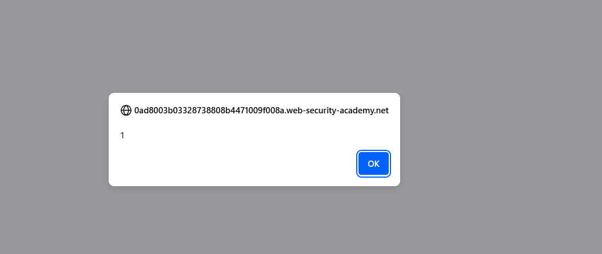
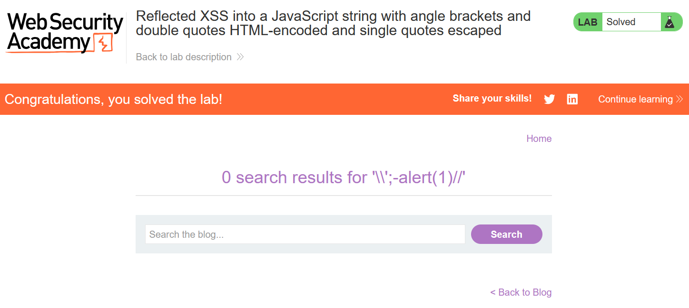

# Write-up: Reflected XSS into a JavaScript string with angle brackets and double quotes HTML-encoded and single quotes escaped

### Tổng quan
Khai thác lỗ hổng Reflected Cross-Site Scripting (XSS) trong chức năng tìm kiếm của ứng dụng, nơi tham số `search` được chèn trực tiếp vào một chuỗi JavaScript trong biến `searchTerms` mà không được làm sạch đúng cách. Angle brackets (`<`, `>`) và double quotes (`"`) bị HTML-encoded, single quotes (`'`) bị escaped, nhưng payload `\';-alert(1)//` được sử dụng để thoát chuỗi và thực thi mã JavaScript, hoàn thành lab.

### Mục tiêu
- Khai thác lỗ hổng Reflected XSS bằng cách chèn mã JavaScript vào chuỗi JavaScript trong tham số `search`, thoát khỏi chuỗi với `\';-alert(1)//` để thực thi `alert(1)` và hoàn thành lab.

### Công cụ sử dụng
- Burp Suite Community
- Firefox Browser

### Quy trình khai thác
1. **Thu thập thông tin (Reconnaissance)**
- Truy cập chức năng tìm kiếm của ứng dụng và nhập chuỗi thử nghiệm vào search box:
    `</script>`

- Sử dụng Dev Tools (Ctrl+U) để xem source code, thấy đoạn script:
    ```java
    <script>
        var searchTerms = '&lt;/script&gt;&lt;img src=1 onerror=alert(1)&gt;';
        document.write('');
    </script>
    ```
- **Quan sát**:
    - Tham số `search` được chèn vào chuỗi JavaScript trong biến `searchTerms`.
    - Angle brackets (`<`, `>`) bị HTML-encoded thành `&lt;`, `&gt;`.
    - Thử với single quote (`'`):
        - **Phản hồi**: `var searchTerms = '\'';`
    - Thử với double quote (`"`):
        - **Phản hồi**: var searchTerms = `'&quot;'`;
- **Phân tích**: Single quotes (`'`) bị escaped thành `\'`, double quotes (`"`) bị HTML-encoded thành `&quot;`, nhưng việc xử lý không ngăn được việc thoát chuỗi, gợi ý khả năng khai thác XSS bằng cách sử dụng `\'` để thoát khỏi chuỗi JavaScript.

2. **Khai thác (Exploitation)**
- Chèn payload XSS vào tham số search:
    `\';-alert(1)//`
    - **Phản hồi**: Đoạn script trở thành:
        ```java
        <script>
            var searchTerms = '\';-alert(1)//';
            document.write('');
        </script>
        ```
    - **Cơ chế**:
        - Payload `\';-alert(1)//` thoát khỏi chuỗi JavaScript bằng `\'`, chèn mã `-alert(1)` vào luồng thực thi, và `//` comment phần còn lại để tránh lỗi cú pháp.
        - Khi script chạy, `alert(1)` được thực thi, hiển thị hộp thoại:
            

- **Giải thích**: Payload tận dụng việc single quotes bị escaped nhưng không ngăn được việc thoát chuỗi, cho phép chèn mã JavaScript trực tiếp vào luồng thực thi, dẫn đến Reflected XSS, hoàn thành yêu cầu của lab:
    

### Bài học rút ra
- Hiểu cách khai thác lỗ hổng Reflected XSS bằng cách thoát chuỗi JavaScript với `\'` để chèn mã thực thi, ngay cả khi angle brackets và double quotes bị HTML-encoded, single quotes bị escaped.
- Nhận thức tầm quan trọng của việc làm sạch (sanitizing) và mã hóa đúng cách input người dùng trước khi chèn vào chuỗi JavaScript để ngăn chặn các cuộc tấn công XSS.

### Tài liệu tham khảo
- PortSwigger: Cross-Site Scripting (XSS)

### Kết luận
Lab này cung cấp kinh nghiệm thực tiễn trong việc phát hiện và khai thác lỗ hổng Reflected XSS trong chuỗi JavaScript, nhấn mạnh tầm quan trọng của việc làm sạch input người dùng trong mã JavaScript để ngăn chặn các cuộc tấn công XSS. Xem portfolio đầy đủ tại https://github.com/Furu2805/Lab_PortSwigger.

*Viết bởi Toàn Lương, Tháng 7/2025.*