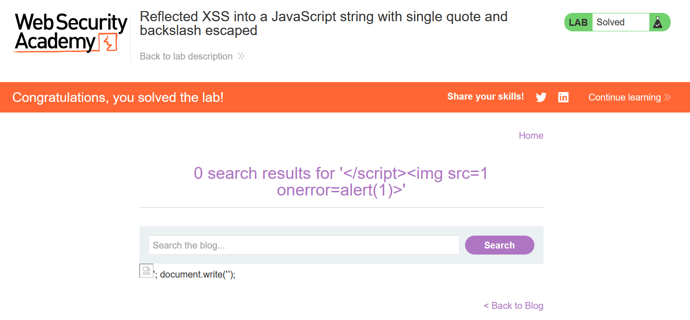

# Write-up: Reflected XSS into a JavaScript string with single quote and backslash escaped

### Tổng quan
Khai thác lỗ hổng Reflected Cross-Site Scripting (XSS) trong chức năng tìm kiếm của ứng dụng, nơi tham số `search` được chèn trực tiếp vào chuỗi JavaScript trong biến `searchTerms` mà không được làm sạch đúng cách. Single quotes (`'`) và backslash (`\`) bị escaped, nhưng payload `\';alert(1)//` được sử dụng để thoát chuỗi và thực thi mã JavaScript, hoàn thành lab.

### Mục tiêu
- Khai thác lỗ hổng Reflected XSS bằng cách chèn mã JavaScript vào chuỗi JavaScript trong tham số `search`, thoát khỏi chuỗi với `\';alert(1)//` để thực thi `alert(1)` và hoàn thành lab.

### Công cụ sử dụng
- Burp Suite Community
- Firefox Browser

### Quy trình khai thác
1. **Thu thập thông tin (Reconnaissance)**
- Truy cập chức năng tìm kiếm của ứng dụng và nhập chuỗi thử nghiệm vào search box:
    `one123!`

- Sử dụng Dev Tools (Ctrl+U) để xem source code, thấy đoạn script:
    ```java
    <script>
        var searchTerms = 'one123!';
        document.write('');
    </script>
    ```
- **Quan sát**:
    - Tham số `search` được chèn trực tiếp vào chuỗi JavaScript trong biến `searchTerms`, bao quanh bởi single quotes (`'`).

2. **Khai thác (Exploitation)**
- Chèn payload XSS vào tham số `search`:
    `\';alert(1)//`
    - **Phản hồi**: Đoạn script trở thành:
        ```java
        <script>
            var searchTerms = '\';alert(1)//';
            document.write('');
        </script>
        ```
    - **Cơ chế**:
        - Payload `\';alert(1)//` sử dụng `\'` để thoát khỏi chuỗi JavaScript, chèn `alert(1)` vào luồng thực thi.
        - Dấu `;` kết thúc câu lệnh, và `//` comment phần còn lại để tránh lỗi cú pháp.
        - Khi script chạy, `alert(1)` thực thi, hiển thị hộp thoại và hoàn thành lab:
            

### Bài học rút ra
- Hiểu cách khai thác lỗ hổng Reflected XSS bằng cách thoát chuỗi JavaScript với \' để chèn mã thực thi, ngay cả khi single quotes và backslash bị escaped.
- Nhận thức tầm quan trọng của việc làm sạch (sanitizing) và mã hóa đúng cách input người dùng trước khi chèn vào chuỗi JavaScript để ngăn chặn các cuộc tấn công XSS.

### Tài liệu tham khảo
- PortSwigger: Cross-Site Scripting (XSS)

### Kết luận
Lab này cung cấp kinh nghiệm thực tiễn trong việc phát hiện và khai thác lỗ hổng Reflected XSS trong chuỗi JavaScript, nhấn mạnh tầm quan trọng của việc làm sạch input người dùng trong mã JavaScript để ngăn chặn các cuộc tấn công XSS. Xem portfolio đầy đủ tại https://github.com/Furu2805/Lab_PortSwigger.

*Viết bởi Toàn Lương, Tháng 7/2025.*