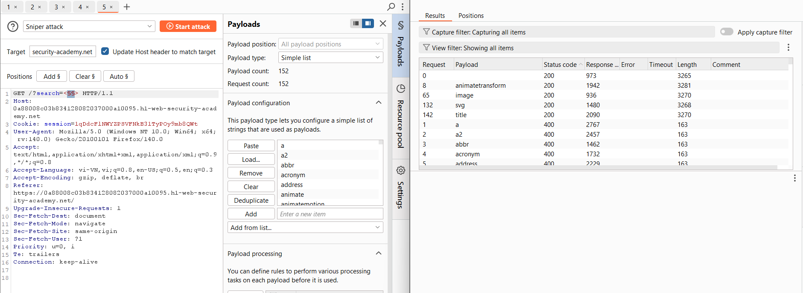
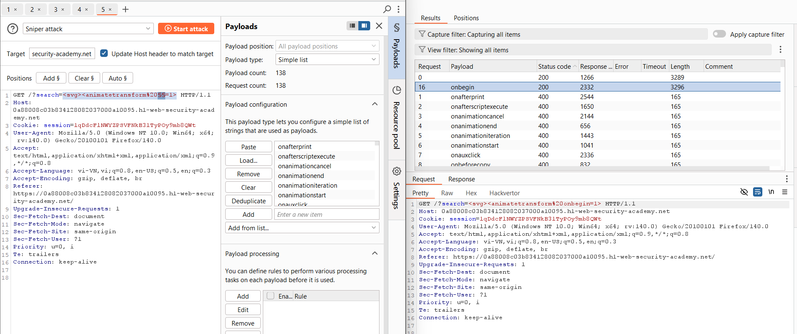
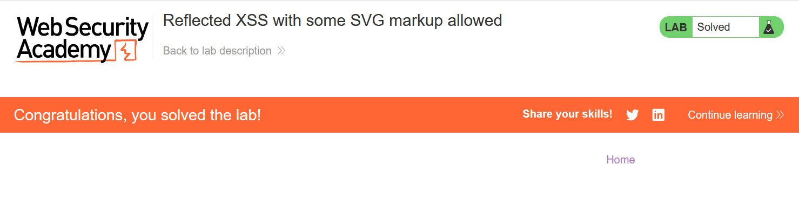

# Write-up: Reflected XSS with some SVG markup allowed

### Tổng quan
- Khai thác lỗ hổng Reflected Cross-Site Scripting (XSS) trong chức năng tìm kiếm của ứng dụng, nơi một số thẻ SVG như `svg`, `animateTransform`, `image`, `title` và sự kiện onbegin được phép sử dụng mà không bị lọc, cho phép thực thi mã JavaScript thông qua payload `<svg><animatetransform onbegin=alert(1)>` để hoàn thành lab.

### Mục tiêu
- Khai thác lỗ hổng Reflected XSS trong chức năng tìm kiếm bằng cách sử dụng thẻ SVG và sự kiện `onbegin` để thực thi `alert(1)` và hoàn thành lab.

### Công cụ sử dụng
- Burp Suite Community
- Firefox Browser

### Quy trình khai thác
1. **Thu thập thông tin (Reconnaissance)**
- Truy cập chức năng tìm kiếm của ứng dụng và nhập chuỗi bất kỳ vào search box:
- Sử dụng Burp Intruder để dò các thẻ HTML/SVG được phép bằng cách gửi các payload:
    - **Kết quả:** Các thẻ `<svg>`, `<image>`, `<animateTransform>`, `<title>`
        
    - `Quan sát`: Ứng dụng cho phép một số thẻ SVG, gợi ý khả năng khai thác XSS qua các thẻ này:

- Tiếp tục sử dụng Burp Intruder để dò các sự kiện (events) với payload mẫu `<svg><animatetransform §§=1`>:
    - **Kết quả**: Sự kiện `onbegin` được phép sử dụng trong thẻ `<animateTransform`> mà không bị lọc.
    - **Phân tích**: Ứng dụng không làm sạch đúng cách các thẻ SVG và sự kiện liên quan, cho phép chèn mã JavaScript thông qua sự kiện `onbegin`:
        

2. **Khai thác (Exploitation)**
- Chèn payload XSS vào tham số search:          `<svg><animatetransform onbegin=alert(1)>`
    - **Phản hồi**: Payload được phản hồi trong HTML:
        `<svg><animatetransform onbegin=alert(1)>`
    - Sự kiện `onbegin` trong thẻ `<animateTransform>` được kích hoạt ngay khi SVG được tải, thực thi `alert(1)`, hiển thị hộp thoại:
        
    - **Giải thích**: Payload `<svg><animatetransform onbegin=alert(1)>` tận dụng thẻ SVG và sự kiện `onbegin` được phép, cho phép thực thi JavaScript mà không bị lọc, dẫn đến Reflected XSS, hoàn thành yêu cầu của lab.
    
### Bài học rút ra
- Hiểu cách khai thác lỗ hổng Reflected XSS bằng cách sử dụng các thẻ SVG như `animateTransform` và sự kiện `onbegin` trong chức năng tìm kiếm khi bộ lọc không chặn các thành phần SVG.
- Nhận thức tầm quan trọng của việc làm sạch (sanitizing) và lọc đúng cách các thẻ SVG và sự kiện liên quan trong input người dùng để ngăn chặn các cuộc tấn công XSS.

### Tài liệu tham khảo
- PortSwigger: Cross-Site Scripting (XSS)

### Kết luận
Lab này cung cấp kinh nghiệm thực tiễn trong việc phát hiện và khai thác lỗ hổng Reflected XSS thông qua các thẻ SVG và sự kiện `onbegin`, nhấn mạnh tầm quan trọng của việc lọc và làm sạch input người dùng, đặc biệt với các thành phần SVG. Xem portfolio đầy đủ tại https://github.com/Furu2805/Lab_PortSwigger.

*Viết bởi Toàn Lương, Tháng 7/2025.*