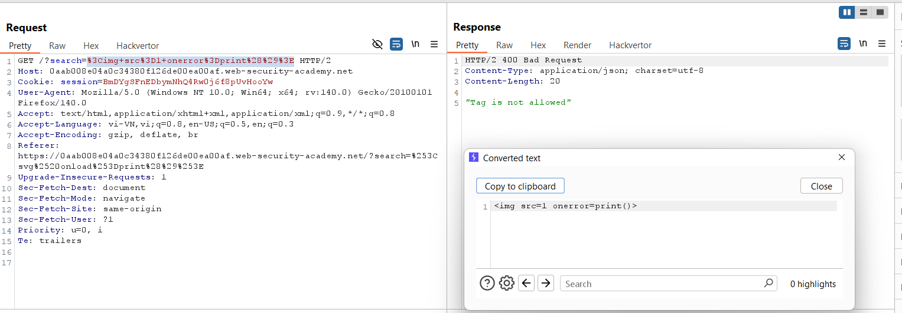
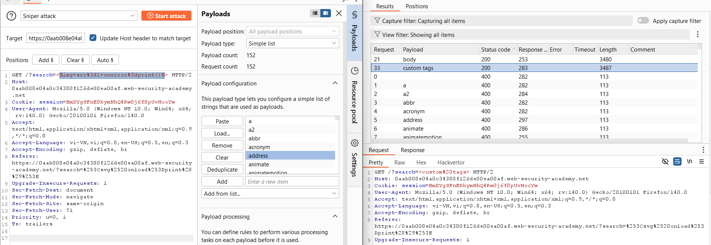
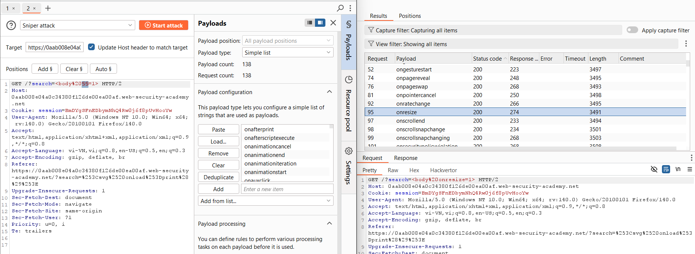
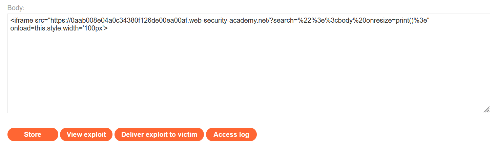
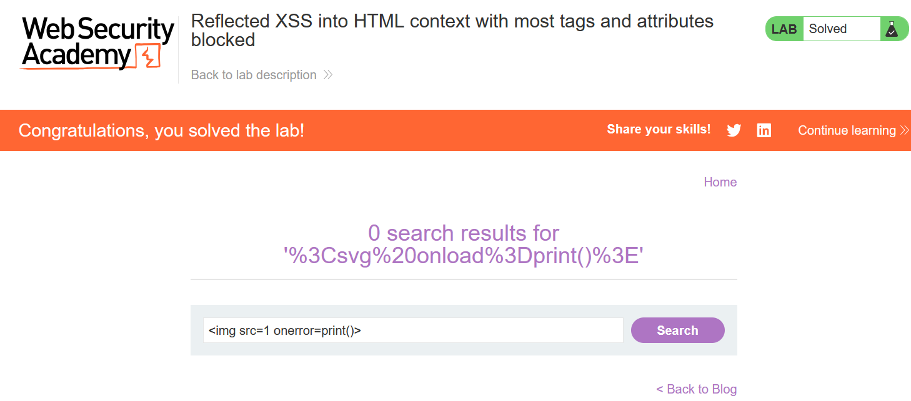

# Write-up: Reflected XSS into HTML context with most tags and attributes blocked

### Tổng quan
Khai thác lỗ hổng Reflected Cross-Site Scripting (XSS) trong chức năng tìm kiếm của ứng dụng, nơi hầu hết các thẻ và thuộc tính HTML bị chặn, nhưng thẻ `<body>` và sự kiện `onresize` được phép. Payload sử dụng thẻ `<iframe>` chứa URL với tham số `search` để chèn `<body onresize=print()>`, kích hoạt XSS khi cửa sổ được resize, và sử dụng Exploit Server để gửi payload đến nạn nhân, hoàn thành lab.

### Mục tiêu
- Khai thác lỗ hổng Reflected XSS bằng cách sử dụng thẻ `<body>` với sự kiện onresize trong tham số `search`, kết hợp với `<iframe`> để tự động kích hoạt `print()` và gửi exploit qua Exploit Server để hoàn thành lab.

### Công cụ sử dụng
- Burp Suite Community
- Firefox Browser

### Quy trình khai thác
1. **Thu thập thông tin (Reconnaissance)**
- Truy cập chức năng tìm kiếm của ứng dụng và nhập payload thử nghiệm vào search box:
    ``
    - **Phản hồi**: Thông báo lỗi hoặc nội dung bị lọc, cho thấy thẻ `` và thuộc tính `onerror` bị chặn:
        

- Sử dụng Burp Intruder để dò các thẻ được phép với payload mẫu:
    `search=<§img src=1 onerror=print()§>`
    - Thay `img` bằng các thẻ khác có trong xss cheat sheet
    - **Kết quả**: Thẻ `<body>` và các thẻ custom được phép, không bị lọc:
        

- Dò các sự kiện được phép với payload: `<body §§=1>`
    - Thử các sự kiện trong xss cheat sheet
    - **Kết quả**: Sự kiện `onresize` được phép trong thẻ `<body>`:
        

2. **Khai thác (Exploitation)**
- Tạo payload XSS: 
    `<body onresize=print()>`

- Mã hóa URL payload:
    `%22%3E%3Cbody%20onresize%3Dprint()%3E`

- Tạo script cho Exploit Server để nhúng payload vào `<iframe>` và tự động resize:
    ```
    <iframe src="https://lab-id.web-security-academy.net/?search=%22%3E%3Cbody%20onresize%3Dprint()%3E" onload=this.style.width='100px'>
    ```
- Truy cập Exploit Server, nhập script trên vào trường Body và lưu.
    
    - Cơ chế:
        - Thẻ `<iframe>` load URL chứa payload `<body onresize=print()>`.
        - Thuộc tính `onload=this.style.width='100px`' thay đổi kích thước iframe, kích hoạt sự kiện `onresize` trên thẻ `<body>`.
        - Hàm `print()` được thực thi, hiển thị hộp thoại:

- Sử dụng chức năng "Deliver exploit to victim" trong Exploit Server để gửi script tới nạn nhân, kích hoạt XSS tự động, hoàn thành yêu cầu của lab.
    

### Bài học rút ra
- Hiểu cách khai thác lỗ hổng Reflected XSS bằng cách sử dụng thẻ `<body>` với sự kiện `onresize`, kết hợp `<iframe>` để kích hoạt tự động, khi hầu hết các thẻ và thuộc tính HTML bị chặn.
- Nhận thức tầm quan trọng của việc lọc và làm sạch (sanitizing) tất cả các thẻ HTML, bao gồm `<body>`, và kiểm tra các sự kiện như `onresize` trong input người dùng để ngăn chặn các cuộc tấn công XSS.

### Tài liệu tham khảo
- PortSwigger: Cross-Site Scripting (XSS)

### Kết luận
Lab này cung cấp kinh nghiệm thực tiễn trong việc phát hiện và khai thác lỗ hổng Reflected XSS bằng thẻ `<body>` và sự kiện `onresize` trong bối cảnh hầu hết các thẻ và thuộc tính bị chặn, nhấn mạnh tầm quan trọng của việc lọc toàn diện input người dùng. Xem portfolio đầy đủ tại https://github.com/Furu2805/Lab_PortSwigger.

*Viết bởi Toàn Lương, Tháng 7/2025.*