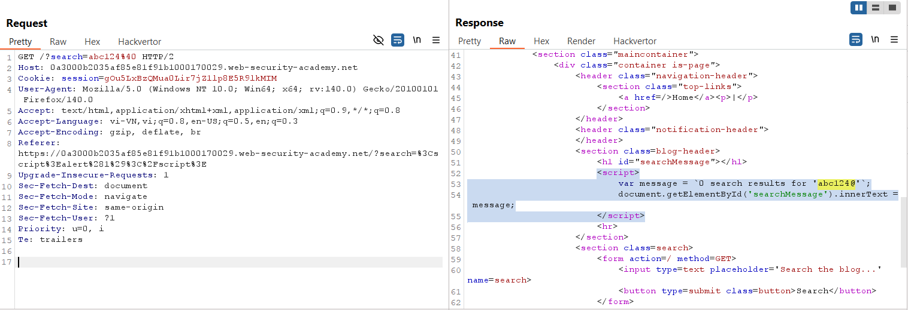
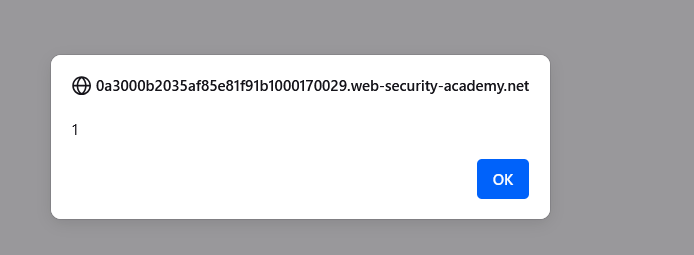
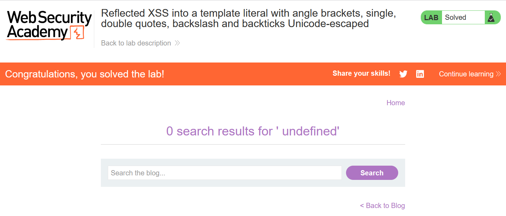

# Write-up: Reflected XSS into a template literal with angle brackets, single, double quotes, backslash and backticks Unicode-escaped

### Tổng quan
Khai thác lỗ hổng Reflected Cross-Site Scripting (XSS) trong chức năng tìm kiếm của ứng dụng, nơi tham số `search` được chèn trực tiếp vào template literal trong đoạn JavaScript mà không được làm sạch, với các ký tự như angle brackets (`<`, `>`), single quotes (`'`), double quotes (`"`), backslash (`\`), và backticks (`) bị Unicode-escaped. Payload `${alert(1)}` được sử dụng để thực thi mã JavaScript, hoàn thành lab.

### Mục tiêu
- Khai thác lỗ hổng Reflected XSS bằng cách chèn mã JavaScript vào template literal thông qua tham số `search` để thực thi `alert(1)` và hoàn thành lab.

### Công cụ sử dụng
- Burp Suite Community
- Firefox Browser

### Quy trình khai thác
1. **Thu thập thông tin (Reconnaissance)**
- Truy cập chức năng tìm kiếm của ứng dụng và nhập chuỗi bất kỳ (ví dụ: `abc124@`) vào search box, sau đó nhấn tìm kiếm:
- Quan sát yêu cầu trả về trong burp proxy thấy đoạn script:
    ```javascript
    <script>
        var message = `0 search results for 'abc124@'`;
        document.getElementById('searchMessage').innerText = message;
    </script>
    ```
    - **Quan sát**: Tham số search (`abc124@`) được chèn trực tiếp vào template literal trong biến message mà không được làm sạch. Các ký tự như `<`, `>`, `'`, `"`, `\`, và ` bị Unicode-escaped , nhưng các ký tự `${` vẫn được phép, gợi ý khả năng khai thác XSS bằng cách chèn biểu thức JavaScript vào template literal:
        

2. **Khai thác (Exploitation)**
- Chèn payload XSS vào tham số `search`: `${alert(1)}`
    - **Phản hồi**: Đoạn script trở thành:
        ```java
        <script>
            var message = `0 search results for '${alert(1)}'`;
            document.getElementById('searchMessage').innerText = message;
        </script>
        ```
    - **Cơ chế**: Payload `${alert(1)}` được xử lý như một biểu thức JavaScript trong template literal, thực thi `alert(1)` ngay khi script chạy, hiển thị hộp thoại:
        

- **Giải thích**: Vì template literal cho phép thực thi biểu thức JavaScript trong `${}`, payload `${alert(1)}` vượt qua bộ lọc Unicode-escaping và thực thi mã trực tiếp, dẫn đến Reflected XSS, hoàn thành yêu cầu của lab:
    

### Bài học rút ra
- Hiểu cách khai thác lỗ hổng Reflected XSS bằng cách chèn biểu thức JavaScript (`${}`) vào template literal trong tham số `search`, ngay cả khi các ký tự nguy hiểm như angle brackets, quotes, backslash, và backticks bị Unicode-escaped.
- Nhận thức tầm quan trọng của việc làm sạch (sanitizing) và mã hóa đúng cách input người dùng trước khi chèn vào template literal trong JavaScript để ngăn chặn các cuộc tấn công XSS.

### Tài liệu tham khảo
- PortSwigger: Cross-Site Scripting (XSS)

### Kết luận
Lab này cung cấp kinh nghiệm thực tiễn trong việc phát hiện và khai thác lỗ hổng Reflected XSS trong template literal, nhấn mạnh tầm quan trọng của việc làm sạch input người dùng trong mã JavaScript, đặc biệt khi sử dụng template literal. Xem portfolio đầy đủ tại https://github.com/Furu2805/Lab_PortSwigger.

*Viết bởi Toàn Lương, Tháng 7/2025.*