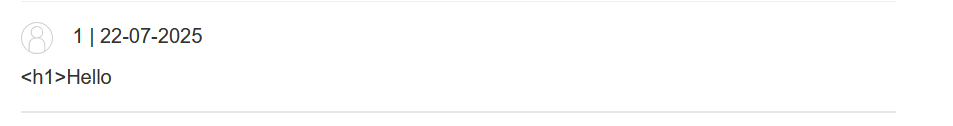
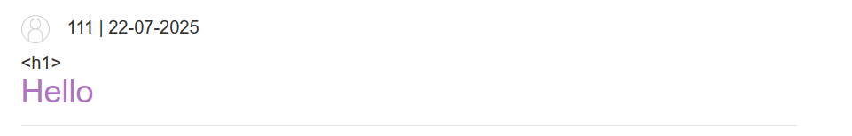
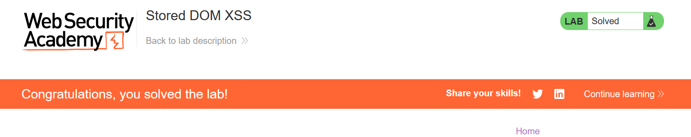

# Write-up: Stored DOM XSS

### Tổng quan
Khai thác lỗ hổng Stored DOM-based Cross-Site Scripting (XSS) trong chức năng comment của một bài blog, nơi input người dùng được xử lý trong DOM mà không được làm sạch, cho phép thực thi mã JavaScript thông qua sự kiện `onerror` của thẻ `` để hoàn thành lab.

### Mục tiêu
- Khai thác lỗ hổng Stored DOM XSS trong chức năng comment của bài blog để thực thi mã JavaScript (`alert(1)`) và hoàn thành lab.

### Công cụ sử dụng
- Burp Suite Community
- Firefox Browser

### Quy trình khai thác
1. **Thu thập thông tin (Reconnaissance)**
- Truy cập một bài blog bất kỳ trên ứng dụng

- Thử comment với thẻ lồng nhau `<h1>Hello</h1>`:
    - **Phản hồi**: Trang blog hiển thị `<h1>Hello</h1>` mà không escape thẻ HTML, gợi ý input được xử lý trong DOM mà không được làm sạch:
        

- Thử nhập comment `<h1><h1>Hello</h1>` và gửi:
    - **Phản hồi**: Comment xuất hiện trên trang blog, hiển thị dưới dạng thẻ HTML `<h1>Hello</h1>` được render:
        

- **Quan sát**: Input người dùng được chèn trực tiếp vào DOM, cho phép thực thi mã HTML và tiềm năng khai thác DOM XSS.

2. **Khai thác (Exploitation)**
- Chèn payload DOM XSS vào ô comment:`<h1>`
    - **Phản hồi**: Comment được lưu trữ, thẻ `` với thuộc tính `src="1"` (URL không hợp lệ) kích hoạt sự kiện `onerror`, thực thi mã JavaScript `alert(1)`, hiển thị hộp thoại và hoàn thành lab:
        

    
### Bài học rút ra
- Hiểu cách khai thác lỗ hổng Stored DOM XSS bằng cách sử dụng các sự kiện JavaScript (như onerror) trong input không được làm sạch trong DOM.
- Nhận thức tầm quan trọng của việc làm sạch (sanitizing) và kiểm tra input người dùng trong quá trình xử lý DOM để ngăn chặn các cuộc tấn công XSS.

### Tài liệu tham khảo
- PortSwigger: Cross-Site Scripting (XSS)

### Kết luận
Lab này cung cấp kinh nghiệm thực tiễn trong việc phát hiện và khai thác lỗ hổng Stored DOM XSS, nhấn mạnh tầm quan trọng của việc làm sạch input người dùng trong DOM để bảo vệ ứng dụng web. Xem portfolio đầy đủ tại https://github.com/Furu2805/Lab_PortSwigger.

*Viết bởi Toàn Lương, Tháng 7/2025.*