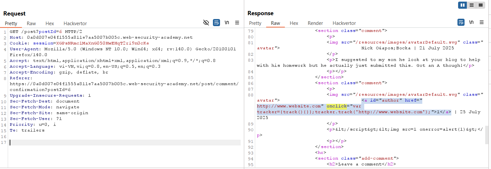
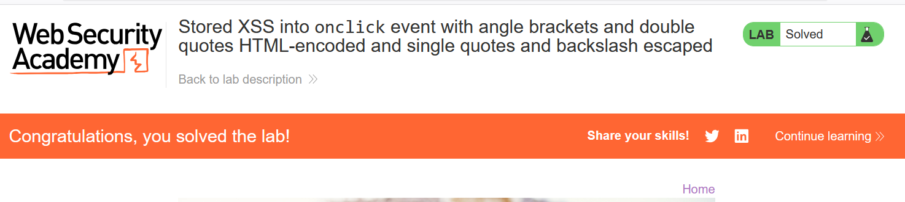

# Write-up: Stored XSS into `onclick` event with angle brackets and double quotes HTML-encoded and single quotes and backslash escaped

### Tổng quan
Khai thác lỗ hổng Stored Cross-Site Scripting (XSS) trong chức năng comment của ứng dụng, nơi trường website được chèn vào sự kiện `onclick` của thẻ `<a>` mà không được làm sạch đúng cách. Với angle brackets (`<`, `>`) và double quotes (`"`) bị HTML-encoded, single quotes (`'`) và backslash (`\`) bị escaped, payload `http://abc?&apos;-alert(1)-&apos;` được sử dụng để tiêm mã JavaScript vào onclick, thực thi `alert(1)` khi người dùng nhấp vào liên kết.

### Mục tiêu
- Khai thác lỗ hổng Stored XSS trong chức năng comment bằng cách chèn mã JavaScript vào sự kiện `onclick` của thẻ `<a>` thông qua trường website, thực thi `alert(1)` và hoàn thành lab.

### Công cụ sử dụng
- Burp Suite Community
- Firefox Browser

### Quy trình khai thác
1. **Thu thập thông tin (Reconnaissance)**
- Truy cập một bài viết bất kỳ ( `/post?postId=6`) và gửi comment với thông tin mẫu:
    - Name: Test User
    - Email: test@example.com
    - Website: http://www.website.com
    - Comment: Test comment

- Sử dụng Burp Proxy để kiểm tra response `GET /post?postId=6`:
    - **Phản hồi**: Thấy đoạn HTML:
        ```
        <a id="author" href="http://www.website.com" onclick="var tracker={track(){}};tracker.track('http://www.website.com');">Test User</a>
        ```
    - **Quan sát**: Trường website được chèn trực tiếp vào thuộc tính `href` và tham số của hàm `tracker.track()` trong sự kiện `onclick`. Angle brackets (`<`, `>`) và double quotes (") bị HTML-encoded (thành `&lt;`, `&gt;`, `&quot;`), single quotes (`'`) và backslash (`\`) bị escaped (thành `\'`), nhưng input không được làm sạch đúng cách, gợi ý khả năng khai thác Stored XSS bằng cách tiêm mã JavaScript vào onclick:
        

2. **Khai thác (Exploitation)**
- Gửi comment mới với trường website chứa payload XSS:
    - Name: Test User
    - Email: test@example.com
    - Website: `http://abc?&apos;-alert(1)-&apos;`
    - Comment: Test comment

- Kiểm tra lại response `GET /post?postId=6`
    ```
    <a id="author" href="http://abc?&apos;-alert(1)-&apos;" onclick="var tracker={track(){}};tracker.track('http://abc?\'-alert(1)-\'');">Test User</a>
    ```
    - **Cơ chế**: Trong sự kiện `onclick`, tham số của `tracker.track()` trở thành
        `tracker.track('http://abc?'-alert(1)-'');`
        - Phần `'-alert(1)-'` thoát khỏi chuỗi và thực thi `alert(1)` như một biểu thức JavaScript, vì single quotes được escaped (`\'`) nhưng không ngăn được việc thoát chuỗi.
- **Giải thích**: Payload `http://abc?&apos;-alert(1)-&apos;` tận dụng việc single quotes bị escaped nhưng vẫn cho phép thoát chuỗi trong onclick, dẫn đến Stored XSS, hoàn thành yêu cầu của lab:
    

### Bài học rút ra
- Hiểu cách khai thác lỗ hổng Stored XSS bằng cách chèn mã JavaScript vào sự kiện `onclick` thông qua trường website, vượt qua các biện pháp HTML-encoding (angle brackets, double quotes) và escaping (single quotes, backslash).
- Nhận thức tầm quan trọng của việc làm sạch (sanitizing) và mã hóa đúng cách input người dùng trước khi chèn vào các sự kiện JavaScript như `onclick` để ngăn chặn các cuộc tấn công XSS.

### Tài liệu tham khảo
- PortSwigger: Cross-Site Scripting (XSS)

### Kết luận
Lab này cung cấp kinh nghiệm thực tiễn trong việc phát hiện và khai thác lỗ hổng Stored XSS trong sự kiện `onclick` của thẻ `<a>`, nhấn mạnh tầm quan trọng của việc làm sạch input người dùng trong các sự kiện JavaScript. Xem portfolio đầy đủ tại https://github.com/Furu2805/Lab_PortSwigger.

*Viết bởi Toàn Lương, Tháng 7/2025.*