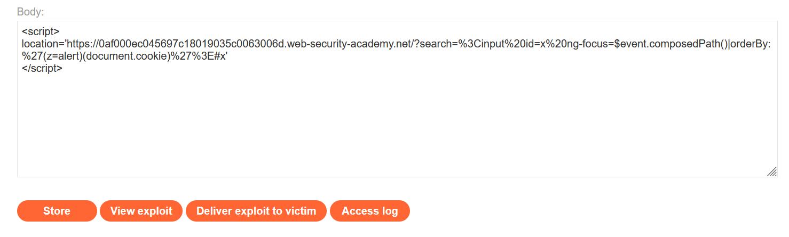
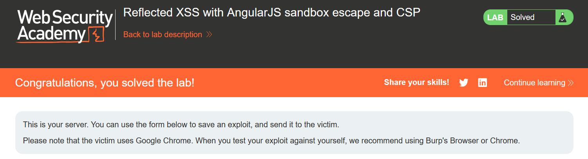

# Write-up: Reflected XSS with AngularJS sandbox escape and CSP

### Tổng quan
Khai thác lỗ hổng Reflected Cross-Site Scripting (XSS) trong ứng dụng sử dụng AngularJS, nơi tham số `search` được chèn vào biểu thức AngularJS mà không được làm sạch đúng cách, cho phép vượt qua sandbox AngularJS và Content Security Policy (CSP). Payload sử dụng sự kiện `ng-focus` và bộ lọc `orderBy` để thực thi `alert(document.cookie)`, được gửi qua Exploit Server để kích hoạt XSS trên trình duyệt nạn nhân, hoàn thành lab.

### Mục tiêu
- Khai thác lỗ hổng Reflected XSS trong ứng dụng AngularJS, vượt qua sandbox và CSP, bằng cách chèn biểu thức vào tham số `search`, sử dụng Exploit Server để thực thi `alert(document.cookie)` trên trình duyệt nạn nhân và hoàn thành lab.

### Công cụ sử dụng
- Burp Suite Community
- Firefox Browser

### Quy trình khai thác
1. **Khai thác (Exploitation)**
- Tạo payload XSS và đưa vào Exploit Server:
    ```javascript
    <script>
    location='https://id-lab.web-security-academy.net/?search=%3Cinput%20id=x%20ng-focus=$event.composedPath()|orderBy:%27(z=alert)(document.cookie)%27%3E#x'
    </script>
    ```

- Cơ chế chi tiết của payload:
    - `location='...'`: Chuyển hướng trình duyệt nạn nhân đến URL chứa tham số `search` với biểu thức AngularJS độc hại.
    - `search=%3Cinput%20id=x%20ng-focus=$event.composedPath()|orderBy:%27(z=alert)(document.cookie)%27%3E`:
        - `%3Cinput%20id=x%20ng-focus=$event.composedPath()`: Chèn thẻ `<input id=x>` với sự kiện `ng-focus`. Khi input được `focus` (tự động qua `#x`), `$event`.`composedPath()` trả về mảng các phần tử DOM, được chuyển tiếp qua bộ lọc `orderBy`.
        - `|orderBy:%27(z=alert)(document.cookie)%27`: Sử dụng bộ lọc `orderBy` để xử lý mảng từ `composedPath()`. Biểu thức `(z=alert)(document.cookie)` gán `alert` cho biến `z` và gọi `z(document.cookie)`, thực thi `alert(document.cookie)`.
    - `#x`: Tự động `focus` vào `<input id=x>`, kích hoạt `ng-focus` khi trang load.

- Nhập payload vào trường Body của Exploit Server , lưu và sử dụng chức năng "Deliver exploit to victim":
    

- **Kết quả**: Khi nạn nhân truy cập Exploit Server, trình duyệt chuyển hướng đến URL chứa payload trong tham số `search` và thực hiện payload trên. Lab hoàn thành.
    

### Bài học rút ra
- Hiểu cách khai thác lỗ hổng Reflected XSS trong AngularJS bằng cách vượt qua sandbox với sự kiện `ng-focus` và bộ lọc `orderBy`, kết hợp Exploit Server để thực thi mã JavaScript trong bối cảnh CSP cho phép `unsafe-inline`.
- Nhận thức tầm quan trọng của việc nâng cấp AngularJS lên phiên bản mới nhất, làm sạch (`sanitizing`) input người dùng trong biểu thức AngularJS, và cấu hình CSP chặt chẽ (tránh `unsafe-inline`) để ngăn chặn các cuộc tấn công XSS.

### Tài liệu tham khảo
- PortSwigger: Cross-Site Scripting (XSS)

### Kết luận
Lab này cung cấp kinh nghiệm thực tiễn trong việc phát hiện và khai thác lỗ hổng Reflected XSS trong AngularJS với kỹ thuật bypass sandbox và CSP, nhấn mạnh tầm quan trọng của việc cập nhật framework, làm sạch input, và cấu hình CSP chặt chẽ. Xem portfolio đầy đủ tại https://github.com/Furu2805/Lab_PortSwigger.

*Viết bởi Toàn Lương, Tháng 7/2025.*