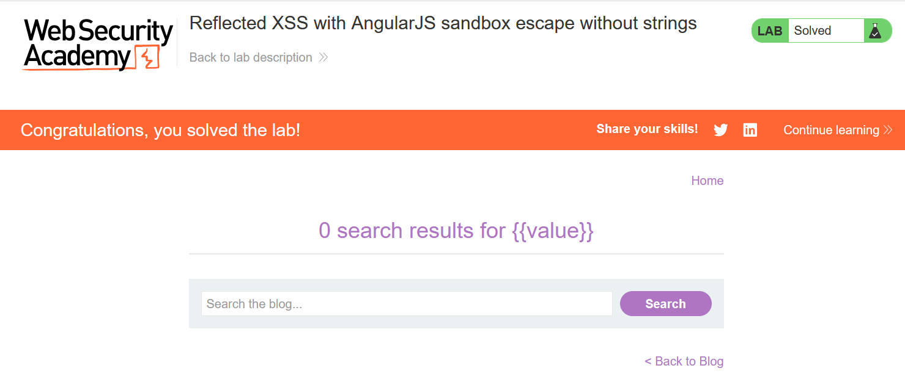

# Write-up: Reflected XSS with AngularJS sandbox escape without strings

### Tổng quan
Khai thác lỗ hổng Reflected Cross-Site Scripting (XSS) trong ứng dụng sử dụng AngularJS, nơi tham số `search` được chèn vào biểu thức AngularJS mà không được làm sạch đúng cách, cho phép vượt qua sandbox để thực thi mã JavaScript. Payload sử dụng kỹ thuật không chứa chuỗi trực tiếp, thao túng prototype của `toString()` và `fromCharCode()` để thực thi `alert(1)`, vượt qua các hạn chế của AngularJS sandbox, hoàn thành lab.

### Mục tiêu
- Khai thác lỗ hổng Reflected XSS trong ứng dụng AngularJS bằng cách chèn biểu thức vào tham số `search`, vượt qua sandbox mà không sử dụng chuỗi trực tiếp, thực thi `alert(1)` và hoàn thành lab.

### Công cụ sử dụng
- Burp Suite Community
- Firefox Browser

### Quy trình khai thác
1. **Khai thác (Exploitation)**
- Chèn payload XSS vào tham số `search`:
    ```
    1&toString().constructor.prototype.charAt=[].join;[1]|orderBy:toString().constructor.fromCharCode(120,61,97,108,101,114,116,40,49,41)=1
    ```

- Cơ chế chi tiết của payload:
    - `1&`: Đặt giá trị `search=1` để tránh lỗi cú pháp, và `&` chuyển sang tham số tiếp theo.
    - `toString().constructor.prototype.charAt=[].join`: Thao túng prototype của Function (là `toString().constructor`). Gán charAt bằng join của mảng (`[].join`), khiến các phương thức chuỗi trả về kết quả khác (ép các ký tự thành chuỗi liền mạch).
    - `;[1]|orderBy:`: Sử dụng bộ lọc `orderBy` trong AngularJS để gọi `toString()` trên mảng `[1]`, kích hoạt prototype đã sửa đổi.
    - `toString().constructor.fromCharCode(120,61,97,108,101,114,116,40,49,41)`: Gọi `Function.fromCharCode` với các mã ASCII (`120,61,97,108,101,114,116,40,49,41` tương ứng với `x=alert(1)`), tạo hàm thực thi `alert(1)`.
    - `=1`: Gán giá trị để đảm bảo cú pháp hợp lệ trong biểu thức AngularJS.

- **Kết quả**: Payload vượt qua sandbox AngularJS, thực thi `alert(1)` khi trang load, hiển thị hộp thoại và hoàn thành lab:
    

### Bài học rút ra
- Hiểu cách khai thác lỗ hổng Reflected XSS trong AngularJS bằng cách vượt qua sandbox mà không sử dụng chuỗi trực tiếp, thông qua thao túng prototype và `fromCharCode` để thực thi mã JavaScript.
- Nhận thức tầm quan trọng của việc nâng cấp AngularJS lên phiên bản mới nhất và làm sạch (sanitizing) input người dùng trong các biểu thức AngularJS để ngăn chặn các cuộc tấn công XSS.

### Tài liệu tham khảo
- PortSwigger: Cross-Site Scripting (XSS)

### Kết luận
Lab này cung cấp kinh nghiệm thực tiễn trong việc phát hiện và khai thác lỗ hổng Reflected XSS trong AngularJS với kỹ thuật bypass sandbox không dùng chuỗi, nhấn mạnh tầm quan trọng của việc cập nhật framework và làm sạch input người dùng. Xem portfolio đầy đủ tại https://github.com/Furu2805/Lab_PortSwigger.

*Viết bởi Toàn Lương, Tháng 7/2025.*