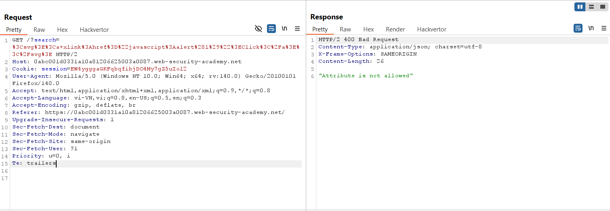
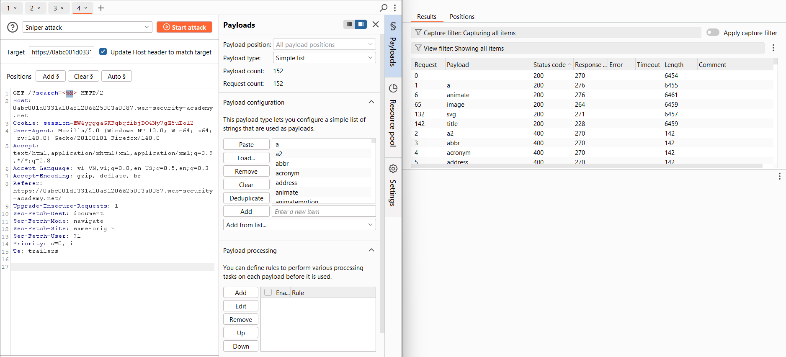
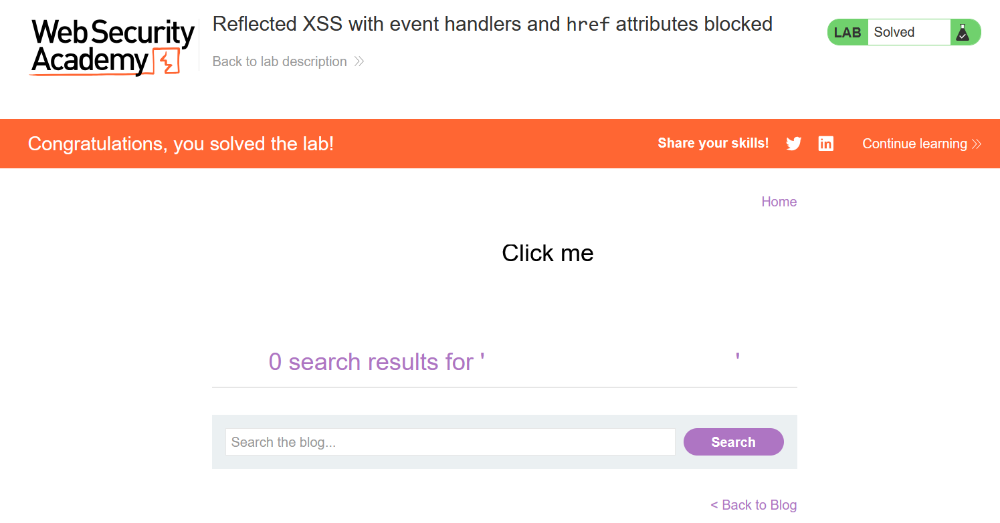

# Write-up: Reflected XSS with event handlers and href attributes blocked

### Tổng quan
Khai thác lỗ hổng Reflected Cross-Site Scripting (XSS) trong chức năng tìm kiếm của ứng dụng, nơi các event handlers và thuộc tính `href` với giao thức `javascript:` bị chặn, nhưng một số thẻ SVG như `svg, a, animate, image` được phép. Payload sử dụng thẻ `<animate>` để thay đổi động thuộc tính href của thẻ `<a>` thành `javascript:alert(1)`, thực thi mã JavaScript khi người dùng nhấp vào "Click me", hoàn thành lab.

### Mục tiêu
- Khai thác lỗ hổng Reflected XSS trong chức năng tìm kiếm bằng cách sử dụng thẻ SVG `<animate>` để thay đổi thuộc tính `href` của thẻ `<a>`, thực thi `alert(1)` khi người dùng nhấp vào liên kết và hoàn thành lab.

### Công cụ sử dụng
- Burp Suite Community
- Firefox Browser

### Quy trình khai thác
1. **Thu thập thông tin (Reconnaissance)**
- Truy cập chức năng tìm kiếm của ứng dụng và nhập payload thử nghiệm vào search box:
    `<svg><a href="javascript:alert(1)">Click</a></svg>`

- **Phản hồi**: Thông báo lỗi `"Attribute is not allowed`", cho thấy thuộc tính `href` với giao thức `javascript:` bị chặn:
    

- Sử dụng Burp Intruder để dò các thẻ HTML/SVG được phép bằng cách gửi các payload:
    - Kết quả: Các thẻ `svg`, `a`, `animate`, `image` được phép, không bị lọc:
        
    - **Quan sát**: Ứng dụng cho phép các thẻ SVG và không chặn một số thuộc tính của thẻ `<animate>`, gợi ý khả năng khai thác XSS bằng cách sử dụng `<animate>` để thay đổi thuộc tính `href` của thẻ `<a>`.

2. **Khai thác (Exploitation)**
- Chèn payload XSS vào tham số search:
  ```
  <svg>
    <a>
      <animate attributeName=href values=javascript:alert(1) />
      <text x=20 y=20>Click me</text>
    </a>
  </svg>
  ```
- **Phản hồi**: Trang hiển thị văn bản "Click me". Khi người dùng nhấp vào liên kết `<a>`, thẻ `<animate>` thay đổi động thuộc tính `href` thành `javascript:alert(1)`, thực thi `alert(1)`, hiển thị hộp thoại:
    

- **Giải thích**: Payload sử dụng thẻ `<animate>` để thay đổi thuộc tính `href` của thẻ `<a>` thành `javascript:alert(1)` một cách động, vượt qua bộ lọc chặn trực tiếp giao thức `javascript:` trong `href`. Khi người dùng nhấp vào "Click me", mã JavaScript được thực thi, dẫn đến Reflected XSS, hoàn thành yêu cầu của lab.
    
### Bài học rút ra
- Hiểu cách khai thác lỗ hổng Reflected XSS bằng cách sử dụng thẻ SVG `<animate>` để thay đổi động thuộc tính `href` của thẻ `<a>` khi các event handlers và giao thức `javascript:` trực tiếp bị chặn.
- Nhận thức tầm quan trọng của việc làm sạch (sanitizing) và lọc đúng cách các thẻ SVG và thuộc tính liên quan trong input người dùng để ngăn chặn các cuộc tấn công XSS.

### Tài liệu tham khảo
- PortSwigger: Cross-Site Scripting (XSS)

### Kết luận
Lab này cung cấp kinh nghiệm thực tiễn trong việc phát hiện và khai thác lỗ hổng Reflected XSS thông qua thẻ SVG `<animate>` để vượt qua các bộ lọc chặn event handlers và thuộc tính `href`, nhấn mạnh tầm quan trọng của việc lọc và làm sạch input người dùng, đặc biệt với các thành phần SVG. Xem portfolio đầy đủ tại https://github.com/Furu2805/Lab_PortSwigger.

*Viết bởi Toàn Lương, Tháng 7/2025.*