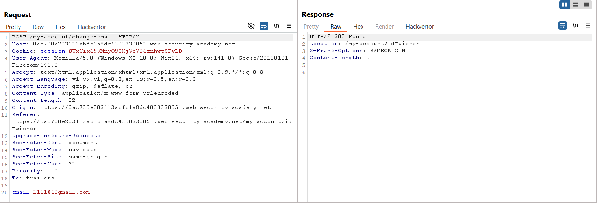
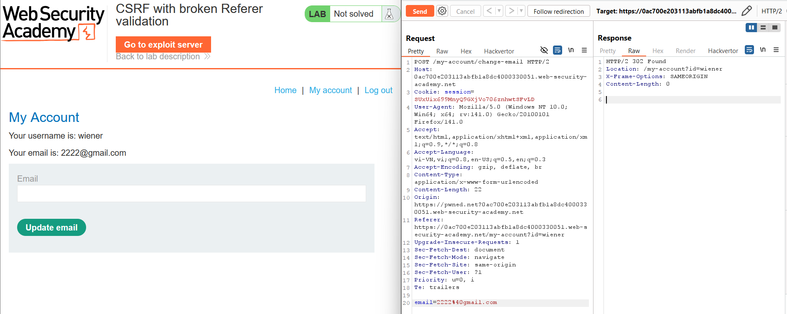
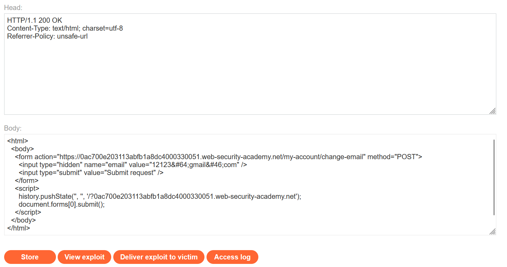
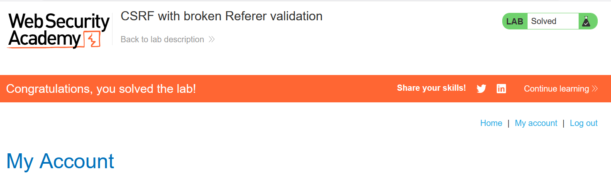

# Write-up: CSRF with broken Referer validation

### Tổng quan
Khai thác lỗ hổng Cross-Site Request Forgery (CSRF) trong chức năng thay đổi email của ứng dụng, nơi cơ chế xác thực `Referer` header không hoạt động đúng, cho phép gửi yêu cầu từ domain bên ngoài với `Referer` chứa tên miền của ứng dụng. Sử dụng HTML form và script trong Exploit Server với header `Referrer-Policy: unsafe-url` để thay đổi email của nạn nhân, tận dụng việc thiếu `SameSite` cookie và kiểm tra `Referer` không chặt chẽ, hoàn thành lab.

### Mục tiêu
- Khai thác lỗ hổng CSRF bằng cách gửi yêu cầu POST giả mạo đến `/my-account/change-email` từ Exploit Server, sử dụng `Referrer-Policy: unsafe-url` và chèn query string để bypass xác thực `Referer`, thay đổi email của nạn nhân và hoàn thành lab.

### Công cụ sử dụng
- Burp Suite Pro
- Firefox Browser

### Quy trình khai thác
1. **Thu thập thông tin (Reconnaissance)**
- Đăng nhập bằng tài khoản `wiener`:`peter` và truy cập `/my-account` để thay đổi email
    
- **Quan sát**:
    - Yêu cầu POST không yêu cầu `csrf token`, không thấy thuộc tính SameSite trong cookie session, cho thấy cookie có thể được gửi kèm trong các yêu cầu cross-site.
    - Header `Referer` được gửi, gợi ý ứng dụng có thể kiểm tra `Referer` để xác thực yêu cầu.
    - Kiểm tra trong Burp Proxy, không có thuộc tính `SameSite` trong response header `Set-Cookie`

2. **Kiểm tra xác thực Referer**
- Gửi yêu cầu POST trên đến Burp Repeater, thay đổi header `Referer` thành domain bên ngoài chứa tên miền ứng dụng:
    - **Phản hồi**: Yêu cầu thành công, email được cập nhật, xác nhận lỗ hổng trong kiểm tra `Referer` (chỉ kiểm tra xem `Referer` có chứa `id-lab.web-security-academy.net` hay không, không yêu cầu domain chính xác):
        

3. **Khai thác (Exploitation)**
- Tạo payload CSRF trong Exploit Server:
    ```html
    <html>
      <body>
        <form action="https://id-lab.web-security-academy.net/my-account/change-email" method="POST">
          <input type="hidden" name="email" value="12123@gmail.com" />
          <input type="submit" value="Submit request" />
        </form>
        <script>
          history.pushState('', '', '/?id-lab.web-security-academy.net');
          document.forms[0].submit();
        </script>
      </body>
    </html```>
    ```

- Cấu hình header trong Exploit Server:
    `Referrer-Policy: unsafe-url`
    

- **Ý tưởng payload**:
    - Tạo một form HTML với action trỏ đến endpoint` /my-account/change-email`, chứa email giả mạo (`12123@gmail.com`)
    - Sử dụng `history.pushState` để thay đổi URL của trang Exploit Server, thêm query string `?id-lab.web-security-academy.net`, khiến `Referer` header trong yêu cầu gửi đi là `https://exploit-id.web-security-academy.net/?id-lab.web-security-academy.net`.
    - Header `Referrer-Policy: unsafe-url` đảm bảo trình duyệt gửi đầy đủ URL (bao gồm query string) trong `Referer`, giúp bypass kiểm tra `Referer` của ứng dụng.
    - Script tự động submit form (`document.forms[0].submit()`), gửi yêu cầu POST để thay đổi email của nạn nhân khi họ truy cập trang Exploit Server.

- Gửi payload đến nạn nhân qua chức năng "Deliver exploit to victim" của Exploit Server:
- **Kết quả**:
    - Khi nạn nhân truy cập trang Exploit Server, form tự động gửi yêu cầu POST đến `/my-account/change-email` với Referer chứa `id-lab.web-security-academy.net`, bypass xác thực và thay đổi email thành `12123@gmail.com` và hoàn thành lab
        

### Bài học rút ra
- Hiểu cách khai thác lỗ hổng CSRF bằng cách tận dụng kiểm tra `Referer` không chặt chẽ, sử dụng `history.pushState` và `Referrer-Policy: unsafe-url` để gửi yêu cầu giả mạo từ domain bên ngoài.
- Nhận thức tầm quan trọng của việc triển khai cơ chế CSRF token, cấu hình `SameSite` cookie (như `Strict` hoặc `Lax`), và kiểm tra `Referer` chặt chẽ (xác thực domain chính xác) để ngăn chặn các cuộc tấn công CSRF.

### Tài liệu tham khảo
- PortSwigger: Cross-Site Scripting (XSS)
- PortSwigger: Bypassing Referer-based CSRF protections

### Kết luận
Lab này cung cấp kinh nghiệm thực tiễn trong việc khai thác lỗ hổng CSRF với kiểm tra `Referer` không chặt chẽ, nhấn mạnh tầm quan trọng của việc triển khai CSRF token, `SameSite` cookie, và kiểm tra `Referer` đúng cách để bảo vệ ứng dụng. Xem portfolio đầy đủ tại https://github.com/Furu2805/Lab_PortSwigger.

*Viết bởi Toàn Lương, Tháng 8/2025.*