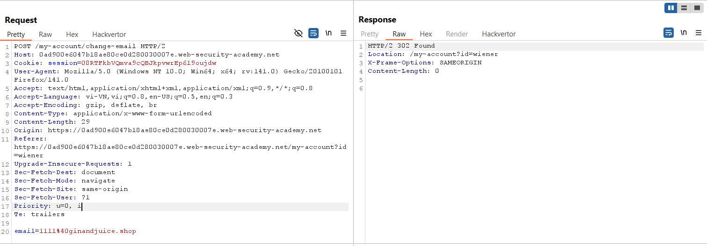
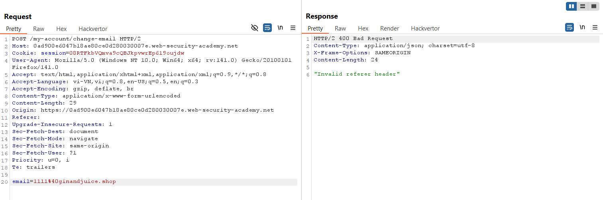
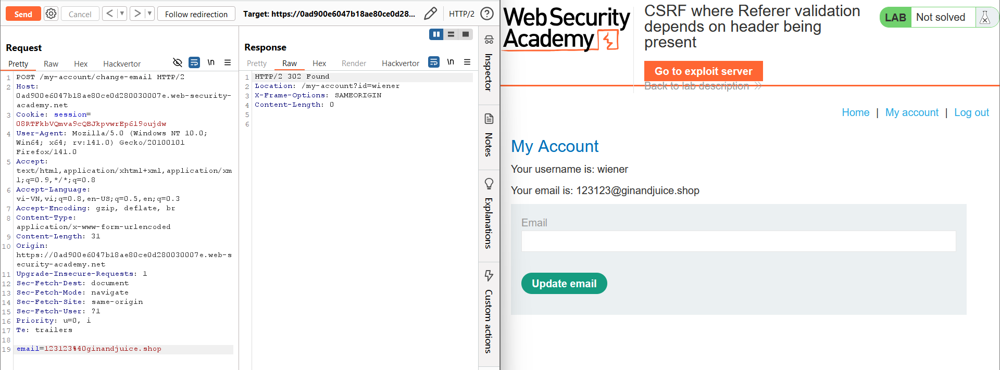
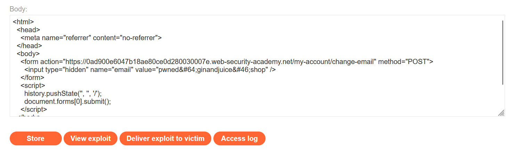
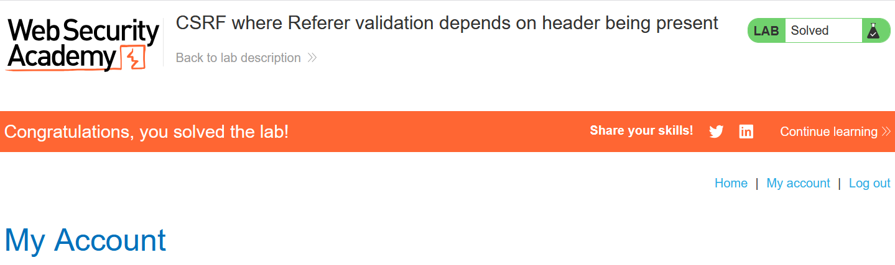

# Write-up: CSRF where Referer validation depends on header being present

### Tổng quan
Khai thác lỗ hổng Cross-Site Request Forgery (CSRF) trong chức năng thay đổi email của ứng dụng, nơi cơ chế xác thực `Referer` header chỉ kiểm tra khi header này tồn tại, cho phép bypass bằng cách loại bỏ hoàn toàn `Referer`. Tận dụng việc thiếu thuộc tính `SameSite` trong cookie và sử dụng HTML form với `<meta name="referrer" content="no-referrer">` trong Exploit Server để gửi yêu cầu POST giả mạo, thay đổi email của nạn nhân, hoàn thành lab.

### Mục tiêu
- Khai thác lỗ hổng CSRF bằng cách gửi yêu cầu POST giả mạo đến `/my-account/change-email` từ Exploit Server, sử dụng `<meta name="referrer" content="no-referrer">` để bỏ `Referer` header, bypass xác thực và thay đổi email của nạn nhân, hoàn thành lab.

### Công cụ sử dụng
- Burp Suite Pro
- Firefox Browser

### Quy trình khai thác
1. **Thu thập thông tin (Reconnaissance)**
- Đăng nhập bằng tài khoản `wiener`:`peter` và truy cập `/my-account` để thay đổi email 
    
- Quan sát:
    - Yêu cầu POST không yêu cầu `csrf token`, cho thấy không có cơ chế CSRF token bảo vệ.
    - Response header `Set-Cookie` không chứa thuộc tính `SameSite`, nghĩa là cookie phiên được gửi kèm trong các yêu cầu cross-site.
    - Header `Referer` được gửi trong yêu cầu, gợi ý ứng dụng kiểm tra `Referer` để xác thực nguồn gốc

2. **Kiểm tra xác thực Referer**
- Gửi yêu cầu POST trên đến Burp Repeater, thay đổi header Referer thành domain tùy ý
    - **Phản hồi**: Nhận lỗi `"Invalid Referer header"`, xác nhận ứng dụng kiểm tra giá trị của Referer.
        

- Thử xóa hoàn toàn header `Referer`:
    - **Phản hồi**: Yêu cầu thành công, email được cập nhật, xác nhận lỗ hổng trong kiểm tra `Referer`: Ứng dụng chỉ kiểm tra `Referer` nếu header này tồn tại, bỏ qua xác thực khi `Referer` không có:
        

3. **Khai thác (Exploitation)**
- Tạo payload CSRF và đưa vào Exploit Server
    ```html
    <html>
      <head>
        <meta name="referrer" content="no-referrer">
      </head>
      <body>
        <form action="https://0ad900e6047b18ae80ce0d280030007e.web-security-academy.net/my-account/change-email" method="POST">
          <input type="hidden" name="email" value="pwned@ginandjuice.shop" />
        </form>
        <script>
          history.pushState('', '', '/');
          document.forms[0].submit();
        </script>
      </body>
    </html>
    ```
    

- Ý tưởng payload:
    - Sử dụng thẻ `<meta name="referrer" content="no-referrer">` để ngăn trình duyệt gửi header `Referer` trong mọi yêu cầu từ trang Exploit Server.
    - Tạo form HTML với action trỏ đến endpoint `/my-account/change-email`, chứa email giả mạo (`pwned@ginandjuice.shop`).
    - Sử dụng `history.pushState('', '', '/')` để đảm bảo URL của trang Exploit Server là hợp lệ (tránh query string không cần thiết)
    - Script tự động submit form (`document.forms[0].submit()`), gửi yêu cầu POST đến `/my-account/change-email` mà không có `Referer`, bypass xác thực.

- Gửi payload đến nạn nhân qua chức năng "Deliver exploit to victim" của Exploit Server:
    - **Kết quả**: Khi nạn nhân truy cập trang Exploit Server, form tự động gửi yêu cầu POST đến `/my-account/change-email` mà không có `Referer` header, bypass xác thực và thay đổi email thành `pwned@ginandjuice.shop`, hoàn thành lab.
        

### Bài học rút ra
- Hiểu cách khai thác lỗ hổng CSRF bằng cách bỏ header `Referer` sử dụng `<meta name="referrer" content="no-referrer">`, tận dụng kiểm tra `Referer` không chặt chẽ chỉ khi header tồn tại.
- Nhận thức tầm quan trọng của việc triển khai cơ chế `CSRF token`, cấu hình `SameSite` cookie (như `Strict` hoặc `Lax`), và kiểm tra `Referer` bắt buộc với domain chính xác để ngăn chặn các cuộc tấn công CSRF.

### Tài liệu tham khảo
- PortSwigger: Cross-Site Scripting (XSS)
- PortSwigger: Bypassing Referer-based CSRF protections

### Kết luận
Lab này cung cấp kinh nghiệm thực tiễn trong việc khai thác lỗ hổng CSRF với cơ chế xác thực `Referer` không chặt chẽ, nhấn mạnh tầm quan trọng của việc triển khai CSRF token, `SameSite` cookie, và kiểm tra `Referer` bắt buộc với domain chính xác để bảo vệ ứng dụng. Xem portfolio đầy đủ tại https://github.com/Furu2805/Lab_PortSwigger.

*Viết bởi Toàn Lương, Tháng 8/2025.*