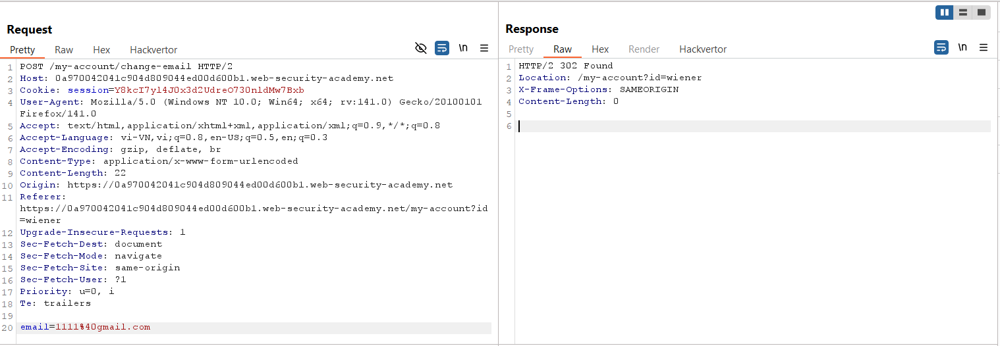
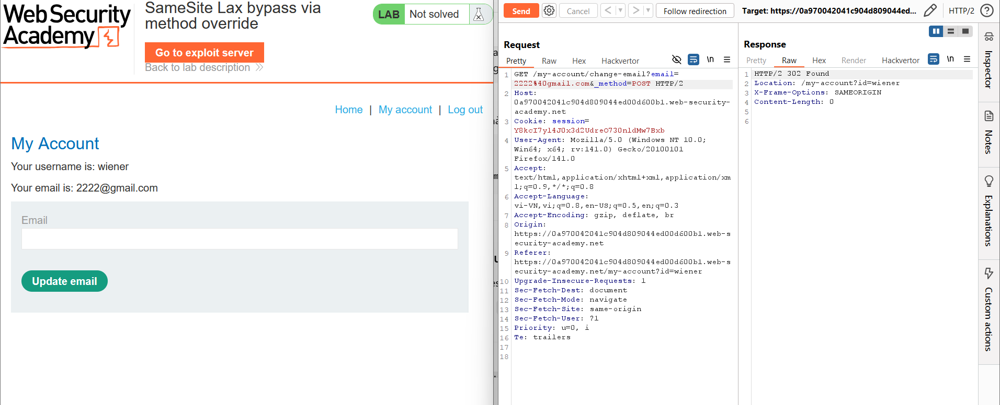
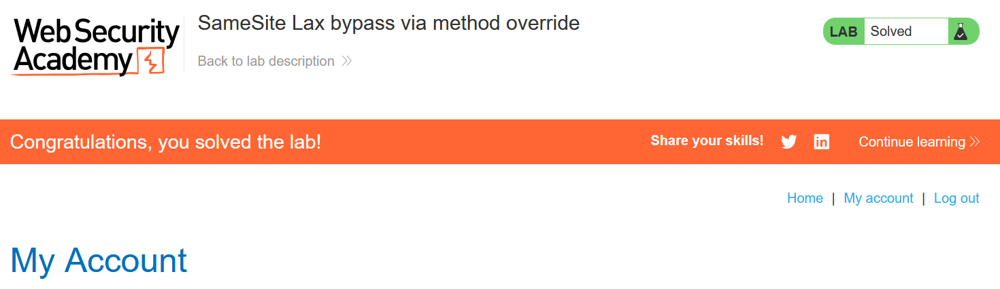

# Write-up: SameSite Lax bypass via method override

### Tổng quan
Khai thác lỗ hổng Cross-Site Request Forgery (CSRF) trong chức năng thay đổi email của ứng dụng, nơi cookie phiên không có thuộc tính `SameSite` rõ ràng, mặc định hoạt động ở chế độ `Lax`. Ứng dụng cho phép chuyển đổi yêu cầu POST thành GET với tham số `_method=POST`, giúp gửi yêu cầu thay đổi email qua GET, bypass hạn chế `SameSite=Lax` do yêu cầu GET được gửi kèm cookie trong top-level navigation. Sử dụng payload XSS trong Exploit Server để kích hoạt redirect đến `/my-account/change-email`, thay đổi email của nạn nhân và hoàn thành lab.

### Mục tiêu
- Khai thác lỗ hổng CSRF bằng cách sử dụng method override để gửi yêu cầu GET giả mạo đến `/my-account/change-email` với `_method=POST`, bypass `SameSite=Lax`, thay đổi email của nạn nhân và hoàn thành lab.

### Công cụ sử dụng
- Burp Suite Pro
- Firefox Browser

### Quy trình khai thác
1. **Thu thập thông tin (Reconnaissance)**
- Đăng nhập bằng tài khoản `wiener`:`peter` và quan sát response của yêu cầu POST `/login`:
    - **Quan sát**: Response header `Set-Cookie` không chứa thuộc tính `SameSite`, suy ra cookie phiên hoạt động ở chế độ `Lax` mặc định:

- Thay đổi email thành `1111@gmail.com` tại `/my-account/change-email`:
    - **Quan sát**: Yêu cầu POST không yêu cầu csrf token, dễ bị khai thác nếu bypass được **SameSite=Lax**:
        

2. **Kiểm tra method override**
- Gửi yêu cầu POST `/my-account/change-email` đến Burp Repeater, chuyển thành GET với tham số `_method=POST`:
    - **Phản hồi**: Email được cập nhật thành công thành `2222@gmail.com`, xác nhận ứng dụng cho phép override phương thức POST thành GET thông qua tham số `_method=POST`:
        
        
3. **Khai thác (Exploitation)**
- Tạo payload XSS trong Exploit Server (giả định endpoint /exploit) để kích hoạt redirect và thay đổi email:
    ```javascript
    <script>
    document.location = "https://0a970042041c904d809044ed00d600b1.web-security-academy.net/my-account/change-email?email=1212@pwn.com&_method=POST";
    </script>
    ```

- Gửi payload đến nạn nhân qua chức năng "Deliver exploit to victim" của Exploit Server:
    - **Kết quả**: Khi nạn nhân truy cập trang Exploit Server, script kích hoạt redirect đến `/my-account/change-email`, thay đổi email thành `1212@pwn.com` và hoàn thành lab.
        

### Bài học rút ra
- Hiểu cách khai thác lỗ hổng CSRF bằng cách sử dụng method override để gửi yêu cầu GET giả mạo với `_method=POST`, bypass hạn chế `SameSite=Lax` trong top-level navigation.
- Nhận thức tầm quan trọng của việc triển khai CSRF token, cấu hình `SameSite=Strict` cho cookie phiên, và kiểm tra chặt chẽ phương thức HTTP để ngăn chặn các cuộc tấn công CSRF.

### Tài liệu tham khảo
- PortSwigger: Cross-Site Scripting (XSS)

### Kết luận
Lab này cung cấp kinh nghiệm thực tiễn trong việc khai thác CSRF bằng method override để bypass `SameSite=Lax`, nhấn mạnh tầm quan trọng của việc triển khai CSRF token, sử dụng `SameSite=Strict`, và kiểm tra phương thức HTTP để bảo vệ ứng dụng. Xem portfolio đầy đủ tại https://github.com/Furu2805/Lab_PortSwigger.

*Viết bởi Toàn Lương, Tháng 8/2025.*