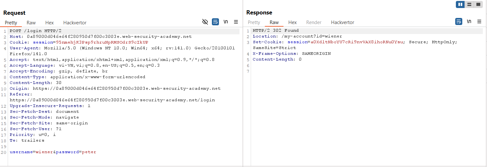
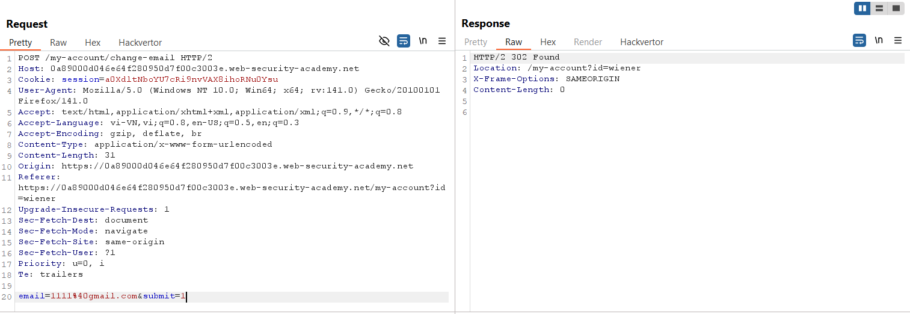
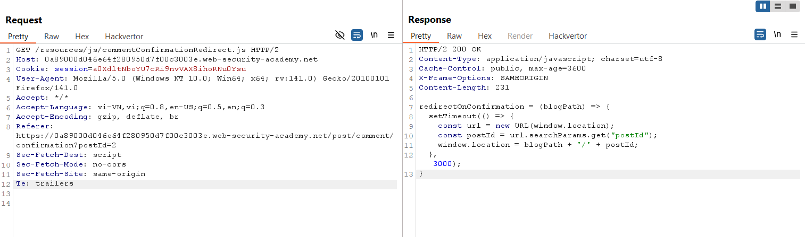
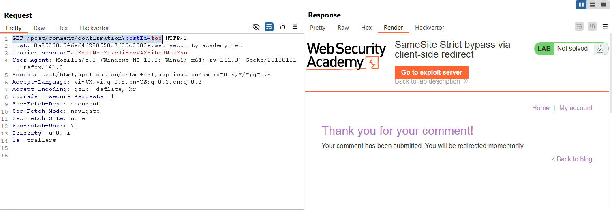
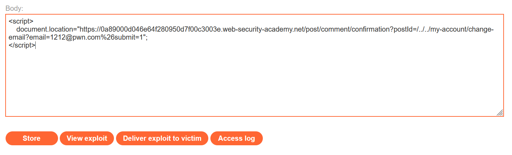
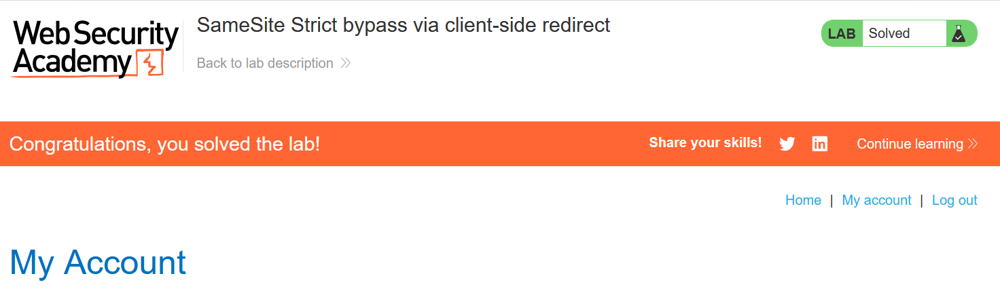

# Write-up: SameSite Strict bypass via client-side redirect

### Tổng quan
Khai thác lỗ hổng Cross-Site Request Forgery (CSRF) trong chức năng thay đổi email của ứng dụng, nơi cookie phiên có thuộc tính `SameSite=Strict` nhưng có thể bị bypass thông qua client-side redirect trong chức năng xác nhận comment. Endpoint `/post/comment/confirmation` cho phép điều hướng đến bất kỳ đường dẫn nào trên cùng domain thông qua tham số `postId`, kết hợp với khả năng chuyển đổi yêu cầu POST thành GET với `_method=POST`. Sử dụng payload XSS trong Exploit Server để kích hoạt redirect đến `/my-account/change-email`, thay đổi email của nạn nhân, bypass `SameSite=Strict` và hoàn thành lab.

### Mục tiêu
- Khai thác lỗ hổng CSRF bằng cách sử dụng client-side redirect trong endpoint `/post/comment/confirmation` để gửi yêu cầu GET giả mạo đến `/my-account/change-email`, bypass thuộc tính `SameSite=Strict`, thay đổi email của nạn nhân và hoàn thành lab.

### Công cụ sử dụng
- Burp Suite Pro
- Firefox Browser

### Quy trình khai thác
1. **Thu thập thông tin (Reconnaissance)**
- Đăng nhập bằng tài khoản `wiener`:`peter` và quan sát response của yêu cầu POST `/login`:
    
    - **Quan sát**: Response header `Set-Cookie` chứa thuộc tính `SameSite=Strict`, ngăn cookie phiên được gửi trong các yêu cầu cross-site:
    
- Thay đổi email thành `1111@gmail.com` tại `/my-account/change-email`:
    
    - **Quan sát**: Yêu cầu POST không yêu cầu `csrf` token .

2. **Kiểm tra client-side redirect**
- Gửi comment tùy ý trong một bài viết và quan sát yêu cầu GET `/resources/js/commentConfirmationRedirect.js`:
- **Quan sát**: Response chứa mã JavaScript thực hiện redirect:
    ```javascript
    redirectOnConfirmation = (blogPath) => {
        setTimeout(() => {
            const url = new URL(window.location);
            const postId = url.searchParams.get("postId");
            window.location = blogPath + '/' + postId;
        }, 3000);
    }
    ```
    - Mã này lấy `postId` từ query string của URL và redirect đến `blogPath/postId` sau 3 giây, cho phép điều hướng đến bất kỳ đường dẫn nào trên domain chính:
        

- Thử yêu cầu GET `/post/comment/confirmation?postId=foo`:
    - **Phản hồi**: Trang xác nhận comment hiển thị, sau 3 giây redirect đến `/post/foo`.
        

- Thử với `postId=1/../../my-account`:
    - **Phản hồi**: Sau 3 giây, redirect đến `/my-account`, xác nhận có thể điều hướng đến bất kỳ đường dẫn nào trên domain chính.

3. **Kiểm tra chuyển đổi POST thành GET**
- Trong Burp Repeater, thử chuyển đổi yêu cầu POST `/my-account/change-email` thành GET với tham số `_method=POST`:
    - **Phản hồi**: Email được cập nhật thành công, xác nhận ứng dụng cho phép override phương thức POST thành GET.

4. **Khai thác (Exploitation)**
- Tạo payload XSS trong Exploit Server để kích hoạt redirect và thay đổi email:
    ```javascript
    <script>
    document.location = "https://0a89000d046e64f280950d7f00c3003e.web-security-academy.net/post/comment/confirmation?postId=/../../my-account/change-email?email=1212@pwn.com%26submit=1";
    </script>
    ```
- Store và view exploit để kiểm tra:
    - Script chuyển hướng trình duyệt đến `/post/comment/confirmation?postId=/../../my-account/change-email?email=1212@pwn.com&submit=1`.
    - Sau 3 giây, client-side redirect thực thi, gửi yêu cầu GET đến `/my-account/change-email?email=1212@pwn.com&submit=1`, thay đổi email thành `1212@pwn.com`.
    - Yêu cầu GET đi kèm cookie phiên vì được thực hiện trong cùng domain, bypass `SameSite=Strict`.

- Gửi payload đến nạn nhân qua chức năng "Deliver exploit to victim" của Exploit Server:
    
- **Kết quả**:
    - Khi nạn nhân truy cập trang Exploit Server, script kích hoạt redirect đến `/post/comment/confirmation`, sau đó chuyển tiếp đến `/my-account/change-email`, thay đổi email thành `1212@pwn.com` và hoàn thành lab.
        

### Bài học rút ra
- Hiểu cách khai thác lỗ hổng CSRF bằng cách sử dụng client-side redirect trong endpoint `/post/comment/confirmation` để gửi yêu cầu GET giả mạo, bypass thuộc tính `SameSite=Strict` thông qua điều hướng trong cùng domain.
- Nhận thức tầm quan trọng của việc triển khai CSRF token, giới hạn tham số điều hướng trong client-side redirect, và sử dụng `SameSite=Strict` kết hợp với kiểm tra phương thức HTTP để ngăn chặn các cuộc tấn công CSRF.

### Tài liệu tham khảo
- PortSwigger: Cross-Site Scripting (XSS)

### Kết luận
- Lab này cung cấp kinh nghiệm thực tiễn trong việc khai thác CSRF thông qua client-side redirect để bypass SameSite=Strict, nhấn mạnh tầm quan trọng của việc triển khai CSRF token, giới hạn redirect, và kiểm tra phương thức HTTP để bảo vệ ứng dụng. Xem portfolio đầy đủ tại https://github.com/Furu2805/Lab_PortSwigger.

*Viết bởi Toàn Lương, Tháng 8/2025.*