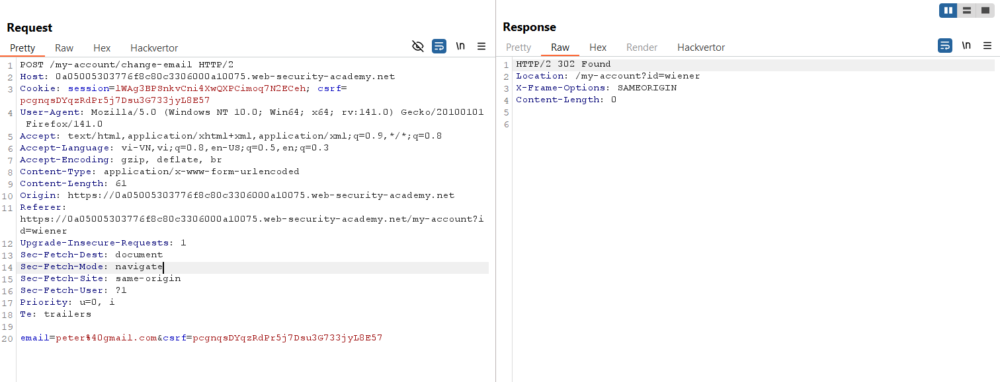
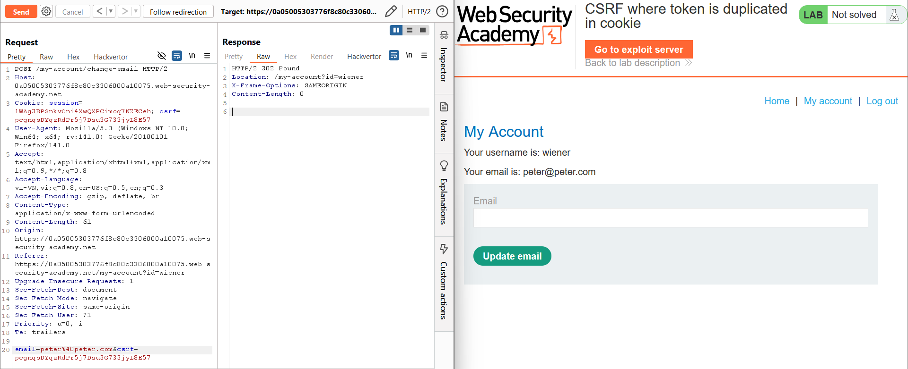
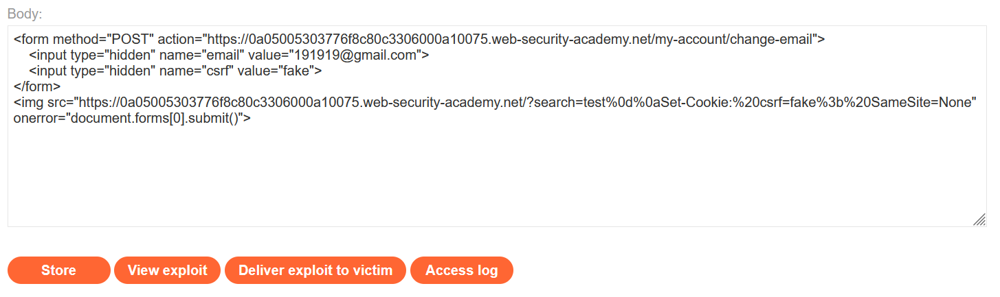
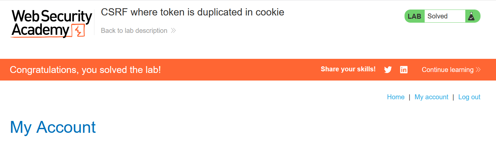

# Write-up: CSRF where token is duplicated in cookie

### Tổng quan
Khai thác lỗ hổng Cross-Site Request Forgery (CSRF) trong chức năng thay đổi email của ứng dụng, nơi token CSRF được lưu trong cả body yêu cầu và cookie, nhưng ứng dụng chỉ kiểm tra sự khớp nhau giữa hai giá trị này mà không xác thực tính hợp lệ của token. Kết hợp với khả năng set cookie `csrf` thông qua HTTP response injection trong endpoint `/`, sử dụng payload HTML với `` để set cookie `csrf=fake` và gửi form POST giả mạo, thay đổi email của nạn nhân, hoàn thành lab.

### Mục tiêu
- Khai thác lỗ hổng CSRF bằng cách set cookie `csrf` giả mạo thông qua HTTP response injection, gửi yêu cầu POST giả mạo đến `/my-account/change-email` với token CSRF khớp cookie, thay đổi email của nạn nhân và hoàn thành lab.

### Công cụ sử dụng
- Burp Suite Pro
- Firefox Browser

### Quy trình khai thác
1. **Thu thập thông tin (Reconnaissance)**
- Đăng nhập bằng tài khoản `wiener`:`peter` và thay đổi email thành `1111@gmail.com` tại `/my-account/change-email`:
- **Quan sát**:
    - Yêu cầu POST chứa tham số csrf trong body và cookie csrf trong header.
    - Response không đặt thuộc tính `SameSite` cho cookie, cho phép cookie được gửi trong các yêu cầu cross-site:
    

2. **Kiểm tra xác thực CSRF token**
- Gửi yêu cầu POST `/my-account/change-email` đến Burp Repeater, thay giá trị `csrf` trong body bằng giá trị của cookie `csrf`:
    - **Phản hồi**: Email được cập nhật thành công, xác nhận ứng dụng chỉ kiểm tra sự khớp nhau giữa `csrf` trong body và cookie, không xác thực tính hợp lệ của token:
        

2. **Khai thác (Exploitation)**
- Tạo payload CSRF trong Exploit Server để set cookie `csrf=fake` và gửi yêu cầu POST giả mạo:
    ```html
    <form method="POST" action="https://lab-id.web-security-academy.net/my-account/change-email">
    <input type="hidden" name="email" value="191919@gmail.com">
    <input type="hidden" name="csrf" value="fake">
    </form>
    
    ```
    

- **Ý tưởng payload**:
    - Sử dụng thẻ `` với src trỏ đến endpoint `/` chứa HTTP response injection (`%0d%0aSet-Cookie:%20csrf=fake%3b%20SameSite=None`), set cookie `csrf=fake` trên trình duyệt nạn nhân
    - Form POST chứa tham số `email=191919@gmail.com` và `csrf=fake`, khớp với cookie vừa set.
    - Sự kiện `onerror` của `` kích hoạt submit form, gửi yêu cầu POST đến `/my-account/change-email`.

- Gửi payload đến nạn nhân qua chức năng "Deliver exploit to victim" của Exploit Server:
    - Kết quả: Khi nạn nhân truy cập trang Exploit Server, thẻ `` set cookie `csrf=fake`, form gửi yêu cầu POST, thay đổi email thành `191919@gmail.com` và hoàn thành lab.
        

### Bài học rút ra
- Hiểu cách khai thác lỗ hổng CSRF bằng cách set cookie `csrf` giả mạo thông qua HTTP response injection, tận dụng cơ chế kiểm tra CSRF token yếu chỉ yêu cầu khớp giữa cookie và body.
- Nhận thức tầm quan trọng của việc triển khai CSRF token ngẫu nhiên và duy nhất, cấu hình `SameSite=Strict` hoặc `Lax` cho cookie, và ngăn chặn HTTP response injection để bảo vệ ứng dụng khỏi các cuộc tấn công CSRF.

### Tài liệu tham khảo
- PortSwigger: Cross-Site Scripting (XSS)

### Kết luận
Lab này cung cấp kinh nghiệm thực tiễn trong việc khai thác CSRF bằng cách lợi dụng kiểm tra CSRF token yếu và HTTP response injection, nhấn mạnh tầm quan trọng của việc sử dụng token ngẫu nhiên, cấu hình `SameSite` hợp lý, và bảo vệ chống injection. Xem portfolio đầy đủ tại https://github.com/Furu2805/Lab_PortSwigger.

*Viết bởi Toàn Lương, Tháng 8/2025.*