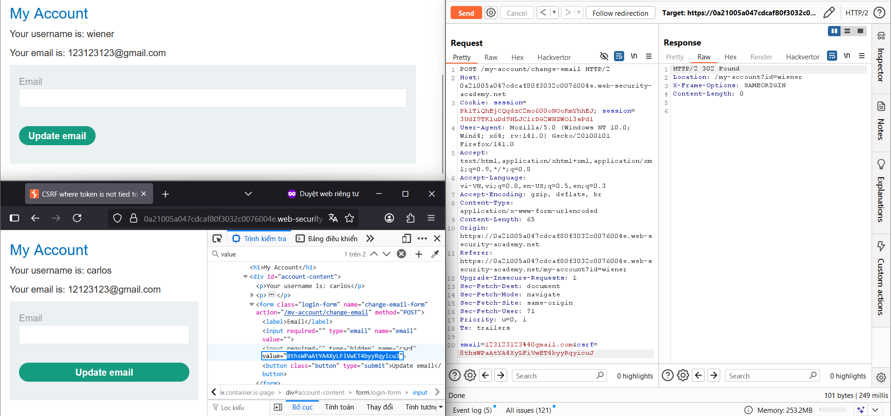
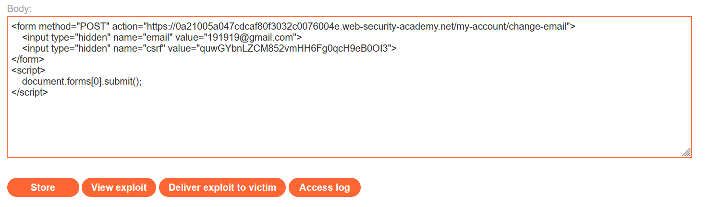

# Write-up: CSRF where token is not tied to user session

### Tổng quan
Khai thác lỗ hổng Cross-Site Request Forgery (CSRF) trong chức năng thay đổi email của ứng dụng, nơi token CSRF không được liên kết với phiên người dùng mà thuộc một pool token hợp lệ toàn cục. Ứng dụng chấp nhận bất kỳ token CSRF nào trong pool mà không kiểm tra mối liên hệ với phiên, cho phép sử dụng token từ tài khoản khác để gửi yêu cầu giả mạo. Sử dụng payload HTML trong Exploit Server với token CSRF từ tài khoản khác để gửi form POST giả mạo, thay đổi email của nạn nhân và hoàn thành lab

### Mục tiêu
- Khai thác lỗ hổng CSRF bằng cách sử dụng token CSRF hợp lệ từ tài khoản khác, gửi yêu cầu POST giả mạo đến `/my-account/change-email`, thay đổi email của nạn nhân và hoàn thành lab.

### Công cụ sử dụng
- Burp Suite Pro
- Firefox Browser

### Quy trình khai thác
1. **Thu thập thông tin (Reconnaissance)**
- Đăng nhập bằng tài khoản `wiener`:`peter` và thay đổi email thành `1111@gmail.com` tại `/my-account/change-email`:
- Quan sát:
    - Yêu cầu POST chứa tham số `csrf` trong body, nhưng không có cookie CSRF riêng.
    - Cookie session không có thuộc tính `SameSite`, cho phép gửi trong các yêu cầu cross-site.

2. **Kiểm tra xác thực CSRF token**
- Mở trình duyệt ở chế độ private, đăng nhập bằng tài khoản `carlos`:`montoya`, mở Dev Tools để quan sát token CSRF trong HTML
    `<input type="hidden" name="csrf" value="quwGYbnLZCM852vmHH6Fg0qcH9eB0OI3">`

- Trong Burp Repeater, sửa yêu cầu POST của `wiener`:`peter`, thay `csrf` bằng giá trị của `carlos`:
    - `Phản hồi`: Email của `wiener` được cập nhật thành công, xác nhận lỗ hổng: ứng dụng duy trì một pool token CSRF hợp lệ toàn cục, chấp nhận bất kỳ token nào trong pool mà không liên kết với phiên người dùng:
        

3. **Khai thác (Exploitation)**
- Sử dụng token `csrf=quwGYbnLZCM852vmHH6Fg0qcH9eB0OI3` của `carlos` từ bước 2. Tạo payload CSRF trong Exploit Server
    ```html
    <form method="POST" action="https://lab-id.web-security-academy.net/my-account/change-email">
    <input type="hidden" name="email" value="191919@gmail.com">
    <input type="hidden" name="csrf" value="quwGYbnLZCM852vmHH6Fg0qcH9eB0OI3">
    </form>
    <script>
    document.forms[0].submit();
    </script>
    ```
    
- **Ý tưởng payload**:
    - Form POST chứa `email=191919@gmail.com` và `csrf=quwGYbnLZCM852vmHH6Fg0qcH9eB0OI3` từ tài khoản `carlos`.
    - Script `document.forms[0].submit()` tự động gửi form, thực hiện yêu cầu POST giả mạo đến `/my-account/change-email`.
    - Cookie `session` của nạn nhân được gửi kèm do thiếu `SameSite`, và token CSRF được chấp nhận vì thuộc pool hợp lệ.

- Gửi payload đến nạn nhân qua chức năng "Deliver exploit to victim" của Exploit Server:
    - **Kết quả**: Khi nạn nhân truy cập trang Exploit Server, form gửi yêu cầu POST, thay đổi email thành `191919@gmail.com` và hoàn thành lab.
        

### Bài học rút ra
- Hiểu cách khai thác lỗ hổng CSRF bằng cách sử dụng token CSRF hợp lệ từ tài khoản khác, tận dụng cơ chế kiểm tra token yếu với pool token toàn cục không liên kết với phiên người dùng.
- Nhận thức tầm quan trọng của việc liên kết CSRF token với phiên người dùng, sử dụng token ngẫu nhiên và duy nhất, cấu hình `SameSite=Strict` hoặc `Lax` cho cookie để ngăn chặn các cuộc tấn công CSRF.

### Tài liệu tham khảo
- PortSwigger: Cross-Site Scripting (XSS)

### Kết luận
Lab này cung cấp kinh nghiệm thực tiễn trong việc khai thác CSRF bằng cách lợi dụng cơ chế kiểm tra CSRF token yếu với pool token toàn cục, nhấn mạnh tầm quan trọng của việc liên kết token với phiên người dùng, sử dụng token ngẫu nhiên, và cấu hình `SameSite` hợp lý để bảo vệ ứng dụng. Xem portfolio đầy đủ tại https://github.com/Furu2805/Lab_PortSwigger.

*Viết bởi Toàn Lương, Tháng 8/2025.*