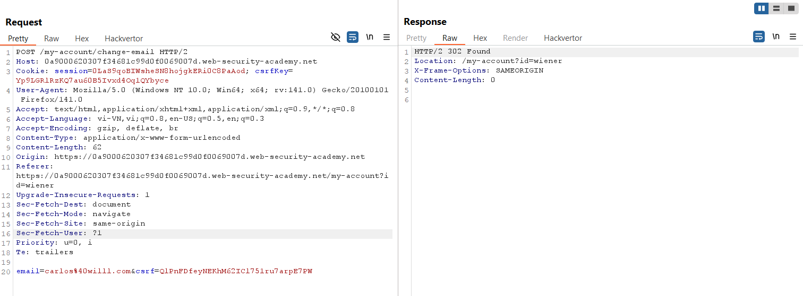
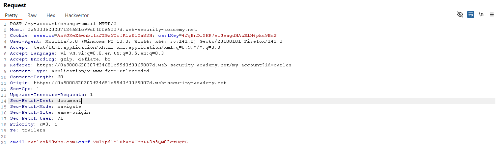
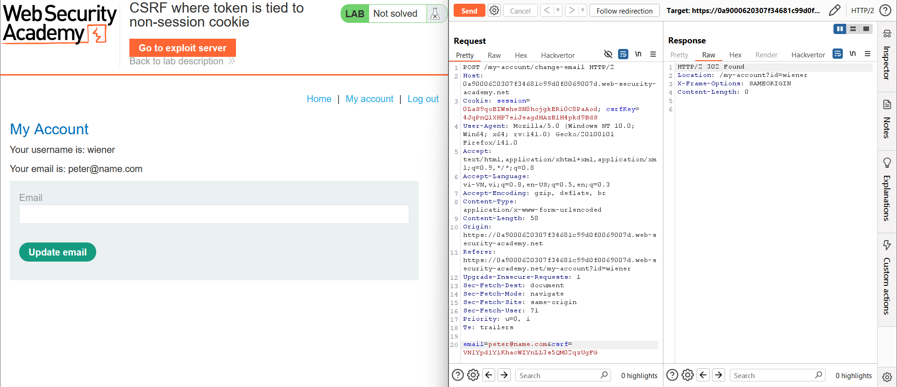
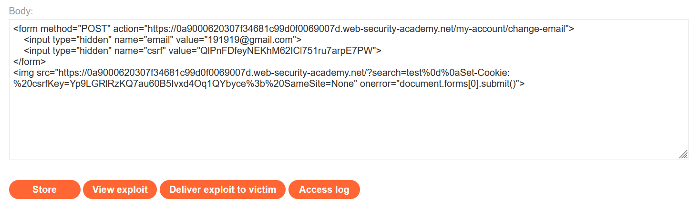
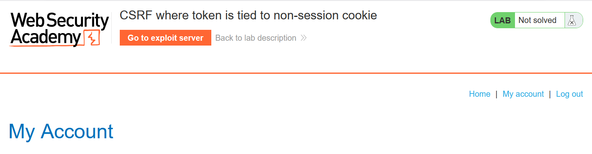

# Write-up: CSRF where token is tied to non-session cookie

### Tổng quan
Khai thác lỗ hổng Cross-Site Request Forgery (CSRF) trong chức năng thay đổi email của ứng dụng, nơi token CSRF được liên kết với cookie `csrfKey` (`non-session cookie`) thay vì cookie phiên. Ứng dụng không kiểm tra tính hợp lệ của cặp `csrfKey` và `csrf` theo người dùng, cho phép sử dụng `csrfKey` và `csrf` của một tài khoản khác để gửi yêu cầu giả mạo. Kết hợp với HTTP response injection trong endpoint `/` để set cookie `csrfKey`, sử dụng payload HTML với `` để set cookie và gửi form POST giả mạo, thay đổi email của nạn nhân, hoàn thành lab.

### Mục tiêu
- Khai thác lỗ hổng CSRF bằng cách set cookie `csrfKey` giả mạo thông qua HTTP response injection, sử dụng token csrf hợp lệ từ tài khoản khác, gửi yêu cầu POST giả mạo đến `/my-account/change-email`, thay đổi email của nạn nhân và hoàn thành lab.

### Công cụ sử dụng
- Burp Suite Pro
- Firefox Browser

### Quy trình khai thác
1. **Thu thập thông tin (Reconnaissance)**
- Đăng nhập bằng tài khoản `wiener`:`peter` và thay đổi email thành `1111@gmail.com` tại `/my-account/change-email`
    
- **Quan sát**:
    - Yêu cầu POST chứa tham số csrf trong body và cookie csrfKey trong header.
    - Cookie session và `csrfKey` không có thuộc tính `SameSite`, cho phép gửi trong các yêu cầu cross-site:

2. **Kiểm tra xác thực CSRF token**
- Mở trình duyệt ở chế độ private, đăng nhập bằng tài khoản `carlos`:`montoya`, bật intercept trong Burp Proxy để bắt yêu cầu POST `/my-account/change-email`:
- Lấy giá trị `csrfKey=carlosKey123` và `csrf=carlosCsrf789`, drop yêu cầu này.
    
- Trong Burp Repeater, sửa yêu cầu POST của `wiener`:`peter`, thay `csrfKey` và `csrf` bằng giá trị của carlos:
    - **Phản hồi**: Email của wiener được cập nhật thành công, xác nhận lỗ hổng: ứng dụng chỉ kiểm tra cặp `csrfKey` và `csrf` hợp lệ, không liên kết với tài khoản người dùng:
        

3. **Khai thác (Exploitation)**
- Sử dụng `csrfKey=Yp9LGRlRzKQ7au60B5Ivxd4Oq1QYbyce` và `csrf=QlPnFDfeyNEKhM62ICl751ru7arpE7PW` của wiener từ bước 1. Tạo payload CSRF trong Exploit Server :
    ```xml
    <form method="POST" action="https://lab-id.web-security-academy.net/my-account/change-email">
    <input type="hidden" name="email" value="191919@gmail.com">
    <input type="hidden" name="csrf" value="QlPnFDfeyNEKhM62ICl751ru7arpE7PW">
    </form>
    
    ```
    
- **Ý tưởng payload**:
    - Thẻ `` với src trỏ đến endpoint `/` chứa HTTP response injection, set cookie `csrfKey=Yp9LGRlRzKQ7au60B5Ivxd4Oq1QYbyce` với `SameSite=None`.
    - Form POST chứa `email=191919@gmail.com` và `csrf=QlPnFDfeyNEKhM62ICl751ru7arpE7PW`, khớp với `csrfKey`.
    - Sự kiện `onerror` của `` kích hoạt submit form, gửi yêu cầu POST đến `/my-account/change-email`.

- Gửi payload đến nạn nhân qua chức năng "Deliver exploit to victim" của Exploit Server:
    - **Kết quả**: Khi nạn nhân truy cập trang Exploit Server, thẻ `` set cookie `csrfKey`, form gửi yêu cầu POST, thay đổi email thành `191919@gmail.com` và hoàn thành lab.
        

### Bài học rút ra
- Hiểu cách khai thác lỗ hổng CSRF bằng cách sử dụng HTTP response injection để set cookie `csrfKey` giả mạo, kết hợp với token `csrf` hợp lệ từ tài khoản khác, tận dụng cơ chế kiểm tra token yếu không liên kết với tài khoản người dùng.
- Nhận thức tầm quan trọng của việc liên kết CSRF token với tài khoản người dùng, sử dụng token ngẫu nhiên và duy nhất, cấu hình `SameSite=Strict` cho cookie, và ngăn chặn HTTP response injection để bảo vệ ứng dụng khỏi các cuộc tấn công CSRF

### Tài liệu tham khảo
- PortSwigger: Cross-Site Scripting (XSS)

### Kết luận
Lab này cung cấp kinh nghiệm thực tiễn trong việc khai thác CSRF bằng cách lợi dụng kiểm tra CSRF token yếu liên kết với non-session cookie và HTTP response injection, nhấn mạnh tầm quan trọng của việc liên kết token với tài khoản, sử dụng token ngẫu nhiên, cấu hình `SameSite` hợp lý, và bảo vệ chống injection. Xem portfolio đầy đủ tại https://github.com/Furu2805/Lab_PortSwigger.

*Viết bởi Toàn Lương, Tháng 8/2025.*