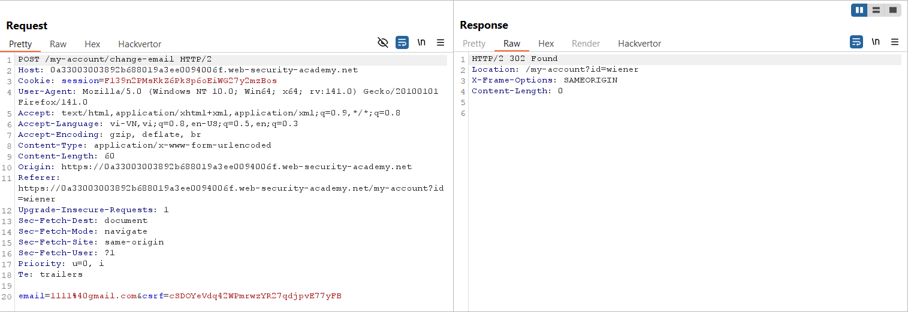

# Write-up: CSRF where token validation depends on token being present

### Tổng quan
Khai thác lỗ hổng Cross-Site Request Forgery (CSRF) trong chức năng thay đổi email của ứng dụng, nơi kiểm tra CSRF token chỉ yêu cầu token hiện diện nhưng không xác thực tính hợp lệ. Nếu tham số `csrf` bị xóa khỏi yêu cầu POST, ứng dụng vẫn xử lý yêu cầu mà không báo lỗi, cho phép gửi yêu cầu giả mạo mà không cần token. Sử dụng payload HTML trong Exploit Server để gửi form POST không chứa `csrf`, thay đổi email của nạn nhân và hoàn thành lab.

### Mục tiêu
- Khai thác lỗ hổng CSRF bằng cách gửi yêu cầu POST giả mạo đến `/my-account/change-email` mà không có tham số `csrf`, tận dụng cơ chế kiểm tra token yếu, thay đổi email của nạn nhân và hoàn thành lab.

### Công cụ sử dụng
- Burp Suite Pro
- Firefox Browser

### Quy trình khai thác
1. **Thu thập thông tin (Reconnaissance)**
- Đăng nhập bằng tài khoản `wiener`:`peter` và thay đổi email thành `1111@gmail.com` tại `/my-account/change-email`:
    
- **Quan sát**:
    - Yêu cầu POST chứa tham số `csrf` trong body.
    - Cookie session không có thuộc tính `SameSite`, cho phép gửi trong các yêu cầu cross-site

2. **Kiểm tra xác thực CSRF token**
- Gửi yêu cầu POST `/my-account/change-email` đến Burp Repeater, sửa tham số `csrf` thành giá trị bất kỳ:
    - **Phản hồi**: Lỗi "Invalid CSRF token", xác nhận ứng dụng kiểm tra tính hợp lệ của `csrf` nếu tham số này hiện diện:
        

- Thử xóa tham số `csrf` trong body:
    - **Phản hồi**: Email được cập nhật thành công, xác nhận lỗ hổng: ứng dụng không yêu cầu `csrf` bắt buộc, chỉ kiểm tra token nếu nó hiện diện:
        

3. **Khai thác (Exploitation)**
- Tạo payload CSRF trong Exploit Server để gửi yêu cầu POST không chứa `csrf`:
    ```xml
    <form method="POST" action="https://lab-id.web-security-academy.net/my-account/change-email">
    <input type="hidden" name="email" value="1212@gmail.com">
    </form>
    <script>
    document.forms[0].submit();
    </script>
    ```

- **Ý tưởng payload**:
    - Form POST chỉ chứa `email=1212@gmail.com`, không có tham số `csrf`.
    - Script `document.forms[0].submit()` tự động gửi form, thực hiện yêu cầu POST giả mạo đến `/my-account/change-email`.
    - Cookie session của nạn nhân được gửi kèm do thiếu `SameSite`, và yêu cầu được xử lý vì không cần csrf.

- Gửi payload đến nạn nhân qua chức năng "Deliver exploit to victim" của Exploit Server:
    - **Kết quả**: Khi nạn nhân truy cập trang Exploit Server, form gửi yêu cầu POST không có `csrf`, thay đổi email thành `1212@gmail.com`.
        

### Bài học rút ra
- Hiểu cách khai thác lỗ hổng CSRF bằng cách gửi yêu cầu POST giả mạo mà không có tham số `csrf`, tận dụng cơ chế kiểm tra token yếu chỉ yêu cầu token nếu hiện diện.
- Nhận thức tầm quan trọng của việc bắt buộc CSRF token trong mọi yêu cầu nhạy cảm, sử dụng token ngẫu nhiên và duy nhất, cấu hình `SameSite=Strict` hoặc Lax cho cookie để ngăn chặn các cuộc tấn công CSRF.

### Tài liệu tham khảo
- PortSwigger: Cross-Site Scripting (XSS)

### Kết luận
Lab này cung cấp kinh nghiệm thực tiễn trong việc khai thác CSRF bằng cách lợi dụng cơ chế kiểm tra CSRF token yếu không yêu cầu token bắt buộc, nhấn mạnh tầm quan trọng của việc bắt buộc token trong mọi yêu cầu nhạy cảm, sử dụng token ngẫu nhiên, và cấu hình `SameSite` hợp lý để bảo vệ ứng dụng. Xem portfolio đầy đủ tại https://github.com/Furu2805/Lab_PortSwigger.

*Viết bởi Toàn Lương, Tháng 8/2025.*