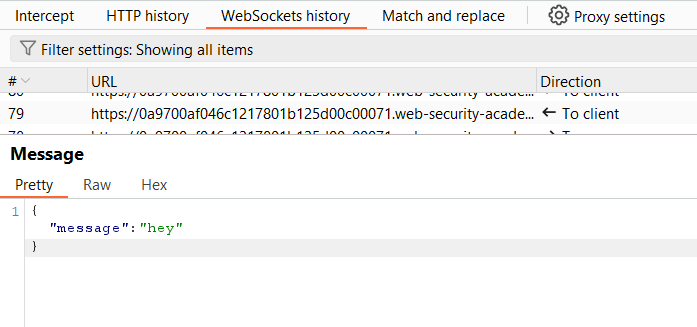
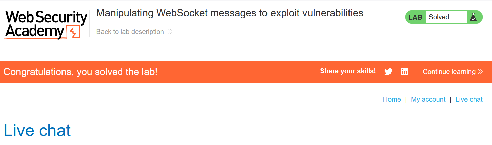

# Write-ups: Manipulating WebSocket messages to exploit vulnerabilities

### Tổng quan
Khai thác lỗ hổng XSS trong chức năng live chat của ứng dụng, nơi WebSocket endpoint xử lý tin nhắn không lọc đúng cách, cho phép tiêm mã JavaScript qua payload XSS. Tin nhắn được gửi qua WebSocket được hiển thị trực tiếp trên trình duyệt của nạn nhân mà không được xử lý an toàn, dẫn đến việc thực thi mã như `alert(1)`. Kẻ tấn công sử dụng Burp Repeater để thao túng tin nhắn WebSocket, gửi payload XSS tới nạn nhân và kích hoạt mã độc, hoàn thành lab.

### Mục tiêu
- Khai thác lỗ hổng XSS trong WebSocket endpoint của chức năng live chat bằng cách thao túng tin nhắn với payload `{"message":""}`, kích hoạt `alert(1)` trên trình duyệt nạn nhân và hoàn thành lab.

### Công cụ sử dụng
- Burp Suite Pro
- Firefox Browser

### Quy trình khai thác
1. **Thu thập thông tin (Reconnaissance)**
- Nhập tin nhắn thử nghiệm (`hey`) và quan sát trong Burp Proxy WebSockets history:
    - Tin nhắn được gửi qua WebSocket có dạng:
        ```json
        {"message":"hey"}
        ```
        
2. **Khai thác (Exploitation)**
- Dùng Burp Repeater để gửi tin nhắn WebSocket với payload XSS:
    ```json
    {"message":""}
    ```
- **Ý tưởng payload**:
    - Thao túng tin nhắn WebSocket để tiêm payload XSS, hiển thị `` trên trình duyệt nạn nhân, kích hoạt `alert(1)`.

- **Kết quả**:
    - Khi nạn nhân đang sử dụng chức năng live chat, payload được gửi qua WebSocket, kích hoạt `alert(1)` trên trình duyệt của họ:
        .png)
    - Lab xác nhận hoàn thành:
        

### Bài học rút ra
- Hiểu cách khai thác lỗ hổng XSS trong WebSocket bằng cách thao túng tin nhắn với payload XSS, tận dụng việc thiếu lọc đầu vào để thực thi mã JavaScript trên trình duyệt nạn nhân.
- Nhận thức tầm quan trọng của việc triển khai lọc đầu vào chặt chẽ và xử lý an toàn dữ liệu trong tin nhắn WebSocket để ngăn chặn các cuộc tấn công XSS.

### Kết luận
Lab này cung cấp kinh nghiệm thực tiễn trong việc khai thác XSS trong WebSocket bằng cách thao túng tin nhắn, nhấn mạnh tầm quan trọng của việc lọc và xử lý an toàn dữ liệu đầu vào để bảo vệ ứng dụng khỏi các cuộc tấn công XSS. Xem portfolio đầy đủ tại https://github.com/Furu2805/Lab_PortSwigger.

**Viết bởi Toàn Lương, Tháng 8/2025.**