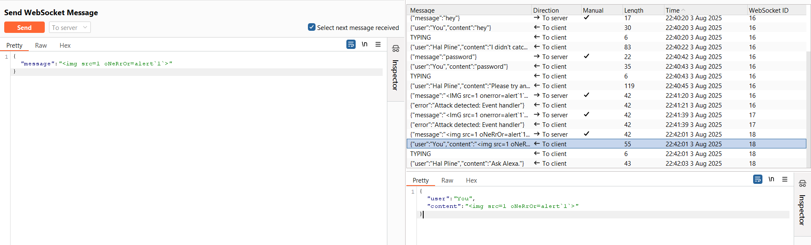

# Write-ups: Manipulating the WebSocket handshake to exploit vulnerabilities

### Tổng quan
Khai thác lỗ hổng trong chức năng live chat của ứng dụng, nơi WebSocket endpoint xử lý tin nhắn không lọc đúng cách các payload XSS, cho phép tiêm mã JavaScript. Ứng dụng có cơ chế chặn tấn công XSS, nhưng bộ lọc không đầy đủ và dễ bị bypass bằng cách sử dụng biến thể thuộc tính (`oNeRrOr`) và cú pháp backtick. Ngoài ra, ứng dụng chặn IP khi phát hiện tấn công, nhưng có thể bypass bằng header `X-Forwarded-For`. Kẻ tấn công thao túng tin nhắn WebSocket để thực thi XSS, kích hoạt `alert(1)` và hoàn thành lab.

### Mục tiêu
- Khai thác lỗ hổng XSS trong WebSocket endpoint của chức năng live chat bằng cách thao túng tin nhắn với payload XSS, bypass bộ lọc và cơ chế chặn IP bằng `X-Forwarded-For`, kích hoạt `alert(1)` và hoàn thành lab.

### Công cụ sử dụng
- Burp Suite Pro
- Firefox Browser

### Quy trình khai thác
1. **Thu thập thông tin (Reconnaissance)**
- Nhập tin nhắn thử nghiệm (hey) và quan sát trong Burp Proxy WebSockets history:
    - Tin nhắn được gửi qua WebSocket có dạng: 
        ```json
        {"message":"heyyy"}
        ```

- Kiểm tra lỗ hổng XSS
    - Dùng Burp Repeater để gửi tin nhắn WebSocket với payload XSS:
        ```json
        {"message":""}
        ```
    - Phản hồi: Nhận được lỗi: `{"error":"Attack detected: Event handler"}`, cho thấy ứng dụng có bộ lọc XSS chặn thuộc tính onerror.  Sau khi gửi payload, kết nối WebSocket bị chặn và IP bị ban:
        
        

- Thêm header `X-Forwarded-For: 1.1.1.1` vào yêu cầu WebSocket trong Burp Repeater để giả mạo IP:
    - Kết nối WebSocket thành công, bypass cơ chế chặn IP

2. **Khai thác (Exploitation)**
- Thử payload XSS khác để bypass bộ lọc:
    ```json
    {"message":""}
    ```
- Gửi payload qua WebSocket trong Burp Repeater với header `X-Forwarded-For: 1.1.1.1`:
    - Payload sử dụng thuộc tính `oNeRrOr` (viết hoa xen kẽ) và cú pháp backtick (`alert1```) để bypass bộ lọc XSS.

- **Kết quả**:
    - Payload được xử lý, kích hoạt alert(1) thành công:
        
        

### Bài học rút ra
- Hiểu cách khai thác lỗ hổng XSS trong WebSocket bằng cách thao túng tin nhắn với payload XSS, sử dụng biến thể thuộc tính (`oNeRrOr`) và cú pháp backtick để bypass bộ lọc, kết hợp header `X-Forwarded-For` để vượt qua cơ chế chặn IP.
- Nhận thức tầm quan trọng của việc triển khai bộ lọc XSS đầy đủ, kiểm tra nghiêm ngặt các thuộc tính và cú pháp JavaScript, đồng thời không dựa vào header `X-Forwarded-For` để xác định IP nhằm bảo vệ ứng dụng khỏi các cuộc tấn công WebSocket.

### Kết luận
Lab này cung cấp kinh nghiệm thực tiễn trong việc khai thác XSS trong WebSocket bằng cách bypass bộ lọc và cơ chế chặn IP, nhấn mạnh tầm quan trọng của việc lọc đầu vào chặt chẽ và xác thực nguồn gốc đáng tin cậy để bảo vệ WebSocket endpoint. Xem portfolio đầy đủ tại https://github.com/Furu2805/Lab_PortSwigger.

*Viết bởi Toàn Lương, Tháng 8/2025.*