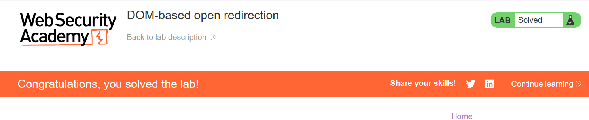

# Write-up: DOM-based open redirection

### Tổng quan
Khai thác lỗ hổng DOM-based open redirection trong chức năng "Back to Blog" của ứng dụng, nơi thẻ `<a>` sử dụng JavaScript với regex `/url=(https?:\/\/.+)/` để chuyển hướng dựa trên tham số `url` trong URL. Logic này không kiểm tra nguồn gốc của URL, cho phép kẻ tấn công chèn một URL độc hại để chuyển hướng người dùng đến trang do mình kiểm soát. Bằng cách sử dụng tham số `url` trong một URL được chế tạo, kẻ tấn công có thể khai thác lỗ hổng để hoàn thành lab.

### Mục tiêu
- Khai thác lỗ hổng DOM-based open redirection bằng cách chèn URL độc hại vào tham số `url` trong liên kết bài viết, chuyển hướng người dùng đến trang do kẻ tấn công kiểm soát và hoàn thành lab.

### Công cụ sử dụng
- Burp Suite Pro
- Firefox Browser

### Quy trình khai thác
1. **Thu thập thông tin (Reconnaissance)**  
- Truy cập một bài viết bất kỳ (ví dụ: `/post?postId=6`) và quan sát trong Burp Proxy HTTP history:  
  ```
  GET /post?postId=6 HTTP/2
  Host: 0a5b001c04ae288181251bc200cf0098.web-security-academy.net
  ```  
- **Phản hồi**:  
  - Trang chứa thẻ `<a>` với logic chuyển hướng:  
    ```html
    <a href='#' onclick='returnUrl = /url=(https?:\/\/.+)/.exec(location); location.href = returnUrl ? returnUrl[1] : "/"'>Back to Blog</a>
    ```  
  - Logic JavaScript:  
    - Sử dụng regex `/url=(https?:\/\/.+)/` để lấy tham số `url` từ `location` (URL hiện tại).  
    - Nếu regex khớp, chuyển hướng đến URL trong `returnUrl[1]` (phần `https://...`); nếu không, về `/`.  
    - Không có kiểm tra nguồn gốc, cho phép chèn URL độc hại:  
      

2. **Khai thác (Exploitation)**  
- tạo URL với tham số `url` dẫn đến trang độc hại:  
    ```
    https://0a5b001c04ae288181251bc200cf0098.web-security-academy.net/post?postId=6&url=https://exploit-0a5b001c04ae288181251bc200cf0098.exploit-server.net/#
    ```

- Gửi URL cho nạn nhân hoặc truy cập trực tiếp:
    - Khi nhấp "Back to Blog", logic JavaScript trích xuất `https://exploit-0a5b001c04ae288181251bc200cf0098.exploit-server.net/` từ tham số url và chuyển hướng đến trang độc hại và hoàn thành lab
        

### Bài học rút ra
- Hiểu cách khai thác lỗ hổng DOM-based open redirection bằng cách chèn URL độc hại vào tham số url, tận dụng logic JavaScript không kiểm tra nguồn gốc để chuyển hướng người dùng đến trang do kẻ tấn công kiểm soát.
- Nhận thức tầm quan trọng của việc kiểm tra và xác thực nguồn gốc của các tham số URL trong logic JavaScript để ngăn chặn các cuộc tấn công open redirection.

### Kết luận
Lab này cung cấp kinh nghiệm thực tiễn trong việc khai thác DOM-based open redirection, nhấn mạnh tầm quan trọng của việc kiểm tra an toàn tham số URL và xác thực nguồn gốc để bảo vệ ứng dụng khỏi các cuộc tấn công chuyển hướng. Xem portfolio đầy đủ tại https://github.com/Furu2805/Lab_PortSwigger.

*Viết bởi Toàn Lương, Tháng 8/2025.*