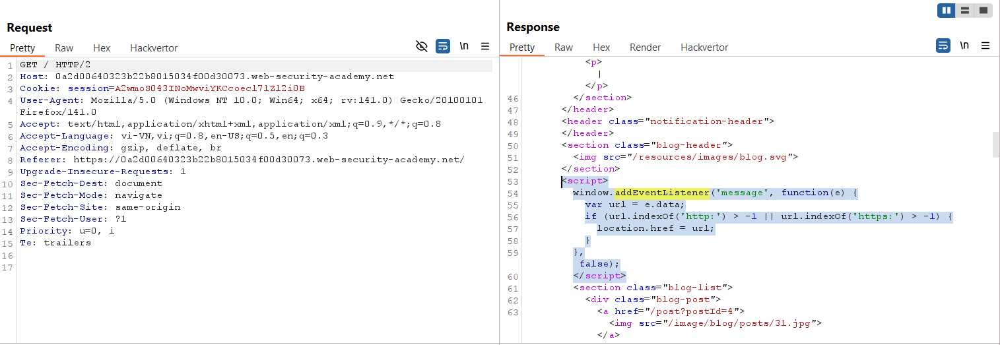
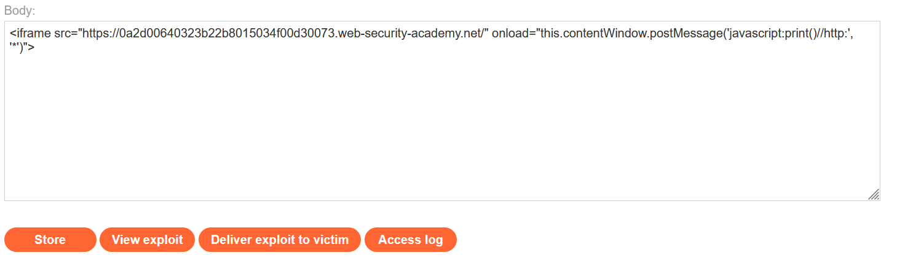
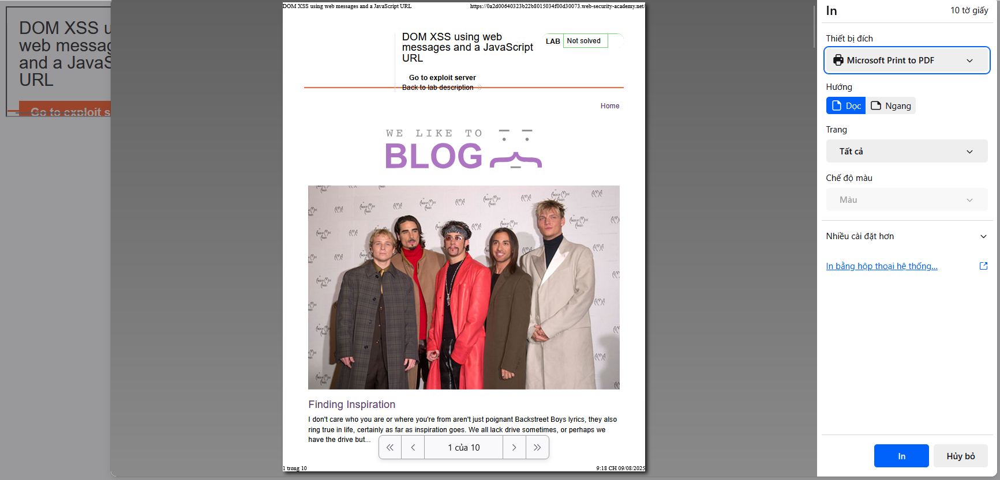
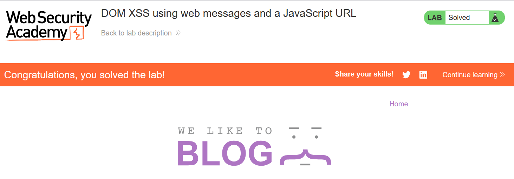

# Write-ups: DOM XSS using web messages and a JavaScript URL

### Tổng quan
Khai thác lỗ hổng DOM-based XSS trong ứng dụng, nơi đoạn mã JavaScript sử dụng `window.addEventListener('message')` để xử lý tin nhắn từ `postMessage` nhưng chỉ kiểm tra sự hiện diện của `http:` hoặc `https:` trong dữ liệu mà không xác thực nguồn gốc (`e.origin`). Điều này cho phép kẻ tấn công gửi tin nhắn chứa URL JavaScript (`javascript:print()`) để thực thi mã trên trình duyệt nạn nhân. Bằng cách sử dụng iframe trong Exploit Server để gửi payload `postMessage`, kẻ tấn công kích hoạt lệnh `print()` và hoàn thành lab.

### Mục tiêu
- Khai thác lỗ hổng DOM-based XSS bằng cách gửi tin nhắn postMessage với URL `javascript:print()`, tận dụng việc kiểm tra không đầy đủ của dữ liệu và thiếu xác thực `e.origin` để thực thi mã trên trình duyệt nạn nhân và hoàn thành lab.

### Công cụ sử dụng
- Burp Suite Pro
- Firefox Browser

### Quy trình khai thác
1. **Thu thập thông tin (Reconnaissance)**
- Truy cập trang web và quan sát trong Burp Proxy HTTP history, response chứa đoạn mã JavaScript:
    ```html
    <script>
        window.addEventListener('message', function(e) {
            var url = e.data;
            if (url.indexOf('http:') > -1 || url.indexOf('https:') > -1) {
                location.href = url;
            }
        }, false);
    </script>
    ```
- Phân tích:
    - Script nghe sự kiện `message` từ bất kỳ nguồn nào (không kiểm tra `e.origin`).
    - Kiểm tra e.data có chứa `http:` hoặc `https:` bằng `indexOf`, sau đó đặt `location.href = url`.
        

2. **Khai thác (Exploitation)**
- Tạo payload trong Exploit Server để gửi tin nhắn `postMessage` với URL JavaScript:
    ```html
    <iframe src="https://0a2d00640323b22b8015034f00d30073.web-security-academy.net/" 
            onload="this.contentWindow.postMessage('javascript:print()//http:', '*')">
    </iframe>
    ```
    
- **Giải thích payload:**
    - Iframe tải trang mục tiêu, sự kiện `onload` gửi tin nhắn `postMessage` với dữ liệu `javascript:print()//http:`, vượt qua kiểm tra `indexOf('http:')` do `http:` trong phần comment.
    - Script trong trang đặt `location.href = javascript:print()//http:`, thực thi lệnh `print()`.

- Store và view exploit:
    - Payload thực thi thành công print() trên trình duyệt:
        

- Gửi payload đến nạn nhân qua "Deliver exploit to victim" của Exploit Server và hoàn thành lab:
    

### Bài học rút ra
- Hiểu cách khai thác DOM-based XSS bằng cách sử dụng `postMessage` để gửi URL JavaScript (`javascript:print()//http:`), tận dụng kiểm tra không đầy đủ của `indexOf` và thiếu xác thực `e.origin` để thực thi mã JavaScript.
- Nhận thức tầm quan trọng của việc kiểm tra nguồn gốc (`e.origin`) trong sự kiện `message` và xác thực chặt chẽ dữ liệu đầu vào để ngăn chặn các cuộc tấn công XSS.

### Kết luận
Lab này cung cấp kinh nghiệm thực tiễn trong việc khai thác DOM-based XSS thông qua `postMessage` với URL JavaScript, nhấn mạnh tầm quan trọng của việc kiểm tra nguồn gốc tin nhắn và xác thực dữ liệu đầu vào để bảo vệ ứng dụng khỏi các cuộc tấn công XSS. Xem portfolio đầy đủ tại https://github.com/Furu2805/Lab_PortSwigger.

*Viết bởi Toàn Lương, Tháng 8/2025.*