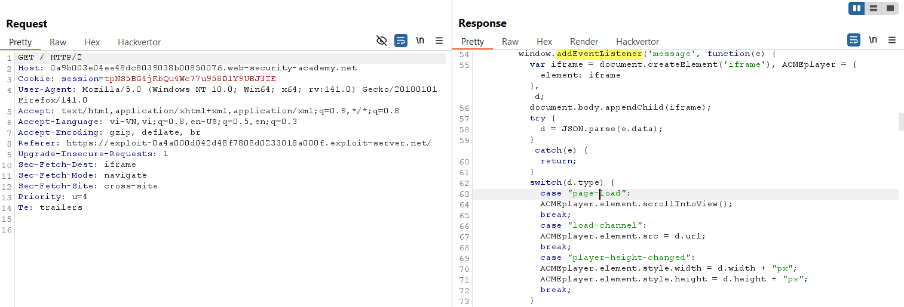
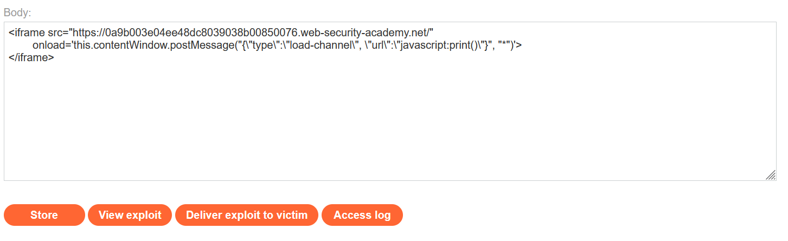
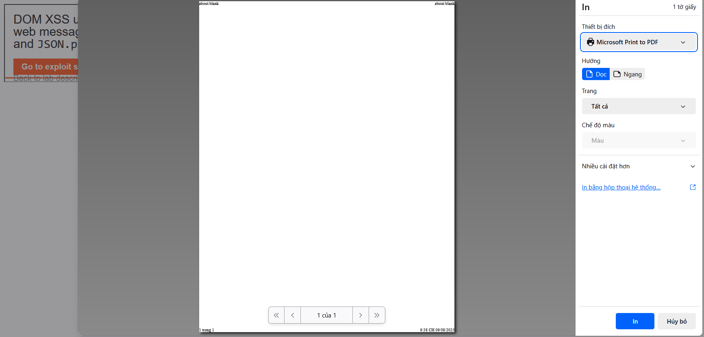
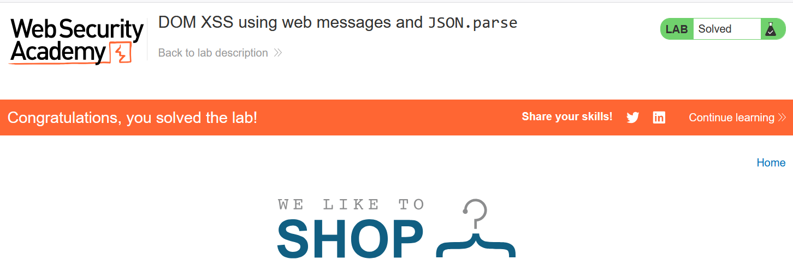

# Write-ups: DOM XSS using web messages and `JSON.parse`

### Tổng quan
Khai thác lỗ hổng DOM-based XSS trong ứng dụng, nơi đoạn mã JavaScript sử dụng `window.addEventListener('message')` để xử lý tin nhắn từ `postMessage` mà không kiểm tra nguồn gốc (`e.origin`). Điều này cho phép kẻ tấn công gửi tin nhắn từ một trang độc hại, thao túng thuộc tính src của `iframe` để thực thi mã JavaScript thông qua URL `javascript:print()`. Bằng cách sử dụng iframe trong Exploit Server để gửi payload `postMessage`, kẻ tấn công kích hoạt lệnh `print()` trên trình duyệt nạn nhân và hoàn thành lab.

### Mục tiêu
- Khai thác lỗ hổng DOM-based XSS bằng cách gửi tin nhắn `postMessage` với payload JSON chứa URL `javascript:print()`, tận dụng việc thiếu kiểm tra `e.origin` để thực thi mã trên trình duyệt nạn nhân và hoàn thành lab.

### Công cụ sử dụng
- Burp Suite Pro
- Firefox Browser

### Quy trình khai thác
1. **Thu thập thông tin (Reconnaissance)**
- Truy cập trang web và quan sát trong Burp Proxy HTTP history, response chứa đoạn mã JavaScript:
    ```html
    <script>
        window.addEventListener('message', function(e) {
            var iframe = document.createElement('iframe'), 
                ACMEplayer = {element: iframe}, 
                d;

            document.body.appendChild(iframe);

            try {
                d = JSON.parse(e.data);
            } catch(e) {
                return;
            }

            switch(d.type) {
                case "page-load":
                    ACMEplayer.element.scrollIntoView();
                    break;

                case "load-channel":
                    ACMEplayer.element.src = d.url;
                    break;

                case "player-height-changed":
                    ACMEplayer.element.style.width = d.width + "px";
                    ACMEplayer.element.style.height = d.height + "px";
                    break;
            }
        }, false);
    </script>
    ```
- **Phân tích:**
    - Script nghe sự kiện `message` từ bất kỳ nguồn nào (không kiểm tra `e.origin`).
    - Tạo `iframe` và thêm vào `body`.
    - Parse dữ liệu `e.data` bằng `JSON.parse`, yêu cầu JSON hợp lệ với key type.
    - Nếu type là load-channel, đặt `iframe.src = d.url` mà không kiểm tra giá trị url.
    - Điều này cho phép tiêm URL `javascript:print()` vào `iframe.src`:
        

2. **Khai thác (Exploitation)**
- Tạo payload trong body Exploit Server để gửi tin nhắn postMessage với JSON chứa URL độc hại:
    ```html
    <iframe src="https://0a50007e034f424b805af82900a00009.web-security-academy.net/" 
            onload='this.contentWindow.postMessage("{\"type\":\"load-channel\", \"url\":\"javascript:print()\"}", "*")'>
    </iframe>
    ```
    
- **Giải thích payload:**
    - Iframe tải trang mục tiêu. sự kiện onload gửi tin nhắn `postMessage` với JSON `{"type":"load-channel", "url":"javascript:print()"}` tới iframe
    - Script trong trang parse JSON, đặt `iframe.src = javascript:print()`, thực thi lệnh `print()`.

- Store và view exploit:
    - Payload thực thi thành công print() trên trình duyệt:
        

- Gửi payload đến nạn nhân qua "Deliver exploit to victim" của Exploit Server xác nhận hoàn thành lab:
    

### Bài học rút ra
- Hiểu cách khai thác DOM-based XSS bằng cách sử dụng `postMessage` để gửi JSON chứa URL `javascript:print()`, tận dụng việc thiếu kiểm tra `e.origin` và xử lý không an toàn của `JSON.parse` để thực thi mã JavaScript.
- Nhận thức tầm quan trọng của việc kiểm tra nguồn gốc (`e.origin`) trong sự kiện message và xử lý an toàn dữ liệu đầu vào từ `JSON.parse` để ngăn chặn các cuộc tấn công XSS.

### Kết luận
Lab này cung cấp kinh nghiệm thực tiễn trong việc khai thác DOM-based XSS thông qua `postMessage` và `JSON.parse`, nhấn mạnh tầm quan trọng của việc kiểm tra nguồn gốc tin nhắn và xử lý an toàn dữ liệu JSON để bảo vệ ứng dụng khỏi các cuộc tấn công XSS. Xem portfolio đầy đủ tại https://github.com/Furu2805/Lab_PortSwigger.

*Viết bởi Toàn Lương, Tháng 8/2025.*