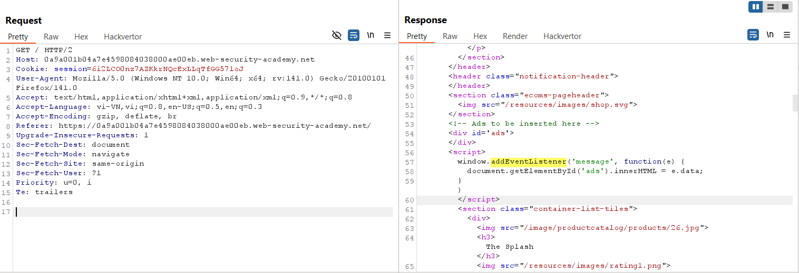
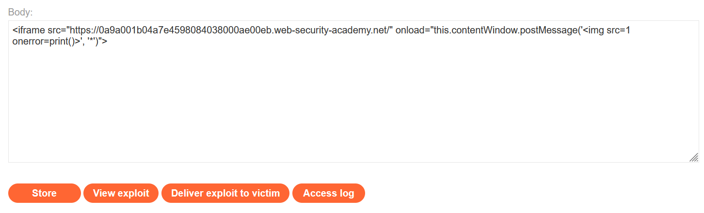
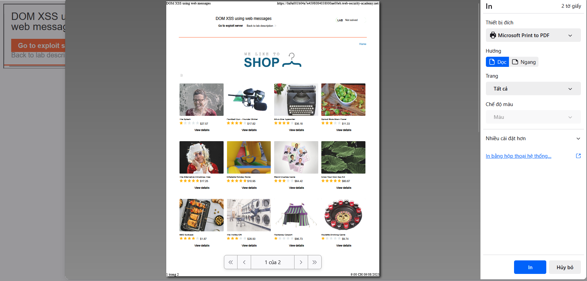
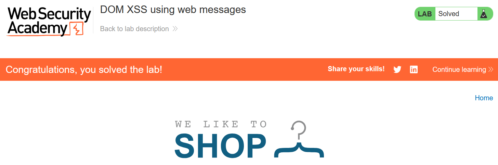

# Write-ups: DOM XSS using web messages

### Tổng quan
Khai thác lỗ hổng DOM-based XSS trong ứng dụng, nơi đoạn mã JavaScript sử dụng `window.addEventListener('message')` để xử lý tin nhắn từ `postMessage` và chèn trực tiếp dữ liệu vào innerHTML của phần tử #ads mà không kiểm tra nguồn gốc (`e.origin`) hoặc xử lý an toàn. Điều này cho phép kẻ tấn công gửi tin nhắn chứa payload XSS (``), thực thi mã JavaScript trên trình duyệt nạn nhân. Bằng cách sử dụng iframe trong Exploit Server để gửi payload `postMessage`, kẻ tấn công kích hoạt lệnh `print()` và hoàn thành lab.

### Mục tiêu
- Khai thác lỗ hổng DOM-based XSS bằng cách gửi tin nhắn `postMessage` với payload ``, tận dụng việc thiếu kiểm tra `e.origin` và chèn trực tiếp vào innerHTML để thực thi mã trên trình duyệt nạn nhân và hoàn thành lab.

### Công cụ sử dụng
- Burp Suite Pro
- Firefox Browser

### Quy trình khai thác
1. **Thu thập thông tin (Reconnaissance)**
- Truy cập trang web và quan sát trong Burp Proxy HTTP history, response chứa đoạn mã JavaScript:
    ```html
    <script>
        window.addEventListener('message', function(e) {
            document.getElementById('ads').innerHTML = e.data;
        })
    </script>
    ```
- Phân tích:
    - Script nghe sự kiện `message` từ bất kỳ nguồn nào (không kiểm tra `e.origin`).
    - Dữ liệu `e.data` được chèn trực tiếp vào `innerHTML` của phần tử `#ads` mà không xử lý, cho phép tiêm mã HTML/JavaScript, dẫn đến XSS:
        

2. **Khai thác (Exploitation)**
- Tạo payload trong Exploit Server để gửi tin nhắn postMessage với payload XSS:
    ```html
    <iframe src="https://0a9a001b04a7e4598084038000ae00eb.web-security-academy.net/" 
            onload="this.contentWindow.postMessage('', '*')">
    </iframe>
    ```
    
- Giải thích payload:
    - Iframe tải trang mục tiêu, sự kiện `onload` gửi tin nhắn `postMessage` với dữ liệu ``.
    - Script trong trang chèn `` vào `innerHTML` của `#ads`, kích hoạt lệnh `print()`.

- Store và view exploit:
    - Payload thực thi thành công print() trên trình duyệt:
        

- Gửi payload đến nạn nhân qua "Deliver exploit to victim" của Exploit Server và hoàn thành lab:
    

### Bài học rút ra
- Hiểu cách khai thác DOM-based XSS bằng cách sử dụng `postMessage` để gửi payload ``, tận dụng việc thiếu kiểm tra `e.origin` và chèn trực tiếp vào `innerHTML` để thực thi mã JavaScript.
- Nhận thức tầm quan trọng của việc kiểm tra nguồn gốc (`e.origin`) trong sự kiện `message` và xử lý an toàn dữ liệu trước khi chèn vào `innerHTML` để ngăn chặn các cuộc tấn công XSS.

### Kết luận
Lab này cung cấp kinh nghiệm thực tiễn trong việc khai thác DOM-based XSS thông qua `postMessage`, nhấn mạnh tầm quan trọng của việc kiểm tra nguồn gốc tin nhắn và xử lý an toàn dữ liệu HTML để bảo vệ ứng dụng khỏi các cuộc tấn công XSS. Xem portfolio đầy đủ tại https://github.com/Furu2805/Lab_PortSwigger.

*Viết bởi Toàn Lương, Tháng 8/2025.*