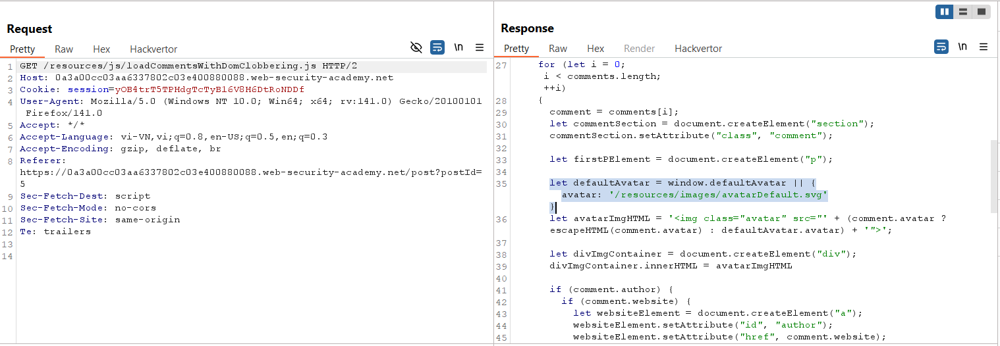
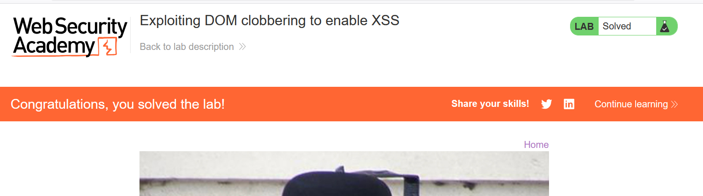

# Write-ups: Exploiting DOM clobbering to enable XSS

### Tổng quan
Khai thác lỗ hổng DOM clobbering trong ứng dụng, nơi đoạn mã JavaScript sử dụng biến `window.defaultAvatar` để thiết lập nguồn ảnh đại diện mà không kiểm tra an toàn. Bằng cách chèn các phần tử HTML với `id=defaultAvatar` vào comment của bài post, kẻ tấn công ghi đè biến `window.defaultAvatar` thành một HTMLCollection, cho phép thao túng thuộc tính avatar để thực thi mã JavaScript thông qua URL `id:"onerror=alert(1)//`. Payload được thêm vào comment, kích hoạt XSS khi trang tải lại, hoàn thành lab.

### Mục tiêu
- Khai thác lỗ hổng DOM clobbering bằng cách chèn các phần tử HTML với `id=defaultAvatar` vào comment để ghi đè biến `window.defaultAvatar`, thực thi lệnh `alert(1)` trên trình duyệt và hoàn thành lab.

### Công cụ sử dụng
- Burp Suite Pro
- Firefox Browser

### Quy trình khai thác
1. **Thu thập thông tin (Reconnaissance)**
- Truy cập trang web và quan sát trong Burp Proxy HTTP history, request tới file JavaScript:
    ```plain
    GET /resources/js/loadCommentsWithDomClobbering.js HTTP/2
    ```
- Phản hồi:
    - File chứa đoạn mã:
        ```javascript
        let defaultAvatar = window.defaultAvatar || {avatar: '/resources/images/avatarDefault.svg'}
        ```
- Phân tích:
    - Script sử dụng `window.defaultAvatar` để thiết lập nguồn ảnh đại diện.
    - Nếu `window.defaultAvatar` không tồn tại, gán giá trị mặc định `{avatar: '/resources/images/avatarDefault.svg'}`.
    - Biến `window.defaultAvatar` có thể bị ghi đè nếu chèn phần tử HTML với `id=defaultAvatar`, vì trình duyệt tạo một HTMLCollection cho các phần tử có cùng id.
    - Thuộc tính avatar có thể được thao túng thông qua phần tử có `name=avatar`, dẫn đến XSS nếu giá trị là URL JavaScript:
        

2. **Khai thác (Exploitation)**
- **Ý tưởng khai thác:**
    - Tạo hai phần tử `<a>` với `id=defaultAvatar` để biến `window.defaultAvatar` thành HTMLCollection thay vì object JavaScript.
    - Phần tử thứ hai có `name=avatar` và `href="cid:&quot;onerror=alert(1)//"`, khiến `defaultAvatar.avatar` trả về giá trị `cid:"onerror=alert(1)//`.
    - Khi script chạy, `defaultAvatar.avatar` được sử dụng làm src của thẻ ``, dẫn đến thực thi `alert(1)` do lỗi xử lý URL cid: trong bối cảnh lab

- Chèn payload vào comment của bài post bất kỳ:
    ```html
    <a id=defaultAvatar><a id=defaultAvatar name=avatar href="cid:&quot;onerror=alert(1)//">
    ```

- Thêm một comment bất kỳ khác vào bài post để kích hoạt tải lại trang và xử lý comment:
    - Kết quả: Lab xác nhận thực thi alert(1) thành công, hoàn thành lab:
        

### Bài học rút ra
- Hiểu cách khai thác DOM clobbering bằng cách chèn các phần tử HTML với `id` trùng lặp để ghi đè biến JavaScript (`window.defaultAvatar`), tận dụng việc sử dụng giá trị không an toàn làm `src` để thực thi mã JavaScript.
- Nhận thức tầm quan trọng của việc tránh sử dụng biến toàn cục (`window.*`) dễ bị ghi đè và kiểm tra an toàn dữ liệu trước khi sử dụng trong HTML để ngăn chặn các cuộc tấn công XSS.

### Kết luận
Lab này cung cấp kinh nghiệm thực tiễn trong việc khai thác DOM clobbering để kích hoạt XSS, nhấn mạnh tầm quan trọng của việc quản lý biến JavaScript an toàn và kiểm tra dữ liệu đầu vào để bảo vệ ứng dụng khỏi các cuộc tấn công XSS. Xem portfolio đầy đủ tại https://github.com/Furu2805/Lab_PortSwigger.

*Viết bởi Toàn Lương, Tháng 8/2025.*