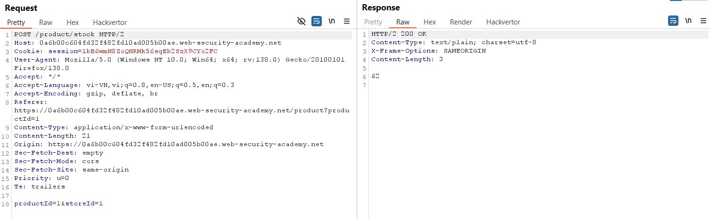
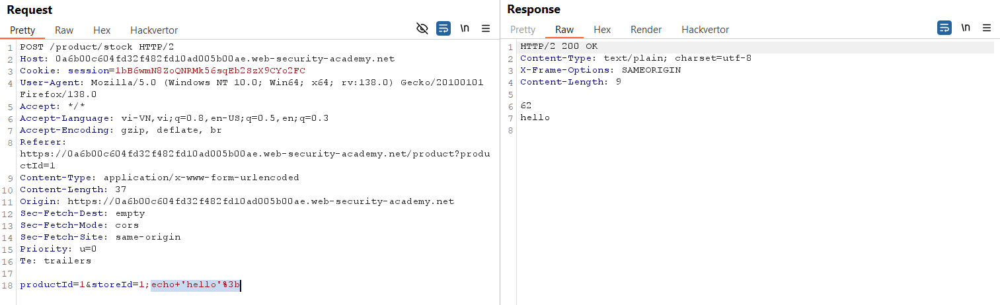
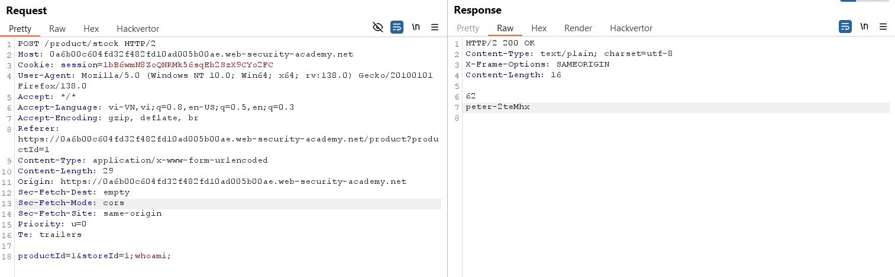

# Write-up: OS command injection, simple case

### Tổng quan
Khai thác lỗ hổng OS command injection trong chức năng kiểm tra kho hàng (`stock checker`) để thực thi lệnh hệ thống và xác định tên người dùng hiện tại bằng lệnh `whoami`.

### Mục tiêu
- Thực thi lệnh `whoami` để lấy tên người dùng hiện tại.

### Công cụ sử dụng
- Burp Suite Community
- Firefox Browser 

### Quy trình khai thác
1. **Thu thập thông tin (Reconnaissance)**
- Chọn một sản phẩm trong ứng dụng và sử dụng tính năng kiểm tra kho hàng (`check stock`).
- Trong Burp Proxy HTTP History, xác định yêu cầu `POST` tới `/product/stock`: 
    - Gửi yêu cầu này tới Repeater để thử nghiệm.
    

2. **Khai thác (Exploitation)**
- Sửa tham số `storeId` để chèn lệnh hệ thống:
    ```
    storeId=1;echo 'hello';
    ```
- Gửi yêu cầu trong Repeater:
    - Phản hồi chứa chuỗi "hello", xác nhận lỗ hổng OS command injection.
    

- Tiếp tục chèn lệnh whoami: `storeId=1;whoami;`
    - **Kết quả**: Phản hồi chứa `peter-2teMhx`, hoàn thành lab:
        
        

### Bài học rút ra
- Hiểu cách khai thác lỗ hổng OS command injection bằng cách chèn lệnh hệ thống vào tham số đầu vào.
- Nhận thức tầm quan trọng của việc kiểm tra và lọc dữ liệu người dùng trước khi thực thi lệnh hệ thống.

### Tài liệu tham khảo
- PortSwigger: OS command injection

### Kết luận
Lab này cung cấp kinh nghiệm thực tiễn trong việc khai thác lỗ hổng OS command injection, sử dụng Burp Suite để chèn lệnh whoami và xác định người dùng hiện tại. Xem portfolio đầy đủ tại https://github.com/Furu2805/Lab_PortSwigger.

*Viết bởi Toàn Lương, Tháng 5/2025.*