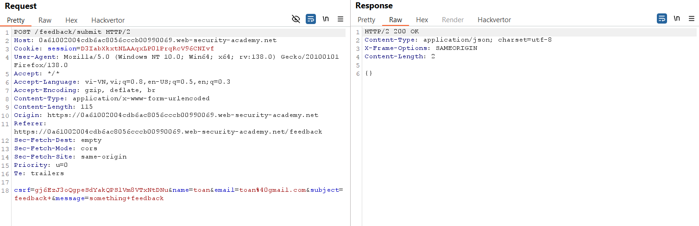
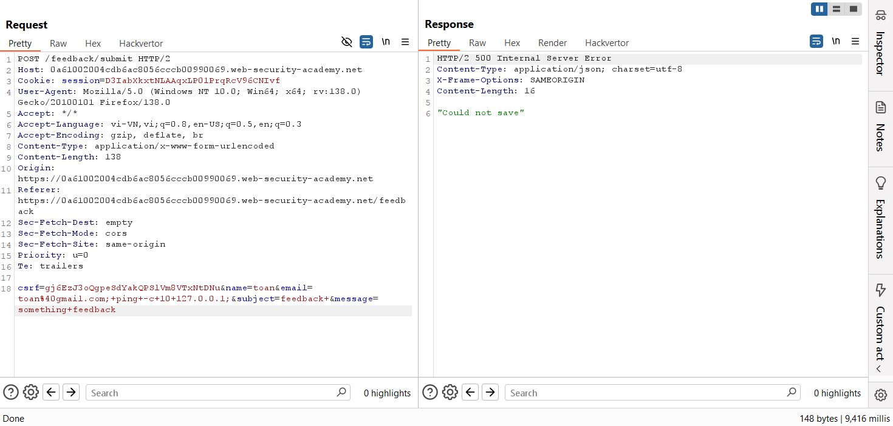

# Write-up: Blind OS command injection with time delays

### Tổng quan
Khai thác lỗ hổng blind OS command injection trong chức năng gửi feedback để gây ra độ trễ 10 giây bằng cách chèn lệnh `ping`.
### Mục tiêu
- Tạo độ trễ 10 giây trong phản hồi của ứng dụng bằng lệnh hệ thống.

### Công cụ sử dụng
- Burp Suite Community
- Firefox Browser 

### Quy trình khai thác
1. **Thu thập thông tin (Reconnaissance)**
- Kiểm tra chức năng `feedback`, gửi một nội dung bất kỳ và bắt yêu cầu trong Burp Proxy HTTP History.
- Xác định yêu cầu POST tới `/feedback/submit`
    - Gửi yêu cầu này tới Repeater để thử nghiệm.
    

2. **Khai thác (Exploitation)**
- Kiểm tra lỗ hổng blind OS command injection bằng cách chèn lệnh gây độ trễ vào tham số `email`:
    ```
    email=toan%40gmail.com;+ping+-c+10+127.0.0.1;
    ```
- Gửi yêu cầu trong Repeater:
    - **Kết quả**: Nhận phản hồi `"Could not save"` sau khoảng 10 giây, xác nhận lệnh `ping -c 10 127.0.0.1` được thực thi, hoàn thành lab:
        
        

### Bài học rút ra
- Hiểu cách khai thác blind OS command injection bằng kỹ thuật time delay khi không có output trực tiếp.
- Nhận thức tầm quan trọng của việc kiểm tra và lọc dữ liệu người dùng trước khi thực thi lệnh hệ thống.

### Tài liệu tham khảo
- PortSwigger: OS command injection

### Kết luận
Lab này cung cấp kinh nghiệm thực tiễn trong việc khai thác lỗ hổng blind OS command injection, sử dụng Burp Suite để chèn lệnh ping và tạo độ trễ 10 giây. Xem portfolio đầy đủ tại https://github.com/Furu2805/Lab_PortSwigger.

*Viết bởi Toàn Lương, Tháng 5/2025.*