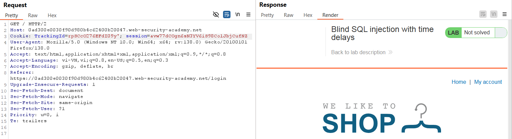
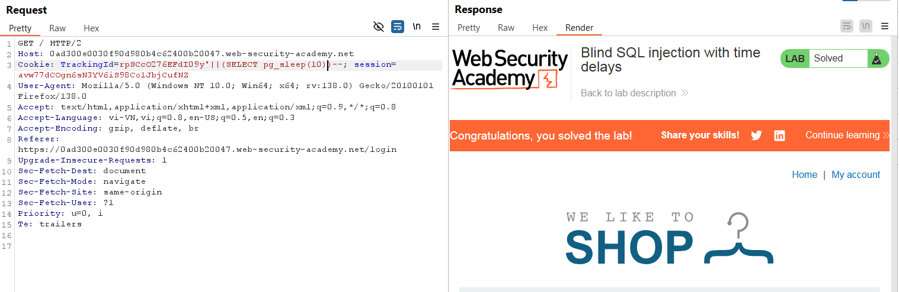

# Write-up: Blind SQL injection with time delays

### Tổng quan
Ghi lại quá trình khai thác Blind SQLi dựa trên time-delay để làm hệ thống hiển thị sau 10s

### Mục tiêu
- Khiến hệ thống trả vể response sau 10s

### Công cụ sử dụng
- BurpSuite Community
- Firefox Browser

### Quy trình khai thác
1. **Thu thập thông tin**
- Kiểm tra tham số `TrackingId` trong header `Cookie` trong HTTP request được chặn trong BurpSuite và thêm dấu `'` để xác nhận lỗi SQLi
    ```
    TrackingId=rpSCcO276EFdI09y'
    ```
    - **Kết quả**: Không có sự thay đổi trong response, xác nhận lỗi Blind SQLi
        

2 **Thử nghiệm time delay với hàm pg_sleep**
- Lab sử dụng cơ sở dữ liệu PostgreSQL, sử dụng hàm pg_sleep để gây trễ.
    ```
    TrackingId=rpSCcO276EFdI09y'||(SELECT pg_sleep(10))--
    ```
    - **Kết quả**: Response trả về sau ~10s. Hoàn thành lab
        


### Bài học rút ra
- Thành thạo khai thác blind SQL injection dựa trên độ trễ thời gian.
- Nhận thức tầm quan trọng của kiểm tra đầu vào để ngăn chặn SQL injection.

### Tài liệu tham khảo
- PortSwigger: SQL Injection cheat sheet
- PortSwigger: Blind SQL Injection

### Kết luận
Lab này giúp tôi hoàn thiện kỹ năng khai thác Blind SQL injection. Xem portfolio đầy đủ tại https://github.com/Furu2805/Lab_PortSwigger 

*Viết bởi Toàn Lương, Tháng 5/2025*.